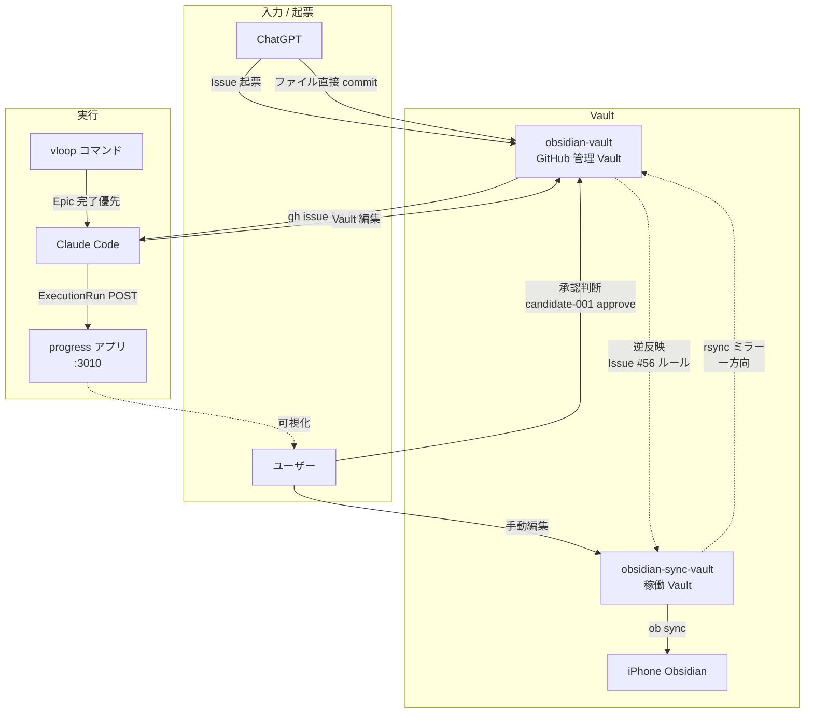

# 🗺 Claude × vloop × Obsidian × Progress 関係図

> [!important] 4 つの登場人物の役割と情報の流れを 1 枚で把握する

---

## 1 枚図

---

## 役割の責任分担

| 主体 | 役割 | できないこと |
|---|---|---|
| **ChatGPT** | Issue 起票 / 方向性承認（approve/hold/reject） / レビュー | candidate を approved にする（人間判断） |
| **ユーザー** | 最終承認 / status 確定 / cron 投入 / 課金・公開判断 | — |
| **Claude Code** | Issue 消化 / Vault 編集 / 実装補助 / progress POST | approved 化 / 承認確認 / 外部公開 |
| **vloop** | Claude 上で Epic を連続実行するコマンド | 1 件ずつ止まる運用（Issue #50 で変更） |
| **obsidian-sync-vault** | 稼働 Vault（iPhone 同期） | git 直接編集（ob sync 衝突回避） |
| **obsidian-vault** | GitHub 管理 Vault（正本） | ob sync（責務分離） |
| **iPhone Obsidian** | 外出先閲覧 / 承認コマンド発行 / チェック | — |
| **progress** | 作業履歴の正本（ExecutionRun） | candidate 自動化（人間が approved 後に投入） |

---

## 情報の流れ（3 経路）

### 経路 1: Issue 起票 → Claude 消化 → GitHub commit
1. ChatGPT が GitHub Issue で起票
2. Claude が vloop で pull / view / 実装
3. obsidian-vault に commit / push
4. ChatGPT が GitHub でレビュー（[[ChatGPTレビュー手順]]）

### 経路 2: ユーザー編集 → ob sync → GitHub 反映
1. ユーザーが obsidian-sync-vault を編集（iPhone or PC）
2. ob sync で同期
3. rsync で obsidian-vault にミラー
4. git push で GitHub 反映

### 経路 3: 逆反映（ChatGPT/Claude 直接 commit → iPhone 反映）
1. ChatGPT or Claude が obsidian-vault に直接 commit
2. Claude が逆反映ルール実行（[[同期導線_sync-vault逆反映]]）: obsidian-vault → sync-vault に cp
3. ob sync で iPhone に反映

---

## 旧運用と新運用の対比

| 観点 | 旧運用 | 新運用（Issue #50 以降） |
|---|---|---|
| vloop の単位 | 小 Issue 1 件ずつ | Epic 完了優先 |
| 止まり方 | 小 Phase 完了で止まる | Epic 完了 / 人間判定待ちで止まる |
| 同期方向 | sync-vault → obsidian-vault 一方向 | 一方向 + 逆反映ルール（#56） |
| iPhone 入口 | 日本語ファイル名（検索しづらい） | 00_START_HERE.md 英数字入口（#56/#57） |
| candidate アクセス | フォルダリンク | scenarios/README.md 中継（#58） |

---

## ファイルの責任分担（正本ルール）

| 種別 | 正本場所 |
|---|---|
| 作業履歴（ExecutionRun） | **progress（:3010）** |
| Vault コンテンツ | **obsidian-vault（GitHub）** |
| iPhone 表示用 | obsidian-sync-vault（同期コピー） |
| 運用ルール | obsidian-vault `03_prompts/` |
| candidate / 収益化判断 | obsidian-vault `05_monetization/` |
| 承認判断材料 | obsidian-vault `20_reviews/` |
| 市場調査 | obsidian-vault `06_research/` |
| 危険作業ログ | `/root/company/engineering/reports/` |

---

## 関連

- [[../00_START_HERE]] — iPhone 入口
- [[claude-commands/vloop]] — vloop 運用ルール（#50 改訂版）
- [[Claude-Code標準運用]] — Claude Code 全般ルール
- [[同期導線_sync-vault逆反映]] — 逆反映ルール（#56）
- [[GitHub反映ルール]] — sync-vault → obsidian-vault 公式運用
- [[Vault同期ルール]] — ob sync 手順
- [[ChatGPTレビュー手順]] — ChatGPT 側レビュー手順
- [[../05_monetization/epics]] — Epic A/B/C/D 進捗
- Issue: kaeru07/vault#58 / #59
