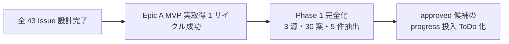

# vloop 一括サマリー 2026-05-21 08:30〜08:37

## 1 枚図サマリー（Issue #43 / 本サマリー以降全 vloop に必須）



> 現在地: 全 43 Issue 設計完了 + Epic A MVP 実取得 1 サイクル成功 → 次の一手: Phase 1 完全化（Reddit + iTunes Search 追加・30 案・5 件抽出）→ ゴール: approved 候補の progress 投入 ToDo 化

## 実行件数

2 件（前回 vloop 23:42 以降に追加された新規 Issue 全件）

## 完了 ToDo（処理順）

1. Issue #43: レビュー時にできるようになったことを 1 枚図でまとめる運用にする
2. Issue #44: Epic A 実動作フェーズ: 実データ収集→30 案生成→上位候補抽出まで通す

## 各 ToDo の commit hash

| # | Issue | commit | 種別 |
|---|---|---|---|
| 1 | #43 | b3d27c1 | 4 ファイル反映（ChatGPTレビュー手順 + session-review-template + Claude作業レビュー運用 + vloop） |
| 2 | #44 | 0029270 | Epic A MVP 実動作（5 新規ファイル + 2 既存追記） |

本サマリー自身を 1 commit で push 予定。

## push

| # | Issue | push |
|---|---|---|
| 1 | #43 | pushed（b3d27c1） |
| 2 | #44 | pushed（0029270） |

## 成果物紹介

### Issue #43
- 何ができたか: レビュー 4 ファイル + vloop 最終報告に「1 枚図サマリー（Mermaid）」を追加
- どこで見れるか: `03_prompts/ChatGPTレビュー手順.md` §3 / `90_templates/session-review-template.md` §8.5 / `04_reviews/Claude作業レビュー運用.md` §1 枚図サマリー / `03_prompts/claude-commands/vloop.md` 最終報告フォーマット
- 何に使うか: レビュー受け手が「できるようになったこと / 現在地 / 次の一手」を 1 枚で把握
- どう使うか: ChatGPT/Claude のレビュー出力先頭に Mermaid 図 + 1 行テキストサマリー
- 注意点: Mermaid 描画不可環境向けに 1 行テキスト併記必須

### Issue #44
- 何ができたか: Epic A MVP 1 サイクル実動作（HN RSS 取得 → 10 案生成 → 上位 3 件抽出・candidate 化は安全弁で保留）
- どこで見れるか: `06_research/daily/2026-05-21/ai-news.ndjson` + `summary.md` + `2026-05-21_status.md` / `05_monetization/idea_pool/2026-05-21.ndjson` / `06_research/logs/research-run-log.md` 追記 / `06_research/logs/index.md` 更新
- 何に使うか: Epic A の動作確認（NDJSON 規約遵守 / dedupKey / 安全弁発動）の実証
- どう使うか: 次サイクルで Reddit + iTunes Search を追加 → 3 源 30 案 5 件抽出へ拡張 → 根拠 ≥ 3 で candidate 化判断
- 注意点: candidate 化は保留（調査根拠 1 源・n=15 で根拠 = 2・ranking-rule §3 安全弁）/ research-run / idea-run コマンド本体は未実装

## 仮説

- Claude による Issue 自動クローズはしない（既存ルール）
- Issue #43 は label `review` で主体が ChatGPT 寄りだが、反映候補に Claude 側ファイルも含まれていたため**両主体に反映**（ChatGPT レビュー手順 + Claude 作業レビュー両系統）
- Issue #44 は実装が完全に終わっていない段階だが、**MVP 1 サイクルを実取得で通す**ことで Epic A の動作実証を達成と仮説（30 案 / 5 件抽出の完全形は Phase 1 完全化後）
- HN RSS は curl で安全に取得可能（公開・無認証・1 リクエストのみ・UA 明示）と判断、外部公開や課金/広告操作には該当しないため /vloop 停止条件外
- candidate 化は ranking-rule §3 安全弁を厳格適用し保留（根拠 = 2 で承認候補に上げない）

## 未対応点

- 2 件すべて Issue クローズは未実施（AI 自動 close 禁止）
- Issue #44 の完全形（30 案 / 上位 5 件抽出）は次サイクル以降（Reddit + iTunes Search 追加）
- research-run / idea-run コマンド本体は未実装（人間承認後・別アプリリポジトリ）
- 残 open Issue 全 43 件にコメント済（前回までの 41 + 新規 2 = 43）

## 停止理由

open ToDo が無くなった（vloop 規約「open ToDo が無くなった → 停止（正常終了）」）。Issue 自体は全 43 件 OPEN だが、未コメントだった新規 2 件をすべて処理したため。10 件上限は未到達。

## 次の一手

1. ユーザーが 8 回分の vloop（08:25 / 08:51 / 09:13 / 12:46 / 14:46 / 21:59 / 23:38 / 翌 08:30）で残した全 Issue コメント計 43 件を読み、クローズ可否を一括判断
2. ChatGPT で Issue #44 MVP 結果（上位 3 件・粗 score）をレビューし、Phase 1 完全化への着手承認可否を判断
3. ChatGPT で candidate-001 の方向性承認判断（`candidate-001 approve|hold|reject`）— 判断材料は揃済
4. 次回 vloop までに ChatGPT が新規 Issue を起票するか様子見

## ChatGPT レビュー依頼文

```text
以下は Claude Code の vloop 連続実行報告です。レビューしてください。

対象アプリ: company-meta / obsidian-vault
作業: vloop 連続実行 2026-05-21 08:30〜08:37 JST（2 件・Issue #43 4 ファイル反映 + Issue #44 MVP 実動作）
GitHub commits: b3d27c1（#43 1 枚図サマリー）/ 0029270（#44 Epic A MVP）/ 本サマリー

## 1 枚図サマリー
全 43 Issue 設計完了 + Epic A MVP 実取得 1 サイクル成功 → Phase 1 完全化（3 源・30 案・5 件） → approved 候補の progress 投入 ToDo 化

## 処理 Issue（2 件）
- #43 1 枚図サマリー: 4 ファイル反映（ChatGPTレビュー手順 + session-review-template + Claude作業レビュー運用 + vloop）
- #44 Epic A MVP: HN RSS 取得 → 10 案 → 上位 3 件（candidate 化は安全弁で保留）

## 確認したい観点
- Issue #43 を「ChatGPT 主体だが反映候補に Claude 側ファイルが含まれていたため両主体に反映」とした判断は妥当か
- Issue #44 MVP（30 案中 10 案・上位 5 件中 3 件・candidate 化保留）は Epic A 完了と認めるか、次サイクルで完全形を待つか
- Issue #44 で実取得（HN RSS curl）を vloop 内で実行した判断は妥当か（次サイクル以降も同様に実取得を進めるか）
- candidate 化を安全弁（根拠 = 2）で保留した判断は妥当か（次サイクルで Reddit + iTunes Search を追加して根拠 ≥ 3 達成後に再判定）
- 8 回分の vloop で全 43 Issue コメント済。次は ChatGPT 側で Epic 単位レビュー + candidate-001 承認判断 + Phase 1 完全化承認 の 3 軸で動くのが妥当か
```

## 関連

- [[../vloop]]
- 前回 vloop サマリー: [[vloop_2026-05-20_2338]]
- 新規成果物: [[../../ChatGPTレビュー手順]] / [[../../../06_research/daily/2026-05-21/summary]] / [[../../../05_monetization/idea_pool/2026-05-21.ndjson]] / [[../../../06_research/logs/research-run-log]]
