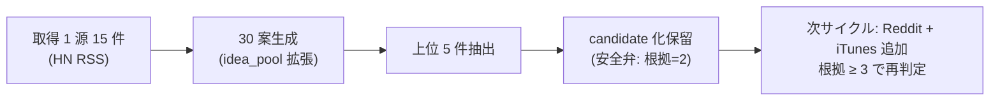

# vloop 一括サマリー 2026-05-21 12:08 サイクル

## 1 枚図サマリー（Issue #43 準拠）



> 現在地: Issue #44 MVP + Issue #45 証跡で Epic A 実運転 30 案・上位 5 件・1 ページ証跡まで完了 → 次の一手: Phase 1 完全化（3 源化）→ ゴール: candidate 化 + progress 投入

## 実行件数

1 件（前回 vloop 08:37 以降に追加された新規 Issue #45）

## 完了 ToDo（処理順）

1. Issue #45: Epic A 実運転証跡を作成する（daily・30 案・上位候補）

## 各 ToDo の commit hash

| # | Issue | commit | 種別 |
|---|---|---|---|
| 1 | #45 | e856b7a | 拡張 + 新規（idea_pool 30 案 + 実運転証跡 Markdown + ログ更新） |

本サマリー自身を 1 commit で push 予定。

## push

| # | Issue | push |
|---|---|---|
| 1 | #45 | pushed（e856b7a） |

## 成果物紹介

- 何ができたか: Epic A 実運転 1 ページ証跡（1 枚図 + 実ファイル証跡パス + 数字集計 + 上位 5 件 + GitHub ハッシュ）+ idea_pool を 30 案に拡張
- どこで見れるか: `06_research/daily/2026-05-21_実運転証跡.md`（1 ページ証跡）/ `05_monetization/idea_pool/2026-05-21.ndjson`（30 案）/ `06_research/logs/research-run-log.md`（上位 5 件表追記）
- 何に使うか: ChatGPT が GitHub で 1 ファイル開けば「動いた」と「次の一手」が一目で分かる動作証跡
- どう使うか: 証跡 §3 上位 5 件と §6 注意点を読み、Phase 1 完全化（Reddit + iTunes 追加）の着手承認可否を判断
- 次に見るファイル: `06_research/daily/2026-05-21_実運転証跡.md` → `06_research/logs/research-run-log.md` → 次は Reddit / iTunes 追加実装
- 注意点: candidate 化は安全弁発動で保留中（根拠 = 2）。実装は手動操作（research-run / idea-run コマンド本体は未実装）

## 仮説

- Claude による Issue 自動クローズはしない（既存ルール）
- Issue #45 は #44 の「証跡」追加要求。30 案完全化と 1 ページ証跡 Markdown で完了条件 5/5 達成
- 上位 5 件の candidate 化は ranking-rule §3 安全弁を厳格適用し保留（根拠 = 2）
- 30 案拡張時、HN RSS の取得済 30 件のうち AI 関連を上位、その他（ゲーム / 歴史 / 環境）を下位粗 score として配置

## 未対応点

- Issue #45 クローズは未実施（AI 自動 close 禁止）
- Phase 1 完全化（Reddit + iTunes Search 追加・根拠 ≥ 3）は次サイクル
- candidate 化は次サイクル以降
- research-run / idea-run コマンド本体は未実装

## 停止理由

open ToDo が無くなった（vloop 規約「open ToDo が無くなった → 停止（正常終了）」）。Issue 自体は全 44 件 OPEN だが、未コメントだった新規 1 件をすべて処理したため。10 件上限は未到達。

## 次の一手

1. ChatGPT が `06_research/daily/2026-05-21_実運転証跡.md` を読み、Phase 1 完全化（Reddit + iTunes Search 追加）の着手承認可否を判断
2. 承認後、次回 vloop で Reddit JSON + iTunes Search API の取得を追加して根拠 ≥ 3 達成 → 上位 5 件の candidate 化判断
3. ChatGPT で candidate-001 の方向性承認判断（`candidate-001 approve|hold|reject`）— 判断材料は揃済（並行課題）

## ChatGPT レビュー依頼文

```text
以下は Claude Code の vloop 連続実行報告です。レビューしてください。

対象アプリ: company-meta / obsidian-vault
作業: vloop 連続実行 2026-05-21 12:08〜12:14 JST（1 件・Issue #45 Epic A 実運転証跡）
GitHub commits: e856b7a（#45 idea_pool 30 案拡張 + 実運転証跡 1 ページ）

## 1 枚図サマリー
Epic A MVP（15 件取得） + 証跡拡張（30 案・上位 5 件・証跡 Markdown） → 次の一手: Phase 1 完全化（3 源） → ゴール: candidate 化 + progress 投入

## 処理 Issue（1 件）
- #45 Epic A 実運転証跡: idea_pool を 30 案に拡張 + 1 ページ証跡 Markdown 新規 + ログ更新

## 確認したい観点
- 1 ページ証跡（1 枚図 + 実ファイル証跡パス + 数字集計 + 上位 5 件 + GitHub ハッシュ）の構成は「動いたが一目で分かる」要件を満たすか
- 上位 5 件の粗 score（13/11/11/10/10）と candidate 化保留判断は妥当か
- HN RSS 1 源での 30 案生成は分野偏りがあるが（AI/動画/セキュリティ系）、これは想定通りか（Reddit / iTunes 追加で分布が広がる想定）
- research-run / idea-run コマンド本体未実装のまま手動操作で MVP + 証跡を達成した方針は妥当か（実装着手承認を別途取るか）
```

## 関連

- [[../vloop]]
- 前回 vloop サマリー: [[vloop_2026-05-21_0830]]
- 新規成果物: [[../../../06_research/daily/2026-05-21_実運転証跡]] / [[../../../05_monetization/idea_pool/2026-05-21.ndjson]]
