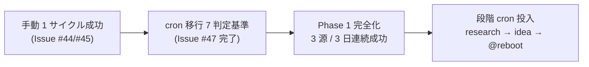

# vloop 一括サマリー 2026-05-21 21:23〜21:25

## 1 枚図サマリー（Issue #43 準拠）



> 現在地: 手動 1 サイクル成功 + cron 移行判定基準完成 → 次の一手: Phase 1 完全化（3 源 / 3 日連続）→ ゴール: 段階 cron 自動化稼働

## 実行件数

2 件（前回 vloop 12:14 以降に追加された新規 Issue #46-#47 全件）

## 完了 ToDo（処理順）

1. Issue #46: 初回は手動で research-run → idea-run を実行して証跡確認する（既に #44/#45 で対応済）
2. Issue #47: 手動実行後に cron 自動化へ切り替える判定基準を作成する

## 各 ToDo の commit hash

| # | Issue | commit | 種別 |
|---|---|---|---|
| 1 | #46 | — | 既存対応済確認（#44/#45 と同主旨ペア処理・コメントのみ） |
| 2 | #47 | 28ff092 | 新規作成（cron移行判定基準.md） |

本サマリー自身を 1 commit で push 予定。

## push

| # | Issue | push |
|---|---|---|
| 1 | #46 | n/a（コメントのみ・#44/#45 同主旨） |
| 2 | #47 | pushed（28ff092） |

## 成果物紹介

### Issue #46
- 何ができたか: 既存 #44 (MVP) + #45 (証跡) で完了条件 5/6 達成・candidate のみ安全弁発動で保留中であることを Issue コメントで報告
- どこで見れるか: GitHub Issue #46 コメント / `06_research/daily/2026-05-21_実運転証跡.md`
- 何に使うか: #44/#45 と同時クローズ可能なペア候補として明示
- どう使うか: ユーザーは #44/#45/#46 を一括クローズ候補として扱える
- 次に見るファイル: `06_research/daily/2026-05-21_実運転証跡.md`
- 注意点: candidate ゼロは安全弁の正しい動作（運用悪化ではない）

### Issue #47
- 何ができたか: cron 自動化移行の **7 項目判定基準** + 段階導入プロセス + 監視 + ロールバック手順
- どこで見れるか: `05_monetization/cron移行判定基準.md`（commit 28ff092）
- 何に使うか: Phase 1 完全化後に「いつ cron 投入してよいか」を機械的に判定
- どう使うか: 7 項目を 3 日連続で PASS したら人間が cron 登録（段階 a/b/c）/ 失敗時はロールバック手順 §5
- 次に見るファイル: `05_monetization/cron_research-run_idea-run設計.md`（#36） → `06_research/logs/research-run-log.md`（連続成功確認用）
- 注意点: 本基準の適用フェーズは Phase 1 完全化（3 源稼働）達成後

## 仮説

- Claude による Issue 自動クローズはしない（既存ルール）
- Issue #46 は #44/#45 と完全に同主旨（手動 1 サイクル + 証跡確認）。新規ファイル作成せず既存成果物リンクのみで完了報告（前回 vloop の #31/#32 / #6/#13 / #25/#33 等と同パターン）
- Issue #47 の閾値（daily 20 件 / 3 日連続 / エラー許容 1/サイクル）は Phase 1 推奨 3 源から保守的に算出（実運用で微調整想定）
- 段階導入（research-run 単独 → 7 日 → idea-run 追加 → 7 日 → @reboot）は爆発リスクを最小化する仮置き

## 未対応点

- 2 件すべて Issue クローズは未実施（AI 自動 close 禁止）
- 本基準の適用フェーズは Phase 1 完全化後（次サイクルで Reddit + iTunes Search 追加）
- 残 open Issue 全 46 件にコメント済（前回までの 44 + 新規 2 = 46）
- 同時クローズ候補ペア（最新）: #25/#33 / #26/#34 / #27/#35 / #6/#13 / #31/#32 / #37/#38 / #40/#41 / **#44/#45/#46**（3 件同時）

## 停止理由

open ToDo が無くなった（vloop 規約「open ToDo が無くなった → 停止（正常終了）」）。Issue 自体は全 46 件 OPEN だが、未コメントだった新規 2 件をすべて処理したため。10 件上限は未到達。

## 次の一手

1. ChatGPT が `cron移行判定基準.md` をレビューし、7 項目閾値の妥当性を判断
2. 次回 vloop で Reddit + iTunes Search を追加 → 3 源 30 案 + 上位 5 件 + candidate 化判断
3. 3 日連続成功達成後に人間が cron 段階導入を判断（§3 a/b/c）
4. ChatGPT で candidate-001 の方向性承認判断（並行課題）

## ChatGPT レビュー依頼文

```text
以下は Claude Code の vloop 連続実行報告です。レビューしてください。

対象アプリ: company-meta / obsidian-vault
作業: vloop 連続実行 2026-05-21 21:23〜21:25 JST（2 件・Issue #46 既存対応済確認 + Issue #47 cron 移行判定基準）
GitHub commits: 28ff092（#47 cron 移行判定基準.md）/ サマリー commit

## 1 枚図サマリー
手動 1 サイクル成功 + cron 移行判定基準完成 → Phase 1 完全化（3 源 / 3 日連続）→ 段階 cron 自動化稼働

## 処理 Issue（2 件）
- #46 既存対応済確認（#44/#45 と同主旨ペア）
- #47 cron 移行判定基準: 7 項目 + 3 日連続 + 段階導入 + ロールバック

## 確認したい観点
- cron 移行 7 項目判定（daily 20 件 / 30 案 / candidate 1 件以上 or 安全弁明示 / エラー許容 1 サイクル / 3 日連続 / 機密混入ゼロ / 規約抵触兆候ゼロ）の閾値は妥当か
- 段階導入（research-run → 7 日 → idea-run 追加 → 7 日 → @reboot）の段階数と日数は妥当か
- 「candidate ゼロが続いた場合は安全弁を見直すサイン」とした運用悪化検知ロジックは妥当か
- 同時クローズ候補ペア #44/#45/#46 を 3 件同時クローズして良いか
- 9 回分の vloop で全 46 Issue にコメント済。次は Phase 1 完全化（Reddit + iTunes 追加）が次の vloop で着手すべきか
```

## 関連

- [[../vloop]]
- 前回 vloop サマリー: [[vloop_2026-05-21_1208]]
- 新規成果物: [[../../../05_monetization/cron移行判定基準]]
- 既存成果物: [[../../../06_research/daily/2026-05-21_実運転証跡]]（#44/#45/#46 共通）
