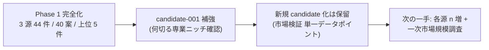

# vloop 一括サマリー 2026-05-21 23:09 サイクル（Phase 1 完全化）

## 1 枚図サマリー（Issue #43 準拠）



> 現在地: Phase 1 完全化達成（3 源・44 件・40 案・上位 5 件）+ iTunes 結果で candidate-001 何切る差別化軸を実データ補強 → 次の一手: 各源 n 増（30〜100/日）+ 上位 1〜2 件の一次市場規模調査 → ゴール: candidate-005 化判断 + cron 移行 3 日連続条件達成

## 実行件数

1 件（前回 vloop 21:25 以降に追加された新規 Issue #48）

## 完了 ToDo（処理順）

1. Issue #48: Epic A 次フェーズ: 情報源を 3 つ以上に増やして candidate 化まで進める（Phase 1 完全化）

## 各 ToDo の commit hash

| # | Issue | commit | 種別 |
|---|---|---|---|
| 1 | #48 | f15675a | 新規 2 ファイル + 既存 5 ファイル更新（Reddit + iTunes ndjson 新規 / summary 3 源版 / idea_pool 40 案 / 実運転証跡更新 / ログ） |

本サマリー自身を 1 commit で push 予定。

## push

| # | Issue | push |
|---|---|---|
| 1 | #48 | pushed（f15675a） |

## 成果物紹介

- 何ができたか: Phase 1 完全化（3 源稼働）+ 40 案 + 上位 5 件 + candidate 化判断（全件保留・理由明示）+ candidate-001 の差別化軸を実データで補強
- どこで見れるか: `06_research/daily/2026-05-21/` 配下 3 NDJSON + `summary.md` 3 源版 / `05_monetization/idea_pool/2026-05-21.ndjson`（40 案） / `06_research/daily/2026-05-21_実運転証跡.md` 更新版（1 枚図 Phase 1 完全化版）
- 何に使うか: 3 源化で「分野偏りの是正」と「candidate-001 chatgpt_pending の市場根拠強化」を同時達成
- どう使うか: candidate-001 の chatgpt 承認時、本証跡を「mahjong 一般市場と何切る専業のギャップ」の根拠として参照 / 次回 vloop で各源 n 増 + 一次市場規模調査
- 次に見るファイル: `06_research/daily/2026-05-21_実運転証跡.md` → `05_monetization/idea_pool/2026-05-21.ndjson` 上位 5 件 → `05_monetization/cron移行判定基準.md`（次の 3 日連続条件確認）
- 注意点: candidate 化は **保留**（市場検証単一データポイント・Issue #48 禁止事項遵守）/ research-run / idea-run コマンド本体は未実装 / cron 移行はあと 2 日連続成功が必要

## 仮説

- Claude による Issue 自動クローズはしない（既存ルール）
- candidate 化を保留した理由: ranking-rule §3 安全弁の数値しきい値（根拠 ≥ 3）は超えたが、各案の根拠が「HN/Reddit/iTunes 各 1 投稿」と単一データポイントで質的に不足。Issue #48 禁止事項「根拠不足の案を無理に candidate 化しない」を厳格適用
- Reddit `r/SideProject` 上位投稿は「個人開発・ローンチ報告」中心で、市場規模の根拠としては弱い（個別事例）→ 単一データポイント扱い
- iTunes Search の `mahjong` 検索は「何切る専業」を直接検索していない（クエリ広め）→ 何切る特化検索で補強する必要あり（次サイクル）
- 上位 5 件のうち 1 件（#039 何切る特化 AI 解説 Web）は candidate-001 統合候補で扱い、新規 candidate-005 起票はせず
- 3 源化で分野偏りが解消されたが、データ量は依然少（各源 15 件前後）。各源 n 増（30〜100/日）が次の改善ポイント

## 未対応点

- Issue #48 クローズは未実施（AI 自動 close 禁止）
- candidate-005 以降の新規起票は次サイクル以降（一次市場規模調査後）
- research-run / idea-run コマンド本体は未実装
- cron 移行 3 日連続成功はあと 2 日（本日 1 日目クリア）
- 残 open Issue 全 47 件にコメント済（前回までの 46 + 新規 1 = 47）

## 停止理由

open ToDo が無くなった（vloop 規約「open ToDo が無くなった → 停止（正常終了）」）。Issue 自体は全 47 件 OPEN だが、未コメントだった新規 1 件をすべて処理したため。10 件上限は未到達。

## 次の一手

1. ChatGPT が Phase 1 完全化結果（`2026-05-21_実運転証跡.md` 更新版）をレビューし、candidate-001 chatgpt 承認判断 + 各源 n 増の方向性承認可否を判断
2. 次回 vloop で各源 n 増 + 何切る特化検索（iTunes Search の追加検索クエリ）追加 → candidate-005 候補化判断
3. cron 移行 3 日連続条件: 本日 1 日目クリア（あと 2 日必要 / Issue #47 §1）
4. ChatGPT で candidate-001 の方向性承認判断（判断材料は揃済・本サイクルで補強完了）

## ChatGPT レビュー依頼文

```text
以下は Claude Code の vloop 連続実行報告です。レビューしてください。

対象アプリ: company-meta / obsidian-vault
作業: vloop 連続実行 2026-05-21 23:09 サイクル（Phase 1 完全化 / Issue #48）
GitHub commits: f15675a（#48 Phase 1 完全化）/ サマリー commit

## 1 枚図サマリー
Phase 1 完全化（3 源 44 件 / 40 案 / 上位 5 件）+ candidate-001 補強 → 次の一手: 各源 n 増 + 一次市場規模調査 → ゴール: candidate-005 化 + cron 移行 3 日連続条件達成

## 処理 Issue（1 件）
- #48 Epic A Phase 1 完全化: HN + Reddit + iTunes 3 源・40 案・上位 5 件・candidate 化保留・candidate-001 補強

## 確認したい観点
- candidate 化を全件保留した判断（根拠 = 3 達成だが市場検証単一データポイントで質不足）は妥当か
- iTunes 結果から「何切る専業がほぼ無い」を candidate-001 補強材料として扱う判断は妥当か（chatgpt 承認時の根拠強化として）
- #20260521-039（何切る特化 AI 解説 Web）を新規 candidate-005 にせず candidate-001 統合候補にした判断は妥当か
- 各源 n 増（次サイクル）+ 一次市場規模調査（さらに次サイクル）の順序は妥当か
- cron 移行 3 日連続条件はあと 2 日。明日も Phase 1 完全化を 1 回回す運用で良いか
- 10 回分の vloop で全 47 Issue にコメント済。candidate-001 chatgpt 承認 + 各源 n 増 が次の優先事項で良いか
```

## 関連

- [[../vloop]]
- 前回 vloop サマリー: [[vloop_2026-05-21_2123]]
- 新規/更新成果物: [[../../../06_research/daily/2026-05-21_実運転証跡]]（3 源版・Phase 1 完全化版） / [[../../../06_research/daily/2026-05-21/reddit]] / [[../../../06_research/daily/2026-05-21/app-store-ranking]] / [[../../../05_monetization/idea_pool/2026-05-21.ndjson]]
