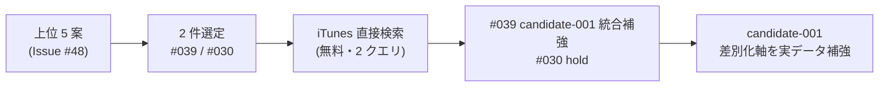

# vloop 一括サマリー 2026-05-22 00:50 サイクル（Epic B 上位 5 案追加調査）

## 1 枚図サマリー（Issue #43 準拠）



> 現在地: Epic B 完了（5 案 → 2 件選定 → 2 件市場検証 → candidate-001 補強 + #030 hold）→ ゴール: candidate-001 chatgpt 承認判断 + 次サイクル各源 n 増

## 実行件数

1 件（前回 vloop 00:30 以降に追加された新規 Issue #49）

## 完了 ToDo（処理順）

1. Issue #49: Epic B: 上位 5 案を追加調査して candidate 化判断まで進める

## 各 ToDo の commit hash

| # | Issue | commit | 種別 |
|---|---|---|---|
| 1 | #49 | eb82bbb | 新規調査ノート + candidate-001 補強 + 承認パック §5-補強 追記 |

本サマリー自身を 1 commit で push 予定。

## push

| # | Issue | push |
|---|---|---|
| 1 | #49 | pushed（eb82bbb） |

## 成果物紹介

- 何ができたか: 上位 5 案から 2 件選定 → iTunes Search 一次データ 2 クエリ → #039 candidate-001 統合補強 + #030 hold（理由 4 点） + candidate-001 差別化軸を実データで強化
- どこで見れるか: `06_research/2026-05-22_上位5案追加調査.md`（新規）/ `05_monetization/scenarios/candidate-001.md`（§差別化軸の補強）/ `20_reviews/candidate-001_ChatGPT承認パック.md`（§5-補強）
- 何に使うか: ChatGPT が candidate-001 を方向性承認する際の「ニッチ市場 + AI 空白 + Web 版」根拠として直接参照可能
- どう使うか: ChatGPT は承認パック §5-補強 を読んで「公開して広告」から「ニッチ × AI 解説 × Web 版」へ判断軸を引き上げる → `candidate-001 approve|hold|reject` を判断
- 次に見るファイル: `20_reviews/candidate-001_ChatGPT承認パック.md`（補強版）→ `05_monetization/scenarios/candidate-001.md`（差別化軸詳細）→ `06_research/2026-05-22_上位5案追加調査.md`（市場データ）
- 注意点: 新規 candidate 起票なし（#039 は統合 / #030 は hold）/ #030 は idea_graveyard に移さず idea_pool に残置（将来再評価可能性）/ 実装に進まず承認扱いもしない

## 仮説

- Claude による Issue 自動クローズはしない（既存ルール）
- 上位 5 案から 2 件のみ選定（Issue #49 「無理に全件調査しない」遵守）
- #002 / #001 / #003 をスキップした理由: 公開予定なし / API キー要 / 競合確立想定 を Issue #49 「根拠不足のまま candidate 化しない」の事前選別と解釈
- #039 を新規 candidate-005 にせず candidate-001 統合とした理由: 「何切る Web 版 + AI 解説」は candidate-001（mahjong アプリ公開）の自然な延長で、新規 candidate を作ると同一領域が 2 件並ぶことになり Vault のノイズになる
- #030 hold は idea_graveyard へ移さない（将来 nanikiru-shorts に文字起こし機能を組み込む話が出た場合に再評価可能性あり）

## 未対応点

- Issue #49 クローズは未実施（AI 自動 close 禁止）
- idea_pool の #030 status を `idea_hold` に更新する作業は次サイクルに送る（本サイクルでは比較表 + 調査ノートで hold 明示済）
- candidate-005 以降の新規起票は次サイクル以降（さらに調査が進んだ場合）
- 残 open Issue 全 48 件にコメント済（前回までの 47 + 新規 1 = 48）

## 停止理由

open ToDo が無くなった（vloop 規約「open ToDo が無くなった → 停止（正常終了）」）。Issue 自体は全 48 件 OPEN だが、未コメントだった新規 1 件をすべて処理したため。10 件上限は未到達。

## 次の一手

1. ChatGPT が `candidate-001_ChatGPT承認パック.md` §5-補強 を読み、候補-001 の方向性承認判断（`candidate-001 approve|hold|reject`）
2. 承認なら人間が candidate-001 status を approved に書換 → progress 投入準備（[[../../../05_monetization/scenarios/candidate-001_progress投入設計]]）
3. 次回 vloop で Phase 1 再実行（cron 移行 3 日連続条件 2 日目達成）+ idea_pool #030 status 更新
4. Epic B は本サイクルで一段落 → Epic C（candidate 昇格・承認待ち）へのバトンタッチ準備

## ChatGPT レビュー依頼文

```text
以下は Claude Code の vloop 連続実行報告です。レビューしてください。

対象アプリ: company-meta / obsidian-vault
作業: vloop 連続実行 2026-05-22 00:50 サイクル（Epic B 上位 5 案追加調査 / Issue #49）
GitHub commits: eb82bbb（#49 上位 5 案追加調査 + candidate-001 補強）/ サマリー commit

## 1 枚図サマリー
上位 5 案 → 2 件選定 → iTunes 直接検索 → #039 candidate-001 統合補強 + #030 hold → candidate-001 chatgpt 承認判断材料が揃った

## 処理 Issue（1 件）
- #49 Epic B 上位 5 案追加調査: 2 件市場検証 / candidate-001 補強反映 / #030 hold

## 確認したい観点
- 5 件から 2 件のみ選定（#002 / #001 / #003 スキップ）の判断は妥当か
- #039「何切る特化 AI 解説 Web」を新規 candidate-005 にせず candidate-001 統合補強とした判断は妥当か
- #030 動画文字起こし SaaS の hold 理由 4 点（競合確立 4 社 / 差別化軸未特定 / 既存資産流用度低 / インパクト試算困難）は妥当か
- candidate-001 補強（差別化軸: Web 版 + AI 解説）は chatgpt 承認判断の根拠強化として妥当か
- 11 回分の vloop で全 48 Issue にコメント済。次は candidate-001 chatgpt 承認判断 + Phase 1 再実行（cron 移行 2 日目） + Epic C 準備 の 3 軸で動くのが妥当か
```

## 関連

- [[../vloop]]
- 前回 vloop サマリー: [[vloop_2026-05-21_2309]]
- 新規/更新成果物: [[../../../06_research/2026-05-22_上位5案追加調査]] / [[../../../05_monetization/scenarios/candidate-001]] / [[../../../20_reviews/candidate-001_ChatGPT承認パック]]
