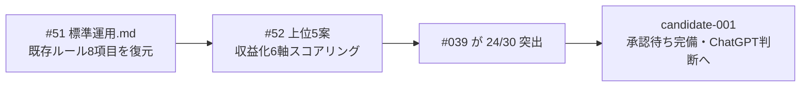

# vloop 一括サマリー 2026-05-22 08:55 サイクル

## 1 枚図サマリー（Issue #43 準拠）



> 用語注: vloop = Claude が Epic をまとめて進める実行コマンド / candidate = 承認前の有力候補 / 収益化6軸 = Shorts化/MVP速度/広告向き/note化/継続性/実装易しさ
> 現在地: 標準運用ルール復元 + Epic B 実行フェーズ完了 → 次の一手: ChatGPT が candidate-001 承認判断 → ゴール: approved → progress 投入

## 実行件数

2 作業群（Issue #51 標準運用復元 + Issue #52 Epic B 実行フェーズ）

## 対象 Epic

- Epic 運用基盤（Issue #51・標準運用ルールの復元）
- Epic B 案生成基盤（Issue #52・上位 5 案の収益化スコアリング）

## できるようになったこと

- Claude-Code標準運用.md の既存 8 項目（role 分担 / 検証表 / POST 必須フィールド / Obsidian 追記先表 / Phase A 知見 / GitHub 反映 / レビューキュー連動 / 機密情報）が復元され、Epic 完了優先ルール（#50）と共存できた
- vloop.md と標準運用.md の役割分担が明文化された
- 上位 5 案を「市場検証（#49）」+「収益化 6 軸スコアリング（#52）」の 2 軸で評価でき、#039 が 24/30 で突出と定量確認
- candidate-001 統合補強の判断が市場・収益化の両面で裏付けられた

## 変更ファイル

| ファイル | 変更 | commit |
|---|---|---|
| 03_prompts/Claude-Code標準運用.md | 既存 8 項目を追記型で復元 + vloop 役割分担 | 5f18e2d |
| 06_research/2026-05-22_上位5案追加調査.md | §9-§11 追記（収益化スコアリング + candidate 判断確定 + レビューまとめ） | c38eed1 |
| 05_monetization/epics.md | Epic B に実行フェーズ完了行を追加 | c38eed1 |

## commit hash

- 5f18e2d（Issue #51 標準運用復元）
- c38eed1（Issue #52 Epic B 実行フェーズ）
- 本サマリー commit（後続）

## push

5f18e2d pushed / c38eed1 pushed / サマリー pushed

## 一括サマリー

`03_prompts/claude-commands/logs/vloop_2026-05-22_0855.md`（本ファイル / commit 後 pushed）

## 成果物紹介

### Issue #51（標準運用復元）
- 何ができたか: #50 改訂で削られた既存ルール 8 項目を git 履歴比較で特定し追記型で復元
- どこで見れるか: `03_prompts/Claude-Code標準運用.md`（role 分担 / 検証表 / POST 必須 / Obsidian 表 / 機密 / vloop 役割分担）
- 何に使うか: Epic 完了優先ルールを保ちつつ、既存の詳細運用ルールも失わない標準運用ページ
- どう使うか: Claude Code は標準運用 = 全般ルール / vloop.md = vloop 固有ルール として参照を使い分ける
- 次に見るファイル: `03_prompts/claude-commands/vloop.md`（vloop 固有ルール）
- 注意点: 本修正は obsidian-vault 側のみ。sync-vault 側の同名ファイル整合はユーザー判断

### Issue #52（Epic B 実行フェーズ）
- 何ができたか: 上位 5 案を収益化 6 軸でスコアリングし candidate 判断を確定（#039 統合 / 他 hold）
- どこで見れるか: `06_research/2026-05-22_上位5案追加調査.md` §9-§11
- 何に使うか: candidate-001 統合補強の判断を収益化観点でも裏付け
- どう使うか: ChatGPT は §9 スコア表 + §10 candidate 判断を見て candidate-001 承認判断の補強材料にする
- 次に見るファイル: `05_monetization/epics.md`（Epic B ステータス）→ `20_reviews/ChatGPT承認待ち`（candidate-001）
- 注意点: 新規 candidate 起票なし（根拠不足は無理に candidate 化しない方針継続）

## 仮説

- Claude による Issue 自動クローズはしない（既存ルール）
- Issue #51: 削られた項目の特定は git 履歴比較（改訂前 b781e0a vs 改訂後 1e34e59）で実施。8 項目を機械的に抽出し追記型で復元
- Issue #52: #49 と対象（上位 5 案）が同じため、#49 ノートに §9-§11 を追記型で続け、新規ファイルを増やさず Epic B 内で完結（Epic 完了優先・新 Issue 増やさない方針）
- 収益化 6 軸スコアは Claude の定性判断による暫定値（実 DL/収益は非公開のため）。#039 突出は市場検証（#49）とも整合するため判断の確度は高い

## 未対応点

- #51 / #52 クローズは未実施（AI 自動 close 禁止）
- #51 は obsidian-vault 側のみ修正。sync-vault 側 Claude-Code標準運用.md との整合は未対応（ユーザー判断）
- Epic A cron 移行 3 日目（2026-05-23）は日付待ち
- Epic C（candidate-001 方向性承認）は ChatGPT + 人間待ち
- 残 open Issue 全 52 件にコメント済（前回までの 50 + 新規 2 = 52）

## 停止理由

進められる Epic 作業を完了（#51 標準運用復元 + #52 Epic B 実行フェーズ）。残りは物理的に進められない: Epic A cron 3 日目は日付待ち（2026-05-23）/ Epic C は ChatGPT 承認待ちで vloop スコープ外。新ルール「止まってよい場合: Epic の完了条件を満たした / 実行環境がなく物理的に進められない」に該当。

## 次の一手

1. ChatGPT が candidate-001 を方向性承認（Epic C / 承認コマンド: candidate-001 approve、または hold: 理由、または reject: 理由）
2. 2026-05-23 に vloop を回し Epic A cron 移行 3 日目を実施（idea-run も含めて cron 移行判定 §1 全項目を評価）
3. sync-vault 側 Claude-Code標準運用.md の整合をユーザーが判断（#51 は obsidian-vault のみ修正）

## ChatGPT レビュー依頼文

```text
以下は Claude Code の vloop 連続実行報告です。レビューしてください。

対象アプリ: company-meta / obsidian-vault
作業: vloop 2026-05-22 08:55 サイクル（Issue #51 標準運用復元 + Issue #52 Epic B 実行フェーズ）
GitHub commits: 5f18e2d（#51 標準運用復元）/ c38eed1（#52 Epic B 実行フェーズ）/ サマリー commit

## できるようになったこと
- Claude-Code標準運用.md の既存 8 項目を復元（Epic 完了優先ルールと共存）
- 上位 5 案を収益化 6 軸でスコアリング、#039 が 24/30 突出と定量確認

## 確認したい観点
- #51 で復元した 8 項目（role 分担 / 検証表 / POST 必須 / Obsidian 表 / Phase A 知見 / GitHub 反映 / レビューキュー連動 / 機密）に過不足はないか
- vloop.md と標準運用.md の役割分担（標準運用 = 全般 / vloop = コマンド固有）は妥当か
- #52 の収益化 6 軸スコアリング（Shorts化/MVP速度/広告向き/note化/継続性/実装易しさ）の軸選定は妥当か
- #039 突出（24/30）と他 4 案 hold（15-17/30）の判断は妥当か
- #51 を obsidian-vault のみ修正とし sync-vault 整合をユーザー判断に回したのは妥当か
```

## 関連

- [[../vloop]]（#50 改訂版）
- 前回 vloop サマリー: [[vloop_2026-05-22_0840]]
- 新規/更新成果物: [[../../Claude-Code標準運用]] / [[../../../06_research/2026-05-22_上位5案追加調査]] / [[../../../05_monetization/epics]]
