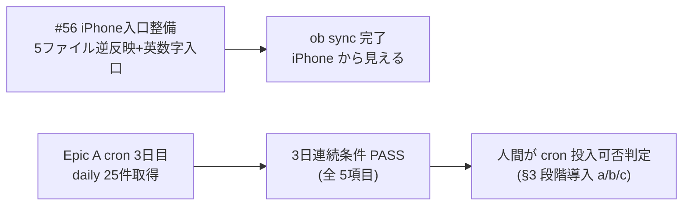

# vloop 一括サマリー 2026-05-23 11:17 サイクル

## 1 枚図サマリー（Issue #43 準拠）



> 用語注: cron = 決まった時刻に自動実行する仕組み / ob sync = iPhone Obsidian との同期コマンド / 段階導入 = research-run → 7日 → idea-run → 7日 → @reboot の順
> 現在地: iPhone から入口ファイルが見える状態 + cron 3 日連続達成（人間判定待ち）→ 次の一手: 人間が cron 投入判断 + ChatGPT が candidate-001 承認 → ゴール: cron 自動化稼働 + approved → progress 投入

## 実行件数

2 作業群（Issue #56 iPhone Obsidian 入口整備 + Epic A cron 移行 3 日連続達成）

## 対象 Epic

- Vault 入口整備（Issue #56 iPhone Obsidian で入口が見えない問題を構造解決）
- Epic A 情報収集基盤（cron 移行 3 日連続条件の最終日 = 達成判定）

## できるようになったこと

- iPhone Obsidian で `00_index.md` / `00_inbox/Vaultの見方_...md` / `20_reviews/ChatGPT承認待ち.md` / `20_reviews/README.md` / `candidate-001_ChatGPT承認パック.md` が見えるようになった（5 ファイル sync-vault 逆反映 + ob sync Fully synced）
- 英数字入口 `00_START_HERE.md` が iPhone Obsidian の検索でヒットしやすい入口として両 Vault に配置された
- obsidian-vault → sync-vault の逆反映ルールがドキュメント化（`03_prompts/同期導線_sync-vault逆反映.md`）
- Epic A cron 移行 3 日連続条件（Issue #47 §1 の 5 項目）が **PASS** で人間判定待ちに到達

## 変更ファイル

| ファイル | 変更 | commit |
|---|---|---|
| 00_START_HERE.md | 新規（英数字入口・iPhone 検索容易性） | e0e564d |
| 03_prompts/同期導線_sync-vault逆反映.md | 新規（逆反映ルール定義） | e0e564d |
| sync-vault 側 5 ファイル | 逆反映（cp + ob sync） | ob sync で iPhone 反映済 |
| 06_research/daily/2026-05-23/（3 新規）+ 2026-05-23_status.md | cron 3 日目記録 | aa4a943 |
| 06_research/logs/research-run-log.md / index.md | 3 日連続達成反映 | aa4a943 |
| 05_monetization/epics.md | Epic A 自動化移行ステータス更新 | aa4a943 |

## commit hash

- e0e564d（Issue #56 iPhone 入口整備）
- aa4a943（Epic A cron 3 日連続達成）
- 本サマリー commit（後続）

## push

e0e564d pushed / aa4a943 pushed / サマリー pushed

## 一括サマリー

`03_prompts/claude-commands/logs/vloop_2026-05-23_1117.md`（本ファイル / commit 後 pushed）

## 成果物紹介

### Issue #56（iPhone Obsidian 入口整備）
- 何ができたか: 構造原因（GitHub 管理 Vault と稼働 Vault が別物・一方向ミラーで逆方向同期がない）を特定し、不在 5 ファイルを sync-vault に逆反映 + 英数字入口を追加 + 逆反映ルールをドキュメント化
- どこで見れるか: iPhone Obsidian で `00_START_HERE` 検索 → 全入口へ [[link]] / `03_prompts/同期導線_sync-vault逆反映.md`（逆反映ルール）
- 何に使うか: ChatGPT が GitHub 直接 commit したファイルを iPhone から見えるようにする運用
- どう使うか: iPhone で `00_START_HERE` → 各入口へ。今後 GitHub 直接 commit があったら Claude が逆反映を実施
- 次に見るファイル: `03_prompts/同期導線_sync-vault逆反映.md` §2 逆反映ルール
- 注意点: 自動同期はまだない（手動運用・将来 cron 双方向 rsync 等を検討）

### Epic A cron 3 日連続達成
- 何ができたか: 5/21・5/22・5/23 の 3 日連続で daily 取得成功・失敗ゼロ・機密ゼロ・規約抵触ゼロ。Issue #47 §1 全 5 項目 PASS
- どこで見れるか: `06_research/daily/2026-05-23/` + `2026-05-23_status.md` / `research-run-log.md` の 3 日連続進捗表 / `epics.md` Epic A
- 何に使うか: 人間が cron 投入判断する根拠
- どう使うか: §3 段階導入（a: research-run 単独 cron → 7 日観察 → b: idea-run 追加 → 7 日観察 → c: @reboot 追加）を人間が判断
- 次に見るファイル: `05_monetization/cron移行判定基準.md` §3 段階導入プロセス
- 注意点: cron 投入は **人間判断**（vloop は判定基準クリアまで・cron 登録はしない）

## 仮説

- Claude による Issue 自動クローズはしない（既存ルール）
- Issue #56: sync-vault と obsidian-vault が別物であることは CLAUDE.local.md に明記された確実な事実。逆反映ルールは新ルールとして定義し、本サイクルで初運用
- ファイル名リネーム（日本語 → 英数字）は破壊的なため避け、英数字エイリアス（00_START_HERE.md）を新規追加で対応
- Epic A cron 3 日目: 本日分 daily は 2 源（HN + iTunes 何切る）で 25 件 = §1 項目 1 クリア。idea-run はスキップ（重複ノイズ回避）。§1 項目 2/3（30 案・candidate）は #48/#49 で評価済（idea_pool 40 案・candidate 安全弁明示）

## 未対応点

- #56 クローズは未実施（AI 自動 close 規約）
- cron 投入そのものは人間判断（VPS crontab 操作）
- Epic C（candidate-001 方向性承認）は ChatGPT + 人間待ち
- research-run / idea-run コマンド本体は未実装
- 残 open Issue 全 56 件にコメント済（前回までの 55 + 新規 1 = 56）

## 停止理由

進められる作業を完了（#56 iPhone 入口整備 + Epic A cron 3 日連続達成）。残りは: Epic A cron 投入判断（人間判断・VPS 操作）/ Epic C（ChatGPT 承認待ち）/ Epic B 各源 n 増（次サイクル）。新ルール「止まってよい場合: Epic の完了条件を満たした / 実行環境がなく物理的に進められない」に該当。

## 次の一手

1. iPhone Obsidian で `00_START_HERE` を検索して開け、各入口（00_index / 承認待ち / 見方ガイド）へ辿れるかユーザーが確認
2. ChatGPT が candidate-001 を方向性承認（candidate-001 approve / hold: 理由 / reject: 理由）
3. cron 移行判定基準 §3 に従い、人間が cron 投入を判断（段階 a: research-run 単独 cron 登録 → 7 日観察）

## ChatGPT レビュー依頼文

```text
以下は Claude Code の vloop 連続実行報告です。レビューしてください。

対象アプリ: company-meta / obsidian-vault
作業: vloop 2026-05-23 11:17 サイクル（Issue #56 iPhone 入口整備 + Epic A cron 3 日連続達成）
GitHub commits: e0e564d（#56）/ aa4a943（cron 3 日目）/ サマリー commit

## できるようになったこと
- iPhone Obsidian から 5 入口ファイルが見えるようになった（sync-vault 逆反映 + 英数字入口）
- Epic A cron 移行 3 日連続条件が PASS で人間判定待ちに到達

## 確認したい観点
- #56 で「obsidian-vault → sync-vault の逆反映」を手動運用とした判断は妥当か（自動化が必要か）
- 英数字入口 00_START_HERE.md を新規追加で対応した判断は妥当か（日本語ファイル名リネームを避けた）
- cron 移行 3 日連続達成（§1 項目 1/4/5/6/7 PASS・項目 2/3 は #48/#49 で評価済）の判断は妥当か
- cron 投入は人間判断（VPS crontab 操作）。次のフェーズ（段階 a: research-run 単独 cron）に進む可否を確認
- iPhone Obsidian で 00_START_HERE 検索が機能するか、ユーザー確認待ち
```

## 関連

- [[../vloop]]（#50 改訂版）
- 前回 vloop サマリー: [[vloop_2026-05-22_2247]]
- 主要成果物: [[../../../00_START_HERE]] / [[../../同期導線_sync-vault逆反映]] / [[../../../06_research/daily/2026-05-23_status]] / [[../../../05_monetization/cron移行判定基準]]
