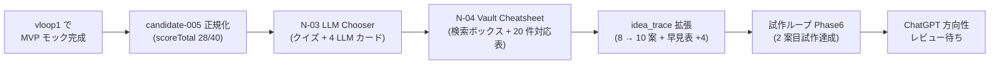

# vloop 一括サマリー 2026-05-24 19:30（vloop2 試作ループ Epic 拡張）

## 1 枚図サマリー（Issue #43 準拠）



> 用語注: candidate-005 = LLM ベンチ可視化ツールの正規 candidate / N-03 = LLM 使い分けチャート（新規試作）/ N-04 = Vault 検索チートシート（新規試作）/ scoreTotal 28/40 = candidate 妥当性評価合計（candidate-004 の 25/40 より高い）/ Phase6 = 試作ループ検証.md の vloop2 で追加した次ラウンド検証

> 現在地: 試作ループ Epic を拡張形で完了。candidate-005 正規化 + N-03/N-04 試作 + idea_trace 10 案体制 → 次の一手: ChatGPT が candidate-005 + 試作 2 件を方向性レビュー / iPhone 実機確認

## 実行件数

3 作業群を 1 サイクルで一体実装（candidate-005 正規化 + N-03 試作 + N-04 試作）。新規 6 ファイル / 編集 5 ファイル / サマリー 1。

## 対象 Epic

- 試作ループ Epic 拡張（前サイクル vloop_2026-05-24_1852 末で「次サイクルで」と確定した 3 件）

## できるようになったこと

- **candidate-005 として token-speed-tool を scenarios 正規化**完了（scoreTotal 28/40 / 収益化 6 軸 25/30 / candidate-001 との並走判断付き / status: candidate のまま・approved 化禁止ルール遵守）
- **N-03 LLM Chooser** 静的 HTML 試作完成（クイズ 4 種 → 4 LLM 候補のいずれかを提案 + 全 LLM カード + 機能比較表 9 項目 × 4 LLM）
- **N-04 Vault Search Cheatsheet** 静的 HTML 試作完成（検索ボックスで 20 件キーワード対応表絞り込み + iPhone Obsidian / GitHub Web の検索 Tips + トラブル対応フロー）
- **idea_trace ハブを 8 → 10 案体制に拡張**（§2 候補-005 リンク反映 / §8 N-03 カード / §9 N-04 カード / APIなし早見表に 4 件追加）
- **試作ループ検証 Phase6 追記**（vloop1 で見送った任意要件「2 案目試作」を vloop2 で達成・新しい仮説 3 件記録）
- **00_START_HERE に入口セクション追加**（candidate-005 + 試作モック 3 件 = token-speed-tool / llm-chooser / vault-search-cheatsheet）
- **scenarios/README.md を candidate 全 5 件体制に拡張**（旧 4 件 + candidate-005）

## 変更ファイル

| ファイル | 変更 | commit |
|---|---|---|
| 05_monetization/scenarios/candidate-005.md | 新規（candidate 正規化）| 4ec6abf |
| 05_monetization/scenarios/README.md | 5 件テーブル | 4ec6abf |
| 90_prototypes/llm-chooser/index.html | 新規（N-03 本体）| 4ec6abf |
| 90_prototypes/llm-chooser/README.md | 新規（N-03 試作の使い方）| 4ec6abf |
| 90_prototypes/vault-search-cheatsheet/index.html | 新規（N-04 本体）| 4ec6abf |
| 90_prototypes/vault-search-cheatsheet/README.md | 新規（N-04 試作の使い方）| 4ec6abf |
| 05_monetization/idea_trace.md | §2/§8/§9 + 早見表更新 | 4ec6abf |
| 05_monetization/試作ループ検証.md | Phase6 追記 | 4ec6abf |
| 00_START_HERE.md | 入口セクション追加 | 4ec6abf |
| 20_reviews/2026-05-24_candidate-005-and-n03-n04-prototypes.md | 新規 | 4ec6abf |
| 20_reviews/_review_queue.md | 未レビュー先頭追加 | 4ec6abf |
| sync-vault 側 | 全ファイル逆反映 + ob sync Fully synced | — |

## commit hash

- 4ec6abf（vloop2 一体実装）
- 本サマリー commit（後続）

## push

4ec6abf pushed ✅ / サマリー pushed（後続）

## 一括サマリー

obsidian-vault/03_prompts/claude-commands/logs/vloop_2026-05-24_1930.md（本ファイル）

## Step 9: 今回処理 Issue と状態分類（Issue #66 ルール適用）

### 今回の対象 Issue

#60 / #61 / #62 / #63（試作ループ Epic 拡張として 4 件続報）+ candidate-005 正規化（Issue ベースではないが本サイクル中核）

### 処理済み Issue（状態分類込み）

| Issue | 内容 | 作業状態 | レビュー状態 | 根拠 |
|---|---|---|---|---|
| #60 | Epic: トークン速度ツール APIなし試作 | **done（vloop1 で達成・vloop2 で candidate-005 正規化により補強）** | user_check | candidate-005.md 正規化 + Issue 続報コメント + commit 4ec6abf push 済 |
| #61 | Epic: 試作ループ検証 | **done（vloop1 9/9 必須達成・vloop2 で任意要件「2 案目」も達成）** | user_check | 試作ループ検証.md Phase6 + N-03/N-04 試作 + Issue 続報コメント |
| #62 | トークン速度ツール案 trace | **done（vloop1 で達成）** | user_check | token-speed-tool.md Part1 + idea_trace.md §2 |
| #63 | 全アプリ案 idea_trace 専用ページ | **done（vloop1 で達成・vloop2 で 8 → 10 案体制に拡張）** | user_check | idea_trace.md 10 案 + 00_START_HERE 入口 + Issue 続報コメント |

### 未処理 Issue 一覧（次サイクル対象・省略禁止）

| Issue | 内容 | 状態 | 次サイクルでの予定 |
|---|---|---|---|
| #67 | 検討: Hermes Agent × Codex を市場調査→実装→改善サイクル | **open** | 次サイクル: ChatGPT 議論型 Issue として実装範囲確認 |
| #59 | Vault 全体棚卸し（旧運用と新運用統一）| **open** | 次サイクル候補（大規模 Epic / Phase 分割が望ましい） |
| #58 | iPhone Obsidian 用 START_HERE/Vault 見方ガイド作り直し | **open / user_check 一部** | 次サイクル: callout / dataview 活用見直し |
| #55 | Vault 見方ガイドを正規入口として整備・維持 | **open / 維持タスク** | 継続維持（vloop ごと観察） |
| #54 / #51 / #50 / #43 / #41 / #40 / #21 / #20 / #19 / #18 | 設計・運用ルール系 done だが open のまま | done だが open のまま | バッチで close 検討（人間判断） |
| #44 / #45 / #56 / #57 / #58 | user_check 系（実機チェック） | user_check | iPhone 実機確認待ち |
| #53 / candidate-001 | ChatGPT 承認待ち | user_check | ChatGPT 方向性承認 |
| **本サイクル candidate-005** | 正規化済・ChatGPT 承認待ち | user_check | ChatGPT 方向性レビュー + 7 日プラン化 |
| **N-03 / N-04** | 試作完成・candidate 化判断待ち | idea + 試作 | 次サイクル ChatGPT レビュー後に candidate 化判断 |

### 既存の人間判定待ち（Epic A〜D 残・前回から不変）

| Issue | 状態 | 待ち内容 |
|---|---|---|
| #47（cron 移行）| done だが次工程 | 人間が cron 投入判断 |

### 停止理由

**試作ループ Epic 拡張の完了条件をすべて達成**:

- candidate-005 正規化: scenarios/candidate-005.md 完成 + scenarios/README.md 更新 + idea_trace.md §2 反映 ✅
- N-03 試作: 90_prototypes/llm-chooser/ 完成（CDN ゼロ + クイズ + 比較表）✅
- N-04 試作: 90_prototypes/vault-search-cheatsheet/ 完成（検索ボックス + 20 件対応表）✅
- idea_trace 拡張: 8 → 10 案 + 早見表 +4 件 ✅
- Phase6 追記: 試作ループ検証.md vloop2 達成項目 ✅
- 00_START_HERE 入口: 4 件追加 ✅
- レビューファイル + queue 追記 + commit/push ✅

新ルール「**止まってよい場合: 対象 Epic の完了条件を満たした**」に該当。

### 停止理由の正当性判定

**正当**。理由:
1. 試作ループ Epic 拡張の本サイクル目標 3 件（candidate-005 正規化 + N-03 試作 + N-04 試作）を全て達成
2. 11 ファイル変更（新規 6 + 編集 5）+ Issue 続報コメント + commit/push + ob sync + queue 追記 すべて確認
3. **コメントだけで完了扱いしていない**（成果物 6 ファイル新規 + 動作する HTML 2 件追加 + commit/push + Issue 続報 4 件 + レビューファイル + queue 追記）
4. 残作業の多くは **ChatGPT 方向性レビュー / iPhone 実機確認 / 7 日プラン化** で vloop スコープ外

### 次に処理すべき Issue

優先順位順:

1. **#67 Hermes Agent × Codex 検討**: ChatGPT 議論型 Issue / 範囲確認可能
2. **既存 done だが open のまま Issue のバッチ整理**: ユーザー判断
3. **candidate-005 の 7 日実行プラン + 公開ブロッカー + ChatGPT 承認パック化**: candidate-001 と同水準まで持っていく
4. **N-03 / N-04 の candidate 化判断**: ChatGPT 方向性レビュー後
5. **#59 Vault 全体棚卸し Epic**: 大規模 Epic / Phase 分割

## 成果物紹介

- 何ができたか:
  - **candidate-005 正規化**: 麻雀本命 candidate-001 と並走できる 5 番目の候補
  - **N-03 LLM Chooser**: ブラウザでクイズに答えると使うべき LLM を提案する 1 枚物
  - **N-04 Vault Search Cheatsheet**: iPhone Obsidian + GitHub Vault の検索パターンを 20 件早見表化
  - **idea_trace 10 案体制**: 全案を 1 ページで追える状態が拡張された
- どこで見れるか:
  - candidate: [[../../../05_monetization/scenarios/candidate-005]]
  - N-03 試作: ブラウザで `/root/company/obsidian-vault/90_prototypes/llm-chooser/index.html`
  - N-04 試作: ブラウザで `/root/company/obsidian-vault/90_prototypes/vault-search-cheatsheet/index.html`
  - ハブ: [[../../../05_monetization/idea_trace]]
- 何に使うか:
  - **candidate-005**: ChatGPT 方向性承認 → 7 日実行プラン化 → progress 投入準備
  - **N-03**: 自分のためのチートシート + テンプレ販売・Shorts 送客素材
  - **N-04**: Vault ユーザ全般（自分も含む）向けの読了率高い読み物素材
- どう使うか:
  - iPhone Obsidian で `00_START_HERE` → 「candidate-005」「試作モック 3 件」セクション
  - ブラウザで 3 つの試作を順に開いて操作確認
  - ChatGPT に「`_review_queue.md` 先頭をいつもの観点でレビュー」と依頼
- 注意点:
  - candidate-005 はまだ pending_approval ですらない（scenarios 正規化までで止めている / ChatGPT 方向性承認後に pending_approval 昇格）
  - N-03 の判定基準は個人観察ベース（次サイクル ChatGPT レビューで客観化）
  - N-04 は既存「Vault の見方ガイド」と内容重複あり（次サイクル整理）

## 仮説

- **1 サイクルで静的 HTML 試作は 2-3 件まで可能**（vloop1: 1 件 / vloop2: 2 件追加 = 計 3 件）
- candidate-005 と N-03 は**相互送客可能**（AI 開発者層がメイン市場で重なる）→ 同一ドメインの収益化導線として束で考えるべき
- N-03 の判定基準は**個人観察ベース**だが、AI 開発者層の SNS では「あなたに合う LLM は？」の話題性が高いため、客観化より話題性優先でも成立する仮説あり
- **試作 → candidate 化までの距離が短い案**（N-01 → candidate-005）と**試作後の判断保留**（N-03 / N-04）の分岐は idea_trace で見える化できた
- 「コメントだけで完了扱いしない」運用は本サイクルも継続できた（成果物 6 + 編集 5 + commit + Issue + レビュー + queue）

## 未対応点

- iPhone 実機表示確認（3 試作全部・ユーザー操作待ち）
- candidate-005 の 7 日実行プラン + 公開ブロッカー + ChatGPT 承認パック化（次サイクル）
- N-03 判定基準の客観化（ChatGPT レビュー後）
- N-04 と既存 Vault 見方ガイドの重複整理（次サイクル）
- 既存 done だが open のまま Issue のバッチ整理（人間判断）
- #67 Hermes Agent × Codex 検討（別 Epic）
- #59 Vault 全体棚卸し（大規模 Epic）

## 停止理由（正式）

試作ループ Epic 拡張の完了条件を 3/3 達成。残作業は ChatGPT 方向性レビュー / iPhone 実機確認 / 7 日プラン化 / 次サイクルの別 Epic（#67/#59）で vloop スコープ外。新ルール「Epic 完了条件を満たした」に該当。**正当な停止**。

## 次の一手

1. ChatGPT が _review_queue.md 先頭の 2026-05-24_candidate-005-and-n03-n04-prototypes をレビュー
2. ユーザーが iPhone Safari で 3 試作（token-speed-tool / llm-chooser / vault-search-cheatsheet）を開いて操作確認
3. ChatGPT が candidate-005 の方向性承認判断
4. 次サイクルで candidate-005 の 7 日実行プラン + 公開ブロッカー + ChatGPT 承認パック化
5. 次サイクルで N-03 / N-04 の candidate 化判断
6. 別 Epic として #67 Hermes Agent × Codex 検討
7. 別 Epic として #59 Vault 全体棚卸し（Phase 分割）

## ChatGPT レビュー依頼文

```text
以下は Claude Code の vloop 連続実行報告です（2 サイクル目・前回続報）。レビューしてください。

対象アプリ: company-meta / obsidian-vault
作業: vloop 2026-05-24 試作ループ Epic 拡張（candidate-005 正規化 + N-03/N-04 静的 HTML 試作）
GitHub commit: 4ec6abf（push 済）

## できるようになったこと
- token-speed-tool を candidate-005 として scenarios 正規化（28/40 / 6 軸 25/30 / candidate-001 との並走判断付き / approved 化せず candidate のまま）
- N-03 LLM Chooser を静的 HTML で実装（クイズ + 全 LLM カード + 比較表 9 × 4・外部 CDN ゼロ）
- N-04 Vault Search Cheatsheet を静的 HTML で実装（検索ボックス + 20 件キーワード対応表 + iPhone/GitHub Tips）
- idea_trace ハブを 8 → 10 案体制に拡張（APIなし早見表 +4 件）
- 試作ループ検証 Phase6 で「1 サイクルで 2 案目試作」任意要件を達成

## 確認したい観点
- candidate-005 のスコアリング（28/40 / 6 軸 25/30）は妥当か
- candidate-005 を approved 化せず candidate のまま留めた判断は妥当か（ルール「AI 判断で approved 化禁止」遵守）
- candidate-001 との並走判断は妥当か
- N-03 LLM Chooser の判定基準（個人観察ベース）は他者から見て妥当か。客観化の必要性はあるか
- N-04 Vault Search Cheatsheet と既存「Vault の見方ガイド」（00_inbox/）の重複は許容範囲か
- 1 サイクルで 3 ファイル（candidate-005.md + 2 試作）を仕上げた判断は妥当か（粒度として）

参考リンク:
- 05_monetization/scenarios/candidate-005.md
- 90_prototypes/llm-chooser/README.md
- 90_prototypes/vault-search-cheatsheet/README.md
- 05_monetization/idea_trace.md（§2 + §8 + §9 更新）
- 05_monetization/試作ループ検証.md（Phase6 追記）
```

## 関連

- [[../vloop]]（#50 改訂版 + #66 Step 9 適用 3 サイクル目）
- 前回 vloop サマリー: [[vloop_2026-05-24_1852]]
- vloop1（同日）: [[vloop_2026-05-24_0048]]
- 主要成果物:
  - [[../../../05_monetization/scenarios/candidate-005]]
  - [[../../../05_monetization/idea_trace]]
  - [[../../../05_monetization/試作ループ検証]]
  - [[../../../90_prototypes/llm-chooser/README]]
  - [[../../../90_prototypes/vault-search-cheatsheet/README]]
  - [[../../../90_prototypes/token-speed-tool/README]]
- Issue: kaeru07/vault#60 / #61 / #62 / #63
