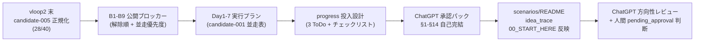

# vloop 一括サマリー 2026-05-24 20:02（vloop3 / candidate-005 承認材料完備）

## 1 枚図サマリー（Issue #43 準拠）



> 用語注: pending_approval = ChatGPT 方向性承認待ちステータス（candidate と approved の間）/ 承認パック = ChatGPT が方向性判断するための自己完結文書 / 並走 = candidate-001 と candidate-005 を同時に進める運用 / B1-B9 = candidate-005 の公開ブロッカー 9 種

> 現在地: candidate-005 を candidate-001 と同水準の承認材料 4 ファイル完備。**status: candidate のまま（approved 化禁止ルール遵守）**。次の一手: ChatGPT が方向性レビュー → 人間が pending_approval 昇格判断 → ChatGPT 承認待ち.md に追加

## 実行件数

1 Epic（candidate-005 承認材料完備）として 4 補助ファイル + 3 反映ファイル + サマリー = **計 8 件** を一体実装。

## 対象 Epic

- candidate-005 承認材料完備 Epic（vloop2 末「次サイクル候補」として確定済）

## できるようになったこと

- **candidate-005 が candidate-001 と同水準の承認材料 4 ファイル完備**:
  - 公開ブロッカー B1-B9（推奨解除順 + candidate-001 並走時の優先度）
  - 7 日実行プラン Day1-7（candidate-001 との並走スケジュール表）
  - progress 投入設計（ExecutionRun フォーマット + 最初の 3 ToDo + 投入チェックリスト）
  - ChatGPT 承認パック §1-§14（自己完結 / 比較 / メリデメ / 30 日プラン / 並走判断 / 質問観点 6+3 件）
- **candidate-001 と candidate-005 の並走スケジュール表**で Day1-7 の同時進行可能性が見える化
- **status は candidate のまま**（pending_approval にも approved にも上げていない / ChatGPT 承認待ち.md にも追加していない）→ ルール「AI 判断で approved 化禁止」厳守
- scenarios/README に candidate-005 補助ファイルセクション追加（candidate-001 と並列の構造）
- idea_trace §2 のリンク欄拡張 + 判断履歴に vloop3 追記
- 00_START_HERE candidate-005 セクションに承認材料 4 件のリンク追加 → iPhone Obsidian からも 1 タップで辿れる

## 変更ファイル

| ファイル | 変更 | commit |
|---|---|---|
| 05_monetization/scenarios/candidate-005_公開ブロッカー.md | 新規 | 2a4117b |
| 05_monetization/scenarios/candidate-005_7日実行プラン.md | 新規 | 2a4117b |
| 05_monetization/scenarios/candidate-005_progress投入設計.md | 新規 | 2a4117b |
| 20_reviews/candidate-005_ChatGPT承認パック.md | 新規 | 2a4117b |
| 05_monetization/scenarios/README.md | candidate-005 補助ファイルセクション追加 | 2a4117b |
| 05_monetization/idea_trace.md | §2 リンク欄 + 判断履歴 更新 | 2a4117b |
| 00_START_HERE.md | candidate-005 セクション拡張 | 2a4117b |
| 20_reviews/2026-05-24_candidate-005-approval-pack.md | 新規 | 2a4117b |
| 20_reviews/_review_queue.md | 未レビュー先頭追加 | 2a4117b |
| sync-vault 側 | 全ファイル逆反映 + ob sync Fully synced | — |

## commit hash

- 2a4117b（vloop3 一体実装）
- 本サマリー commit（後続）

## push

2a4117b pushed ✅ / サマリー pushed（後続）

## 一括サマリー

obsidian-vault/03_prompts/claude-commands/logs/vloop_2026-05-24_2002.md（本ファイル）

## Step 9: 今回処理 Issue と状態分類（Issue #66 ルール適用）

### 今回の対象 Issue

#60（Epic: トークン速度ツール APIなし試作）を主軸として、candidate-005 を承認可能水準まで仕上げる。

### 処理済み Issue（状態分類込み）

| Issue | 内容 | 作業状態 | レビュー状態 | 根拠 |
|---|---|---|---|---|
| #60 | Epic: トークン速度ツール APIなし試作 | **done（vloop1 試作 + vloop2 正規化 + vloop3 承認材料完備で完全達成）** | user_check | 承認材料 4 ファイル完備 + Issue 続報コメント 3 件 + commit 2a4117b push 済 |

### 未処理 Issue 一覧（次サイクル対象・省略禁止）

| Issue | 内容 | 状態 | 次サイクルでの予定 |
|---|---|---|---|
| #61 | Epic: 試作ループ検証 | done（vloop1+vloop2 で完了）| 次サイクル: candidate 化判断（N-03/N-04）と 3 案目（N-12 麻雀役チートシート等）の検討 |
| #62 | トークン速度ツール案 trace | done（vloop1+vloop2）| close 候補 |
| #63 | 全アプリ案 idea_trace 専用ページ | done（vloop1+vloop2）| close 候補 |
| #67 | 検討: Hermes Agent × Codex を市場調査→実装→改善サイクル | **open** | 次サイクル: ChatGPT 議論型 Issue として実装範囲確認 |
| #59 | Vault 全体棚卸し（旧運用と新運用統一）| **open** | 次サイクル候補（大規模 Epic / Phase 分割が望ましい）|
| #58 / #56 / #57 | iPhone Obsidian 系 user_check | user_check | iPhone 実機確認待ち |
| #54 / #51 / #50 / #43 / #41 / #40 / #21 / #20 / #19 / #18 等 | 設計・運用ルール系 done だが open | done だが open | バッチ close 検討（人間判断）|

### 既存の人間判定待ち（Epic A〜D 残）

| Issue | 状態 | 待ち内容 |
|---|---|---|
| #47（cron 移行）| done だが次工程 | 人間が cron 投入判断 |
| candidate-001 | chatgpt_pending | ChatGPT 方向性承認 |
| **candidate-005（本サイクルで完備）** | **chatgpt_pending 直前** | ChatGPT 方向性レビュー + 人間 pending_approval 昇格判断 |

### 停止理由

**candidate-005 承認材料完備 Epic の完了条件をすべて達成**:

- 公開ブロッカー（B1-B9）整理 ✅
- 7 日実行プラン（Day1-7 + 並走表）✅
- progress 投入設計（フォーマット + 3 ToDo + チェックリスト）✅
- ChatGPT 承認パック（§1-§14 自己完結）✅
- scenarios/README + idea_trace + 00_START_HERE 反映 ✅
- レビューファイル + queue 追記 + commit/push ✅

次の一手は **ChatGPT 方向性レビュー / 人間 pending_approval 昇格判断 / ChatGPT 承認待ち.md 追加** で**vloop スコープ外**（AI 判断で pending_approval / approved 化禁止）。

新ルール「**止まってよい場合: Epic 完了条件を満たした / 認証情報・課金・外部公開など人間判断が必要**」に該当。

### 停止理由の正当性判定

**正当**。理由:
1. candidate-005 承認材料 4 ファイル + 3 反映ファイル + サマリー = 8 件すべて達成
2. status を candidate のままに保持（**AI 判断で pending_approval / approved 化禁止**ルール厳守）
3. ChatGPT 承認待ち.md への追加も**意図的に保留**（pending_approval 昇格は人間判断後）
4. **コメントだけで完了扱いしていない**（成果物 4 新規 + 3 編集 + commit/push + Issue コメント + レビューファイル + queue 追記）
5. 残作業は **ChatGPT 方向性レビュー / 人間判断 / 公開承認** で vloop スコープ外

### 次に処理すべき Issue

優先順位順:

1. **candidate-005 の人間 pending_approval 昇格判断**（ChatGPT レビュー後）
2. **candidate-005 を ChatGPT 承認待ち.md に追加**（Claude が実施可・pending_approval 昇格後）
3. **#67 Hermes Agent × Codex 検討**: 別 Epic
4. **#59 Vault 全体棚卸し**: 大規模 Epic / Phase 分割
5. **既存 done だが open のまま Issue のバッチ整理**: 人間判断
6. **N-03 / N-04 の candidate 化判断**: ChatGPT レビュー後
7. **候補-001 と candidate-005 の同時 approved 後の並走実行**: progress 投入

## 成果物紹介

- 何ができたか:
  - **candidate-005 が「ChatGPT に方向性判断を依頼できる状態」に到達**（承認パック §1-§14 自己完結）
  - candidate-001 と candidate-005 の**並走スケジュール表**で Day1-7 の同時進行可能性が見える化
  - 4 補助ファイル + 3 反映ファイル + サマリーで、ChatGPT / 人間が読みやすい構造
- どこで見れるか:
  - 主要入口: [[../../../00_START_HERE]] § candidate-005 セクション
  - 承認パック: [[../../../20_reviews/candidate-005_ChatGPT承認パック]]
  - 補助 3 件: [[../../../05_monetization/scenarios/candidate-005_公開ブロッカー]] / [[../../../05_monetization/scenarios/candidate-005_7日実行プラン]] / [[../../../05_monetization/scenarios/candidate-005_progress投入設計]]
  - 索引: [[../../../05_monetization/scenarios/README]] §candidate-005 補助ファイル
- 何に使うか:
  - **ChatGPT 方向性レビュー**: 承認パック §1-§14 を読んで approve / hold / reject の判断
  - **人間 pending_approval 昇格判断**: ChatGPT レビュー結果を踏まえて status 確定
  - **approved 後の progress 投入**: progress 投入設計の最初の 3 ToDo を人間が投入
- どう使うか:
  - iPhone Obsidian で `00_START_HERE` → 「candidate-005（承認材料 4 ファイル完備）」セクションをタップ → 承認パックへ
  - ChatGPT に「`_review_queue.md` 先頭をいつもの観点でレビュー」と依頼
  - 承認パック §14 の質問観点 6 件 + 加えて 3 件を確認観点として渡す
- 注意点:
  - candidate-005 は依然として `status: candidate`（pending_approval にも approved にも上げていない）
  - ChatGPT 承認待ち.md にはまだ追加していない（pending_approval 昇格は人間判断後）
  - iPhone 実機表示は未確認（B1 / ユーザー操作待ち）

## 仮説

- **承認材料の標準形式（4 ファイル = 公開ブロッカー / 7 日プラン / progress 投入 / 承認パック）** が candidate ごとに再利用可能なテンプレートになった
- candidate-001（既存実装）と candidate-005（新規 MVP）で**ブロッカー構成が異なる**（candidate-001 は build 検証 / candidate-005 はデプロイ + コンテンツ蓄積）→ 補助ファイル形式は揃えつつ中身は個別化が正解
- **並走スケジュール表**は ChatGPT に「両方承認していいか」を判断させやすい形式
- ChatGPT 承認パック §14 の「質問観点」セクションは ChatGPT の判断速度を上げる効果がある仮説
- 「pending_approval にも上げない」運用は AI と人間の責任分界を明確にする

## 未対応点

- ChatGPT 方向性レビュー（_review_queue.md 先頭）
- 人間 pending_approval 昇格判断
- ChatGPT 承認待ち.md への candidate-005 ブロック追加（昇格後・Claude が実施可）
- iPhone 実機表示確認（3 試作 + 承認パック / ユーザー操作）
- approved 後の最初の 3 ToDo progress 投入（人間操作）
- N-03 / N-04 candidate 化判断（次サイクル）
- #67 / #59 等の別 Epic 着手（次サイクル）

## 停止理由（正式）

candidate-005 承認材料完備 Epic の完了条件を 6/6 達成。残作業は ChatGPT 方向性レビュー / 人間 pending_approval 昇格判断 / 公開承認で **vloop スコープ外**（AI 判断で pending_approval / approved 化禁止ルール）。新ルール「Epic 完了条件を満たした / 認証情報・課金・外部公開など人間判断が必要」に該当。**正当な停止**。

## 次の一手

1. ChatGPT が _review_queue.md 先頭の 2026-05-24_candidate-005-approval-pack をレビュー
2. ChatGPT が candidate-005_ChatGPT承認パック §1-§14 で方向性判断（approve / hold / reject）
3. 人間が pending_approval 昇格判断 → decision-log 追記
4. 昇格後、Claude が ChatGPT 承認待ち.md に candidate-005 ブロック追加
5. 人間 approved 化 → progress 投入（最初の 3 ToDo）
6. Day1 から 7 日プランで実行（candidate-001 と並走）
7. 次サイクル: #67 Hermes Agent × Codex 検討 / #59 Vault 全体棚卸し

## ChatGPT レビュー依頼文

```text
以下は Claude Code の vloop 連続実行報告です（3 サイクル目・本日 3 回目）。レビューしてください。

対象アプリ: company-meta / obsidian-vault
作業: vloop 2026-05-24 candidate-005 承認材料 4 ファイル完備（candidate-001 と同水準）
GitHub commit: 2a4117b（push 済）

## できるようになったこと
- candidate-005 が candidate-001 と同水準の承認判断材料 4 ファイルを揃えた
- 公開ブロッカー B1-B9 / 7 日プラン Day1-7（並走表）/ progress 投入設計 / ChatGPT 承認パック §1-§14
- status は依然として candidate のまま（pending_approval にも approved にも上げていない）

## 確認したい観点（承認パック §14 と同じ）
1. candidate-005 を candidate-001 と並走させる判断は妥当か
2. scoreTotal 28 / 6 軸 25/30 のスコアリングは妥当か
3. 体感スコア計算式の重みは妥当か
4. AI 開発者層を主市場に据えた判断は妥当か
5. B9 公開ベンチ取り込みルール（手動 + 出典必須）は十分か
6. ChatGPT 承認 → 人間 approved 判断の流れは本ケースでも適用可か

## 加えて確認したい観点
7. candidate-005 を pending_approval に上げる準備は整ったか
8. candidate-001（5 ファイル）と candidate-005（4 ファイル）の差は妥当か
9. 並走スケジュール（Day1-7 / 7 日プラン §並走スケジュール）の Day3-6 並行可能と判断したのは妥当か

参考リンク:
- 20_reviews/candidate-005_ChatGPT承認パック.md（§1-§14 自己完結 / これ単体で判断可）
- 05_monetization/scenarios/candidate-005_公開ブロッカー.md
- 05_monetization/scenarios/candidate-005_7日実行プラン.md
- 05_monetization/scenarios/candidate-005_progress投入設計.md
- 00_START_HERE.md（candidate-005 セクション）
```

## 関連

- [[../vloop]]（#50 改訂版 + #66 Step 9 適用 4 サイクル目）
- 前回 vloop サマリー: [[vloop_2026-05-24_1930]]（vloop2）
- vloop1（同日朝）: [[vloop_2026-05-24_0048]]
- vloop1 続編: [[vloop_2026-05-24_1852]]
- 主要成果物:
  - [[../../../20_reviews/candidate-005_ChatGPT承認パック]]
  - [[../../../05_monetization/scenarios/candidate-005_公開ブロッカー]]
  - [[../../../05_monetization/scenarios/candidate-005_7日実行プラン]]
  - [[../../../05_monetization/scenarios/candidate-005_progress投入設計]]
  - [[../../../05_monetization/scenarios/candidate-005]]
- Issue: kaeru07/vault#60（前提 #61 / #62 / #63）
