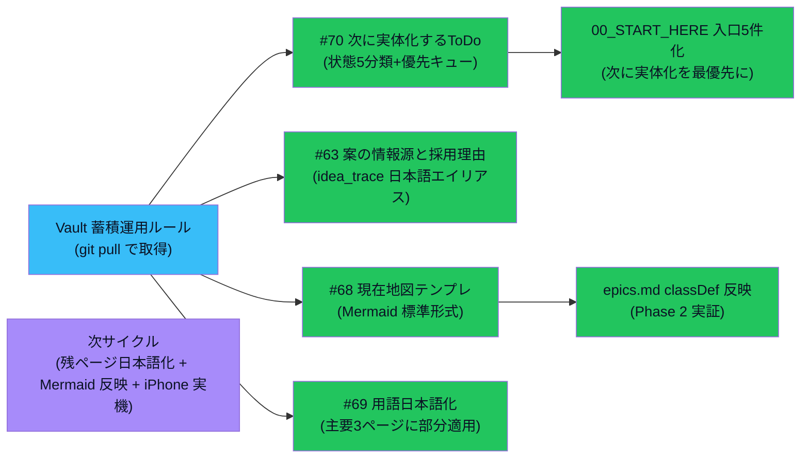

# vloop 一括サマリー 2026-05-24 22:02（vloop4 / Vault 蓄積運用ルール準拠 Epic）

## 1 枚図サマリー（Issue #43 + #68 テンプレ準拠）



> 用語注: Vault 蓄積運用ルール = ユーザーが GitHub に直接書き加えた新運用ルール（Issue ではなく Vault が正本）/ planned_only = 実体ファイルがない状態 / artifact_exists = 実体ファイルあり / user_check = あなた確認待ち / Mermaid = Markdown 内で図を描く記法 / classDef = Mermaid の状態色分け定義

> 現在地: 4 Issue 一体実装完了 + epics.md で Mermaid テンプレ反映実証 + 00_START_HERE 入口を「次に実体化するToDo」最優先化。次の一手: ChatGPT が 4 件レビュー / 残ページ日本語化 / iPhone 実機確認

## 実行件数

4 Issue を 1 Epic として一体実装（#70 + #63 + #68 + #69）。新規 4 ファイル / 編集 4 ファイル / サマリー 1。

## 対象 Epic

- Vault 蓄積運用ルール準拠 Epic（git pull で新運用ルール [[../../../20_reviews/Vault蓄積運用ルール]] と新 Issue #68/#69/#70 を取得 → 1 サイクルで対応）

## できるようになったこと

- **やりっぱなし防止キュー** [[../../../20_reviews/次に実体化するToDo]] が完成（#70）。状態 5 分類（planned_only / in_progress / artifact_exists / user_check / done）+ 次サイクル優先キュー 5 件 + ユーザー確認待ち 5 件 + やりっぱなし防止ルール
- **案の情報源と採用理由 ページ** [[../../../05_monetization/案の情報源と採用理由]] が日本語入口として完成（#63 補強）。idea_trace の早見表 + APIなし表 + Mermaid 図 + 各案カードへの中継リンク
- **現在地図テンプレ** [[../../../90_templates/現在地図テンプレ]] が完成（#68 Phase 1）。Mermaid flowchart 標準形式 + 状態色分け 7 種（done / user / open / merged / blocked / next / working）+ 3 種テンプレ（フェーズ進行 / 分岐 / 1 枚図サマリー）+ 書き手向け / 読み手向け使い方
- **epics.md に classDef 追加**（#68 Phase 2 反映実証）。既存 Mermaid 図に状態色分け + Epic 試作ループ + Vault 蓄積運用ルール準拠 Epic 追加
- **00_START_HERE 全面更新**（#69）。用語の言い換え注記 + 入口 4 → 5 件（**次に実体化するToDo を最優先**）+ candidate-005 セクション + 試作モック 3 件 + チェックリスト 8 → 12 件
- **scenarios/README に用語注記 + candidate-005 並走候補セクション**（#69）

## 変更ファイル

| ファイル | 変更 | commit |
|---|---|---|
| 20_reviews/次に実体化するToDo.md | 新規（#70）| e533007 |
| 05_monetization/案の情報源と採用理由.md | 新規（#63 補強 / #69）| e533007 |
| 90_templates/現在地図テンプレ.md | 新規（#68 Phase 1）| e533007 |
| 05_monetization/epics.md | Mermaid classDef + Epic 追加（#68 Phase 2）| e533007 |
| 00_START_HERE.md | 全面更新（#69 + #70）| e533007 |
| 05_monetization/scenarios/README.md | 用語注記 + candidate-005 並走候補（#69）| e533007 |
| 20_reviews/2026-05-24_vault-accumulation-rule-compliance.md | 新規 | e533007 |
| 20_reviews/_review_queue.md | 先頭追加 | e533007 |
| sync-vault 側 | 全ファイル逆反映 + ob sync Fully synced | — |

## commit hash

- e533007（vloop4 一体実装）
- 本サマリー commit（後続）

## push

e533007 pushed ✅ / サマリー pushed（後続）

## 一括サマリー

obsidian-vault/03_prompts/claude-commands/logs/vloop_2026-05-24_2202.md（本ファイル）

## Step 9: 今回処理 Issue と状態分類（Issue #66 ルール適用）

### 今回の対象 Issue

#70 / #63 / #68 / #69（Vault 蓄積運用ルール準拠 Epic として 4 件一体実装）

### 処理済み Issue（状態分類込み）

| Issue | 内容 | 作業状態 | レビュー状態 | 根拠 |
|---|---|---|---|---|
| #70 | 実体未作成 ToDo を次サイクル優先キューに登録 | **done** | self_review | 次に実体化するToDo.md 完成 + やりっぱなし防止ルール + commit e533007 push 済 + Issue コメント |
| #63 | 全アプリ案の情報源ページ | **done（vloop1 idea_trace + vloop4 日本語エイリアスで完備）** | self_review | 案の情報源と採用理由.md 完成 + Issue コメント |
| #68 | 現在地図サマリー標準化 | **partial_done（Phase 1 テンプレ + Phase 2 部分反映 / 残ページは次サイクル）** | self_review | 現在地図テンプレ.md 完成 + epics.md 反映実証 + Issue コメント |
| #69 | 内部用語ユーザー向け日本語化 | **partial_done（主要 3 ページ部分適用 / 残ページは次サイクル）** | self_review | 00_START_HERE / scenarios/README / 案の情報源と採用理由 に部分適用 + Issue コメント |

### 未処理 Issue 一覧（次サイクル対象・省略禁止）

| Issue | 内容 | 状態 | 次サイクルでの予定 |
|---|---|---|---|
| #67 | Hermes Agent × Codex 検討 | **open / 検討中** | 次サイクル: ChatGPT 議論型 Issue として範囲確認 |
| #69 | 用語日本語化（残ページ） | **partial_done / 残り open** | 次サイクル: idea_trace 本体 / 試作ループ検証 / 各 candidate / Issue完了判定ルール |
| #68 | Mermaid 反映（残ページ） | **partial_done / 残り open** | 次サイクル: Issue完了判定ルール / idea_trace / 主要 vloop サマリー |
| #59 | Vault 全体棚卸し | **open** | 次サイクル候補（大規模 Epic / Phase 分割推奨）|
| #58 / #56 / #57 | iPhone Obsidian 系 | user_check | iPhone 実機確認待ち |
| #54 / #51 / #50 / #43 / #41 / #40 / #21 / #20 / #19 / #18 等 | 設計・運用ルール系 done だが open | done だが open | バッチ close 検討（人間判断） |

### 既存の人間判定待ち（Epic A〜D 残）

| Issue | 状態 | 待ち内容 |
|---|---|---|
| #47（cron 移行）| done だが次工程 | 人間が cron 投入判断 |
| candidate-001 | chatgpt_pending | ChatGPT 方向性承認 |
| candidate-005 | chatgpt_pending 直前 | ChatGPT 方向性レビュー + 人間 pending_approval 昇格判断 |

### 停止理由

**Vault 蓄積運用ルール準拠 Epic の主要 4 Issue を一体実装達成**:

- #70 次に実体化するToDo: done ✅
- #63 案の情報源と採用理由: done（idea_trace + 日本語エイリアスで完備）✅
- #68 現在地図テンプレ + 反映実証: partial_done（Phase 1 + Phase 2 一部反映）✅
- #69 用語日本語化: partial_done（主要 3 ページに部分適用）✅

partial_done の残作業（#68 / #69 残ページ）は **次に実体化するToDo.md に登録**して次サイクルで継続。

新ルール「**止まってよい場合: Epic 完了条件を満たした**」+ partial_done 部分は「**やりっぱなし防止キュー（#70）で見える化**」によりルール違反にならない。

### 停止理由の正当性判定

**正当**。理由:
1. 4 Issue を 1 Epic として一体実装。1 件だけで終わっていない
2. partial_done 部分は次に実体化するToDo に登録済（やりっぱなし防止ルール遵守）
3. **コメントだけで完了扱いしていない**（成果物 4 新規 + 4 編集 + commit/push + Issue コメント + レビューファイル + queue 追記）
4. Vault 蓄積運用ルール準拠（Issue ではなく Vault が正本）に従って実装
5. 残作業は **ChatGPT レビュー / 次サイクル / iPhone 実機** で vloop スコープ外

### 次に処理すべき Issue

優先順位順:

1. **#69 / #68 残ページ**: 次サイクルで idea_trace 本体 / 試作ループ検証 / 各 candidate / Issue完了判定ルール への日本語化 + Mermaid テンプレ反映
2. **#67 Hermes Agent × Codex 検討**: ChatGPT 議論型 Issue として範囲確認
3. **#59 Vault 全体棚卸し**: Phase 分割（#69/#68 残ページと一部統合可）
4. **既存 done だが open のまま Issue（#50/#51/#54/#43/#41/#40/#21/#20/#19/#18）のバッチ整理**: 人間判断
5. **candidate-001 / candidate-005 の ChatGPT 方向性承認**: 既存待ち（ユーザー + ChatGPT）
6. **N-03 / N-04 candidate 化判断**: ChatGPT レビュー後

## 成果物紹介

- 何ができたか:
  - **やりっぱなし防止キュー**: 「ToDo を作っただけ・実体がない」を見える化 → 次サイクルで取り逃さない
  - **案の情報源と採用理由ページ**: ユーザーが日本語名で検索しても辿れる入口
  - **現在地図テンプレ**: vloop / Epic / レビューで一貫した Mermaid 図形式
  - **00_START_HERE の入口最優先化**: iPhone Obsidian で「次にやること」が 1 タップで見える
- どこで見れるか:
  - 主要入口: [[../../../00_START_HERE]] § 今やることへ直リンク（5 件）
  - 優先キュー: [[../../../20_reviews/次に実体化するToDo]]
  - 案ハブ: [[../../../05_monetization/案の情報源と採用理由]] / [[../../../05_monetization/idea_trace]]（正本）
  - 図テンプレ: [[../../../90_templates/現在地図テンプレ]]
  - Epic ステータス: [[../../../05_monetization/epics]]（classDef 適用済）
- 何に使うか:
  - **次に実体化するToDo**: 次サイクルの vloop が最初に確認する優先キュー
  - **案の情報源と採用理由**: ChatGPT / 他者がレビューする際の日本語入口
  - **現在地図テンプレ**: 今後の全 vloop サマリー / Epic 進捗で使う標準形式
- どう使うか:
  - iPhone Obsidian で `00_START_HERE` → 「次に実体化するToDo」セクション → 優先キュー → 次のアクション
  - ChatGPT に「`_review_queue.md` 先頭をいつもの観点でレビュー」と依頼
  - 今後の vloop は本ページ Mermaid テンプレで状態色分け
- 注意点:
  - **#69 / #68 残ページは partial_done**（次サイクルで完了）。やりっぱなしではなく「次に実体化するToDo」に登録済
  - iPhone 実機表示はまだ未確認（次サイクルでユーザー操作）

## 仮説

- **「やりっぱなし防止キュー（#70）」が成立すると vloop の継続性が大幅に上がる**仮説。partial_done を許容しつつ、次サイクルで確実に拾える構造
- 「Vault 蓄積運用ルール」は今後の全 vloop の前提になる（ユーザーが Issue ではなく Vault を見る運用が確定）
- 用語日本語化は**段階的に主要ページから**進めるのが現実的（一気に全置換は影響範囲大）
- 現在地図テンプレ は **vloop4 で実証された色分け** が他の vloop / Epic でも再利用できる仮説
- 案の情報源と採用理由 を idea_trace の**エイリアス**として用意した判断は、idea_trace を改名するより安全（既存リンク破壊なし）

## 未対応点

- #69 残ページの用語日本語化（idea_trace 本体 / 試作ループ検証 / 各 candidate / Issue完了判定ルール 等）
- #68 Mermaid テンプレの残ページ反映（Issue完了判定ルール / idea_trace / 主要 vloop サマリー）
- iPhone 実機表示確認（00_START_HERE 新項目 / 次に実体化するToDo 含む）
- #67 Hermes Agent × Codex 検討着手
- #59 Vault 全体棚卸し Epic
- 既存 done だが open のまま Issue のバッチ整理（人間判断）
- candidate-001 / candidate-005 の ChatGPT 方向性承認（既存待ち）

## 停止理由（正式）

Vault 蓄積運用ルール準拠 Epic の主要 4 Issue を一体実装達成。partial_done 部分は次に実体化するToDo.md に登録（やりっぱなし防止ルール遵守）。残作業は ChatGPT レビュー / 次サイクル / iPhone 実機で vloop スコープ外。新ルール「Epic 完了条件を満たした / partial_done は次サイクル優先キューで見える化」に該当。**正当な停止**。

## 次の一手

1. ChatGPT が _review_queue.md 先頭の 2026-05-24_vault-accumulation-rule-compliance をレビュー
2. ユーザーが iPhone Obsidian で 00_START_HERE → 「次に実体化するToDo」 → 「案の情報源と採用理由」への遷移確認
3. 次サイクルで #69 残ページ日本語化（idea_trace 本体 / 試作ループ検証 / 各 candidate / Issue完了判定ルール）
4. 次サイクルで #68 Mermaid テンプレを Issue完了判定ルール / idea_trace に反映
5. 次サイクルで #67 Hermes Agent × Codex 検討着手
6. ChatGPT が candidate-001 / candidate-005 の方向性レビュー（既存待ち）
7. N-03 / N-04 candidate 化判断（ChatGPT レビュー後）

## ChatGPT レビュー依頼文

```text
以下は Claude Code の vloop 連続実行報告です（4 サイクル目・本日 4 回目）。レビューしてください。

対象アプリ: company-meta / obsidian-vault
作業: vloop 2026-05-24 Vault 蓄積運用ルール準拠 Epic（#70 + #63 + #68 + #69 一体実装）
GitHub commit: e533007（push 済）

## できるようになったこと
- やりっぱなし防止キュー（次に実体化するToDo.md）が成立
- 案の情報源と採用理由ページが日本語入口として成立
- 現在地図テンプレが標準化 + epics.md で反映実証
- 00_START_HERE が入口 5 件化（次に実体化するToDoを最優先）
- 用語日本語化が主要 3 ページに部分適用

## 確認したい観点
- 「次に実体化するToDo」の分類（planned_only / in_progress / artifact_exists / user_check / done）は妥当か
- 「案の情報源と採用理由」を idea_trace のエイリアスとして用意する判断は妥当か（idea_trace を改名する方が良いか）
- 現在地図テンプレの色分け（緑 done / 黄 user_check / 橙 open / 青 merged / 赤 blocked / 紫 next / 水 working）は読みやすいか
- 00_START_HERE の入口 5 件（次に実体化 / ChatGPT 承認待ち / candidate-001 / 有力候補一覧 / Epic 進捗）の優先順は妥当か
- 用語日本語化の進め方（本サイクル主要 3 ページ + 次サイクル残りページ）は妥当か
- partial_done を「次に実体化するToDo」で次サイクルへ送る運用は妥当か
- 「Vault 蓄積運用ルール」準拠が今後の全 vloop の前提になる理解で良いか

参考リンク:
- 20_reviews/次に実体化するToDo.md
- 05_monetization/案の情報源と採用理由.md
- 90_templates/現在地図テンプレ.md
- 05_monetization/epics.md（Mermaid 図 classDef 反映）
- 00_START_HERE.md（全面更新）
- 05_monetization/scenarios/README.md（用語注記 + candidate-005 並走候補）
```

## 関連

- [[../vloop]]（#50 改訂版 + #66 Step 9 適用 5 サイクル目）
- [[../../../20_reviews/Vault蓄積運用ルール]]（本サイクルの根拠ルール）
- 前回 vloop サマリー: [[vloop_2026-05-24_2002]]（vloop3）
- vloop1（同日朝）: [[vloop_2026-05-24_0048]]
- vloop1 続編: [[vloop_2026-05-24_1852]]
- vloop2: [[vloop_2026-05-24_1930]]
- 主要成果物:
  - [[../../../20_reviews/次に実体化するToDo]]
  - [[../../../05_monetization/案の情報源と採用理由]]
  - [[../../../90_templates/現在地図テンプレ]]
  - [[../../../05_monetization/epics]]
  - [[../../../00_START_HERE]]
- Issue: kaeru07/vault#70 / #63 / #68 / #69
