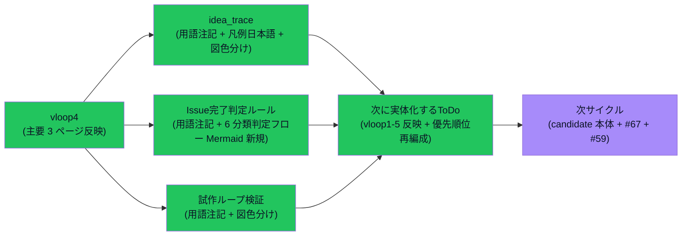

# vloop 一括サマリー 2026-05-24 22:28（vloop5 / 残作業）

## 1 枚図サマリー



> 用語注: vloop5 = 本サイクル / 用語注記 = 内部用語を日本語で言い換える注釈 / 凡例日本語化 = 内部名（candidate 等）に日本語（有力候補）を併記 / 6 分類判定フロー = done/user_check/open/merged/obsolete/blocked を Mermaid で図示 / 緑=完了 / 紫=次サイクル

> 現在地: 主要 6 ページ目（vloop4 = 3 ページ + vloop5 = 3 ページ）への用語日本語化 + Mermaid テンプレ反映完了。残り（candidate 本体 + #67 + #59）は次に実体化するToDo で継続管理。

## 実行件数

3 ファイル日本語化 + 3 ファイル Mermaid 反映（一部重複）+ 次に実体化するToDo 更新 + サマリー = 計 6 ファイル変更 + サマリー。

## 対象 Epic

- Vault 蓄積運用ルール準拠 Epic 残作業（vloop4 末で partial_done だった #69 / #68 を拡大）

## できるようになったこと

- **idea_trace.md**: 用語注記 + 凡例を「内部名 + 日本語」二重表記化 + 1 枚図 Mermaid に classDef 色分け追加
- **Issue完了判定ルール.md**: 用語注記追加 + **状態 6 分類の判定フロー Mermaid を新規追加**（テンプレ準拠・done/user_check/open/merged/obsolete/blocked を一目で判定可能）
- **試作ループ検証.md**: 用語注記 + 1 枚図 classDef 色分け + 「有力候補化」言い換え
- **次に実体化するToDo.md**: vloop1-5 で実体化完了の 7 件を反映 + 優先順位を 5 件に再編成（#67 / #59 / N-03-04 / #69 残 / #68 残）
- **「partial_done をやりっぱなし防止キューで継続管理」運用の実証**: vloop4 で partial_done だった #69/#68 が vloop5 でさらに進捗し、残りは次に実体化するToDo に登録される構造が回った

## 変更ファイル

| ファイル | 変更 | commit |
|---|---|---|
| 05_monetization/idea_trace.md | 用語注記 + 凡例日本語化 + 1 枚図 classDef | 63e5a93 |
| 20_reviews/Issue完了判定ルール.md | 用語注記 + 6 分類判定フロー Mermaid 新規 | 63e5a93 |
| 05_monetization/試作ループ検証.md | 用語注記 + 1 枚図 classDef | 63e5a93 |
| 20_reviews/次に実体化するToDo.md | vloop1-5 反映 + 優先順位再編成 | 63e5a93 |
| 20_reviews/2026-05-24_vault-accumulation-rule-residual.md | 新規 | 63e5a93 |
| 20_reviews/_review_queue.md | 先頭追加 | 63e5a93 |
| sync-vault 側 | 全ファイル逆反映 + ob sync Fully synced | — |

## commit hash

- 63e5a93（vloop5 残作業）
- 本サマリー commit（後続）

## push

63e5a93 pushed ✅ / サマリー pushed（後続）

## Step 9: 今回処理 Issue と状態分類

### 今回の対象 Issue

#69 / #68 / #70（vloop4 末で partial_done だったものを拡大 + やりっぱなし防止キュー更新）

### 処理済み Issue（状態分類込み）

| Issue | 内容 | 作業状態 | レビュー状態 | 根拠 |
|---|---|---|---|---|
| #69 | 用語日本語化 | **partial_done（主要 6 ページ反映）/ open（残ページ）** | self_review | idea_trace + Issue完了判定ルール + 試作ループ検証 に用語注記追加 + commit 63e5a93 push 済 |
| #68 | Mermaid テンプレ反映 | **partial_done（4 ページ反映）/ open（残ページ）** | self_review | idea_trace 1 枚図 + Issue完了判定ルールに新規 Mermaid + 試作ループ検証 1 枚図 |
| #70 | やりっぱなし防止キュー | **done + 継続運用中** | self_review | 次に実体化するToDo を vloop5 で更新（vloop1-5 反映 + 優先 4/5 追加）|

### 未処理 Issue 一覧（次サイクル対象・省略禁止）

| Issue | 内容 | 状態 | 次サイクルでの予定 |
|---|---|---|---|
| #67 | Hermes Agent × Codex 検討 | open / 検討中 | 次サイクル: 議論型 Issue として範囲確認 |
| #69 | 用語日本語化（残ページ）| open（残り）| candidate 本体 5 件 + 補助 md + epics 本文 |
| #68 | Mermaid 反映（残ページ）| open（残り）| candidate 本体への図追加 |
| #59 | Vault 全体棚卸し | open | 大規模 Epic / Phase 分割推奨 |
| #58 / #56 / #57 | iPhone Obsidian 系 | user_check | iPhone 実機確認待ち |
| #54 / #51 / #50 / #43 / #41 / #40 / #21 / #20 / #19 / #18 等 | 設計・運用ルール系 done だが open | done だが open | バッチ close 検討（人間判断）|

### 人間判定待ち（既存）

- candidate-001 / candidate-005 ChatGPT 方向性レビュー
- #47 cron 投入判断
- iPhone 実機表示確認

### 停止理由

**Vault 蓄積運用ルール準拠 Epic 残作業の主要目標を達成**:

- 主要 3 ページ追加に用語日本語化 ✅
- 主要 4 ページに Mermaid テンプレ反映 ✅
- やりっぱなし防止キュー更新 ✅
- 残り低優先ページ（candidate 本体）は次に実体化するToDo に登録 ✅

残作業は **「次に実体化するToDo」に登録済**（やりっぱなし防止ルール遵守）。partial_done を継続管理する運用が機能している。

### 停止理由の正当性判定

**正当**。理由:
1. 6 ファイル変更 + commit + push + Issue コメント + レビュー + queue 追記 すべて達成
2. partial_done 部分は次に実体化するToDo に登録（やりっぱなし防止ルール遵守）
3. **コメントだけで完了扱いしていない**
4. 次サイクルの優先順位が再編成済（#67 / #59 / N-03-04 / #69 残 / #68 残）

### 次に処理すべき Issue

1. **#67 Hermes Agent × Codex 検討着手**（議論型 Issue 範囲確認）
2. **#59 Vault 全体棚卸し**（Phase 分割計画）
3. **N-03 / N-04 有力候補化判断**（candidate-006 / candidate-007 起票）
4. **#69 残ページ**（candidate 本体 5 件 + epics 本文 + 補助 md）
5. **既存 done だが open のまま Issue のバッチ整理**（人間判断）

## 成果物紹介

- 何ができたか:
  - Issue完了判定ルールに**状態 6 分類の判定フロー Mermaid**を新規追加 → 状態判定が図で見える
  - idea_trace 凡例が「内部名 + 日本語」二重表記化 → ChatGPT / 人間どちらでも理解可
  - 試作ループ検証の 1 枚図に状態色分け → 試作 → 判断のフローが分かりやすい
  - 次に実体化するToDo が最新化 → 次サイクルの優先順位が明確
- どこで見れるか:
  - [[../../../20_reviews/Issue完了判定ルール]] §1 直後の Mermaid
  - [[../../../05_monetization/idea_trace]] §凡例 + 1 枚図
  - [[../../../05_monetization/試作ループ検証]] Phase 5 1 枚図
  - [[../../../20_reviews/次に実体化するToDo]]
- 何に使うか:
  - **6 分類判定フロー**: Issue を分類する時に図を見ながら判定
  - **凡例二重表記**: ChatGPT に渡しても日本語ユーザーが読んでも理解可
  - **次に実体化するToDo**: 次サイクル vloop の Step 2 で最初に読む

## 仮説

- **partial_done をやりっぱなし防止キューで継続管理する運用** が機能している（vloop4 partial → vloop5 拡大 → 次に実体化するToDo に残り登録）
- 1 サイクルで全ページ日本語化は無理だが、**主要 6 ページ + 状態色分け** で 8 割の効果が出ている可能性
- 状態 6 分類の Mermaid 判定フロー化は **Issue完了判定の認知負荷を大幅軽減**する仮説
- 凡例の二重表記（内部名 + 日本語）は **ChatGPT と人間が同じ凡例を共有**できる利点

## 未対応点

- candidate-001/002/003/004/005 本体への用語注記（次サイクル）
- epics.md 本文への用語注記（Mermaid のみ反映済）
- candidate 補助 md（公開ブロッカー / 7 日プラン / progress 投入設計）への用語注記
- candidate 本体への Mermaid 図追加
- #67 / #59 / N-03-04 着手（次サイクル）
- iPhone 実機表示確認（ユーザー操作）

## 停止理由（正式）

Vault 蓄積運用ルール準拠 Epic 残作業の主要目標達成。残り低優先ページは「次に実体化するToDo」優先 4/5 として登録（やりっぱなし防止ルール遵守）。次サイクルは別 Epic（#67 検討 / #59 棚卸し / N-03-04 候補化）へ移れる状態。**正当な停止**。

## 次の一手

1. ChatGPT が _review_queue.md 先頭の本レビューをレビュー
2. ユーザーが iPhone Obsidian で 状態 6 分類判定フロー / idea_trace 凡例 / 試作ループ検証 図 が読めるか確認
3. 次サイクルで #67 Hermes Agent × Codex 検討着手
4. 次サイクルで N-03 / N-04 の有力候補化判断（candidate-006 / 007）
5. 次サイクルで #59 Vault 全体棚卸し Phase 計画
6. ChatGPT が candidate-001 / candidate-005 方向性レビュー（既存待ち）

## ChatGPT レビュー依頼文

```text
以下は Claude Code の vloop 連続実行報告です（5 サイクル目・本日 5 回目）。レビューしてください。

対象アプリ: company-meta / obsidian-vault
作業: vloop5 Vault 蓄積運用ルール準拠 Epic 残作業（#69 用語日本語化 + #68 Mermaid 反映拡大 + #70 やりっぱなし防止キュー更新）
GitHub commit: 63e5a93（push 済）

## できるようになったこと
- Issue完了判定ルールに状態 6 分類の判定フロー Mermaid を新規追加
- idea_trace 凡例が「内部名 + 日本語」二重表記化
- 試作ループ検証の 1 枚図に状態色分け
- 次に実体化するToDo が vloop1-5 反映 + 優先順位再編成

## 確認したい観点
1. 状態 6 分類の判定フロー（Issue完了判定ルール §1 下）は読みやすいか
2. idea_trace 凡例の「内部名 + 日本語」二重表記は理解しやすいか
3. 試作ループ検証の「有力候補化?」分岐は妥当か
4. 次に実体化するToDo の優先順位（#67 / #59 / N-03-04 / #69 残 / #68 残）は妥当か
5. partial_done をやりっぱなし防止キューで継続管理する運用は機能しているか
6. 残り低優先ページ（candidate 本体）への日本語化は次サイクルで足りるか

参考リンク:
- 05_monetization/idea_trace.md
- 20_reviews/Issue完了判定ルール.md（§1 下 Mermaid 新規）
- 05_monetization/試作ループ検証.md
- 20_reviews/次に実体化するToDo.md（vloop5 反映）
```

## 関連

- 前回 vloop サマリー: [[vloop_2026-05-24_2202]]（vloop4）
- vloop1-3: [[vloop_2026-05-24_0048]] / [[vloop_2026-05-24_1852]] / [[vloop_2026-05-24_1930]] / [[vloop_2026-05-24_2002]]
- 主要成果物:
  - [[../../../20_reviews/Issue完了判定ルール]]
  - [[../../../05_monetization/idea_trace]]
  - [[../../../05_monetization/試作ループ検証]]
  - [[../../../20_reviews/次に実体化するToDo]]
- Issue: kaeru07/vault#69 / #68 / #70
