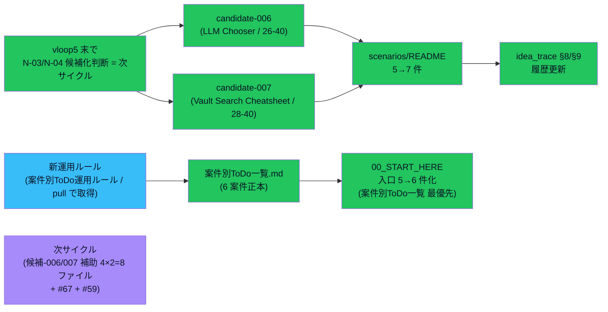

# vloop 一括サマリー 2026-05-24 23:05（vloop6）

## 1 枚図サマリー



> 用語注: 案件別ToDo運用ルール = ユーザーが pull で持ってきた新運用ルール（Issue ではなく案件別 ToDo 正本）/ candidate-006 = N-03 LLM Chooser を有力候補化 / candidate-007 = N-04 Vault Search Cheatsheet を有力候補化 / scoreTotal = 候補の妥当性評価合計 / 補助 4 ファイル = 公開ブロッカー + 7 日プラン + progress 投入設計 + 承認パック

> 現在地: vloop5 末で「次サイクルで N-03/N-04 候補化判断」と確定 → vloop6 で達成 + 新運用ルール準拠の案件別ToDo一覧も同時実装

## 実行件数

3 Epic を 1 サイクルで一体実装（案件別ToDo一覧 + candidate-006 起票 + candidate-007 起票）。新規 4 ファイル + 編集 4 ファイル + サマリー 1。

## 対象 Epic

- 候補-006/007 起票 Epic（試作完成済の自然な次ステップ）
- 案件別ToDo運用ルール準拠 Epic（pull で取得した新ルール）

## できるようになったこと

- **candidate-006 として N-03 LLM Chooser を正規化**（scoreTotal 26/40 / コンパクト版 / status: candidate / candidate-005 と相互送客可能な並走候補）
- **candidate-007 として N-04 Vault Search Cheatsheet を正規化**（scoreTotal 28/40 / 既存「Vault の見方ガイド」との重複整理 3 統合方針案 A/B/C 付き）
- **scenarios/README 候補全件 5 → 7 件体制**に拡張
- **idea_trace §8/§9 のステータス**を「idea + 試作」→「candidate（candidate-006/007 として正規化済）」へ変更 + 履歴に vloop6 追記
- **案件別ToDo一覧.md 新規作成**（Vault運用 / 麻雀アプリ / トークン速度 / 複数案試作 / 収益化案 / レビュー承認 の 6 案件で整理 / 新運用ルール準拠）
- **00_START_HERE 入口 5 → 6 件化**（案件別ToDo一覧を**最優先①**として配置）
- **次に実体化するToDo 更新**（実体化済 8 件目 + 優先 3 完了 + 優先 6 として候補-006/007 補助 8 ファイルを planned_only 登録）
- candidate-006/007 を **status: candidate のまま保持**（approved 化禁止ルール厳守 / pending_approval にも上げていない）

## 変更ファイル

| ファイル | 変更 | commit |
|---|---|---|
| 20_reviews/案件別ToDo一覧.md | 新規 | 0113a54 |
| 05_monetization/scenarios/candidate-006.md | 新規 | 0113a54 |
| 05_monetization/scenarios/candidate-007.md | 新規 | 0113a54 |
| 05_monetization/scenarios/README.md | 5→7 件 + 補助セクション | 0113a54 |
| 05_monetization/idea_trace.md | §8/§9 ステータス + 履歴 | 0113a54 |
| 00_START_HERE.md | 入口 6 件化（案件別ToDo一覧 最優先）| 0113a54 |
| 20_reviews/次に実体化するToDo.md | 実体化済 8 件目 + 優先 6 追加 | 0113a54 |
| 20_reviews/2026-05-24_candidate-006-007-and-project-todos.md | 新規 | 0113a54 |
| 20_reviews/_review_queue.md | 先頭追加 | 0113a54 |
| sync-vault 側 | 全ファイル逆反映 + ob sync Fully synced | — |

## commit hash

- 0113a54（vloop6 一体実装）
- 本サマリー commit（後続）

## push

0113a54 pushed ✅ / サマリー pushed（後続）

## Step 9: 今回処理 Issue と状態分類

### 今回の対象 Issue

#61（試作ループ Epic の自然な続編）+ #70（案件別ToDo一覧の正本化）

### 処理済み Issue（状態分類込み）

| Issue | 内容 | 作業状態 | レビュー状態 | 根拠 |
|---|---|---|---|---|
| #61 | 複数案試作ループ | **done（vloop1-2 試作 + vloop6 候補化で完全達成）** | self_review | candidate-006/007 起票 + scenarios/README 反映 + Issue #61 続報コメント + commit 0113a54 push 済 |
| #70 | やりっぱなし防止キュー + 案件別ToDo運用ルール準拠 | **done + 継続運用中** | self_review | 案件別ToDo一覧.md 新規 + 00_START_HERE 入口最優先 + 次に実体化するToDo 更新 |

### 未処理 Issue 一覧（次サイクル対象・省略禁止）

| Issue | 内容 | 状態 | 次サイクルでの予定 |
|---|---|---|---|
| #67 | Hermes Agent × Codex 検討 | open / 検討中 | 次サイクル: 議論型 Issue として範囲確認 |
| #59 | Vault 全体棚卸し | open | 大規模 Epic / Phase 分割推奨 |
| #69 | 用語日本語化（残ページ）| open（残り）| candidate 本体 5 件 + 補助 md |
| #68 | Mermaid 反映（残ページ）| open（残り）| candidate 本体への図追加 |
| **候補-006/007 補助 4×2=8 ファイル**（新規 vloop6 発生）| planned_only | 次に実体化するToDo 優先 6 | 次サイクル |
| #58 / #56 / #57 | iPhone Obsidian 系 | user_check | iPhone 実機確認待ち |
| #54 / #51 / #50 / #43 / #41 / #40 / #21 / #20 / #19 / #18 等 | 設計・運用ルール系 done だが open | done だが open | バッチ close 検討（人間判断）|

### 人間判定待ち（既存）

- candidate-001 / candidate-005 ChatGPT 方向性レビュー
- candidate-006 / 007（vloop6 新規）の ChatGPT 方向性レビュー
- #47 cron 投入判断
- iPhone 実機表示確認

### 停止理由

**vloop6 の主要目標 3 件達成**:

- candidate-006 起票 ✅
- candidate-007 起票 ✅
- 案件別ToDo一覧.md 新規（新運用ルール準拠）✅

補助 4 × 2 = 8 ファイルは **次に実体化するToDo 優先 6 として登録**（やりっぱなし防止ルール遵守）。

### 停止理由の正当性判定

**正当**。理由:
1. 候補本体 2 件 + 案件別ToDo一覧 + 索引 4 件編集 + レビュー + queue + サマリー = 計 9 ファイル達成
2. status: candidate のまま保持（approved 化禁止ルール厳守）
3. 補助 8 ファイル新規発生分は次に実体化するToDo に登録（やりっぱなし防止）
4. **コメントだけで完了扱いしていない**
5. 残作業は ChatGPT 方向性レビュー / 次サイクル / iPhone 実機で vloop スコープ外

### 次に処理すべき Issue

優先順位順:

1. **候補-006/007 の判断するための資料一式（4×2=8 ファイル）**: candidate-005 と同形式で次サイクル
2. **#67 Hermes Agent × Codex 検討**: 議論型 Issue 範囲確認
3. **#59 Vault 全体棚卸し**: Phase 分割計画
4. **#69 残ページ用語日本語化**: candidate 本体 5 件
5. **既存 done だが open のまま Issue のバッチ整理**: 人間判断

## 成果物紹介

- 何ができたか:
  - **候補-006**: LLM 使い分けチャートが有力候補に
  - **候補-007**: Vault 検索チートシートが有力候補に + 既存資産との統合 3 案
  - **案件別ToDo一覧**: 6 案件で ToDo を一覧化 = vloop 開始時の標準入口
  - **00_START_HERE 最優先①** が「案件別ToDo一覧」に変更 = 案件別 ToDo がユーザー入口
- どこで見れるか:
  - 主要入口: [[../../../00_START_HERE]] ①
  - 案件別ToDo一覧: [[../../../20_reviews/案件別ToDo一覧]]
  - 候補-006: [[../../../05_monetization/scenarios/candidate-006]]
  - 候補-007: [[../../../05_monetization/scenarios/candidate-007]]
  - 7 件テーブル: [[../../../05_monetization/scenarios/README]]
- 何に使うか:
  - **案件別ToDo一覧**: 次サイクル vloop の標準入口
  - **候補-006/007**: ChatGPT 方向性レビュー後 → pending_approval 昇格 → progress 投入
- どう使うか:
  - iPhone Obsidian で `00_START_HERE` → 「案件別ToDo一覧」（最優先①） → 6 案件から選択
  - ChatGPT に「`_review_queue.md` 先頭をいつもの観点でレビュー」と依頼
- 注意点:
  - 候補-006/007 は依然として `status: candidate`（pending_approval にも approved にも上げていない）
  - 補助 4 ファイル × 2 = 8 ファイルは次サイクル

## 仮説

- **試作完成 → 候補化判断 → 補助ファイル化** という Epic の進行形式が **vloop1-6 で一貫**して回っている（N-01 → candidate-005 / N-03 → candidate-006 / N-04 → candidate-007）
- 案件別ToDo一覧は **vloop 開始時の標準入口**として機能する仮説（次サイクルで実証）
- **コンパクト版 candidate**（補助 4 ファイルなし）と **フル版 candidate**（補助 4 ファイル完備）の二段構造が成立する仮説（候補-001/005 = フル / 候補-006/007 = コンパクト）
- candidate-007 の既存「Vault の見方ガイド」との重複整理 3 統合方針案（A/B/C）を残しておくことで、ChatGPT が判断材料を持って方向性レビューできる

## 未対応点

- 候補-006/007 の補助 4 ファイル × 2 = 8 ファイル（次サイクル）
- ChatGPT が候補-006/007 方向性レビュー
- 既存「Vault の見方ガイド」と候補-007 の統合方針決定（A/B/C）
- iPhone 実機表示確認（候補-006/007 試作 + 案件別ToDo一覧）
- candidate-001 / 005 の ChatGPT 方向性承認（既存待ち）
- #67 / #59 / #69 残ページ / #68 残ページ 着手（次サイクル）

## 停止理由（正式）

vloop6 主要目標 3 件達成。残作業は ChatGPT 方向性レビュー / 補助ファイル化（次サイクル）/ 人間判断で vloop スコープ外。新ルール「Epic 完了条件を満たした / 新規発生 ToDo は次に実体化するToDo に登録」に該当。**正当な停止**。

## 次の一手

1. ChatGPT が _review_queue.md 先頭の 2026-05-24_candidate-006-007-and-project-todos をレビュー
2. ユーザーが iPhone Obsidian で 00_START_HERE → 「案件別ToDo一覧」が最優先入口として機能するか確認
3. 次サイクルで候補-006/007 の判断するための資料一式（補助 4×2=8 ファイル）
4. 次サイクルで #67 Hermes Agent × Codex 検討着手
5. 次サイクルで #59 Vault 全体棚卸し Phase 計画
6. 既存待ち: candidate-001 / 005 の ChatGPT 方向性承認

## ChatGPT レビュー依頼文

```text
以下は Claude Code の vloop 連続実行報告です（6 サイクル目・本日 6 回目）。レビューしてください。

対象アプリ: company-meta / obsidian-vault
作業: vloop6 候補-006/007 起票 + 案件別ToDo一覧 新規作成
GitHub commit: 0113a54（push 済）

## できるようになったこと
- N-03 LLM Chooser → candidate-006 として scenarios 正規化（26/40 コンパクト版）
- N-04 Vault Search Cheatsheet → candidate-007 として scenarios 正規化（28/40 / 既存資産との統合方針 A/B/C 付き）
- 新運用ルール「案件別ToDo運用ルール」準拠の案件別ToDo一覧.md 新規（6 案件正本）
- 00_START_HERE 入口 5→6 件化（案件別ToDo一覧を最優先①）
- scenarios/README 5→7 件 + idea_trace §8/§9 反映

## 確認したい観点
1. 案件別ToDo一覧の 6 案件分類（Vault運用 / 麻雀 / トークン速度 / 複数案試作 / 収益化案 / レビュー承認）は妥当か
2. candidate-006 26/40 / candidate-007 28/40 のスコアリングは妥当か
3. 候補-007 の既存「Vault の見方ガイド」との統合方針 A/B/C のいずれが望ましいか
4. candidate-005 + candidate-006 の相互送客判断は妥当か
5. 候補-006/007 を approved 化せず candidate のまま留めた判断は妥当か（候補-001/005 と同パターン）
6. 補助 4×2=8 ファイルを次サイクル化（次に実体化するToDo 優先 6）は妥当か
7. 試作完成 → 候補化判断 → 補助ファイル化 の Epic 進行形式が一貫しているか

参考リンク:
- 20_reviews/案件別ToDo一覧.md
- 05_monetization/scenarios/candidate-006.md
- 05_monetization/scenarios/candidate-007.md
- 05_monetization/scenarios/README.md
- 00_START_HERE.md
```

## 関連

- [[../vloop]]（#50 改訂版 + #66 Step 9 適用 7 サイクル目）
- [[../../../20_reviews/案件別ToDo運用ルール]]（本サイクルの根拠ルール / pull で取得）
- 前回 vloop サマリー: [[vloop_2026-05-24_2228]]（vloop5）
- 本日 vloop1-5: 0048 / 1852 / 1930 / 2002 / 2202
- 主要成果物:
  - [[../../../20_reviews/案件別ToDo一覧]]
  - [[../../../05_monetization/scenarios/candidate-006]]
  - [[../../../05_monetization/scenarios/candidate-007]]
  - [[../../../05_monetization/scenarios/README]]
  - [[../../../00_START_HERE]]
- Issue: kaeru07/vault#61 / #70 / #63
