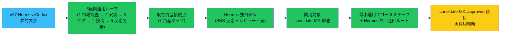

# vloop 一括サマリー 2026-05-24 23:40（vloop7）

## 1 枚図サマリー



> 用語注: Hermes Agent = SNS 反応分析等を行うとされる Agent（仕様未確認）/ Codex = OpenAI の AI コーディング Agent / 5 段階運用ループ = 市場調査 → 実装 → ログ → 投稿 → 反応分析 → 改善 / candidate-001 = 麻雀何切るアプリ（試用対象）/ 緑=完了 / 水=今 vloop で進行中 / 黄=判断待ち

> 現在地: vloop5-6 末で「次サイクルで #67 検討」と確定 → vloop7 で達成。実採用は candidate-001 approved 後 + Hermes 公式仕様確認後の人間判断（vloop スコープ外）

## 実行件数

1 Epic として 6 ファイル変更 + サマリー（新規 2 ファイル + 編集 4 ファイル）

## 対象 Epic

- #67 Hermes Agent × Codex 組み込み検討 材料整備（議論型 Issue を vloop スコープ内でできる範囲）

## できるようになったこと

- **06_research/hermes-agent-codex-組み込み検討.md 新規作成**（10 セクション）で Issue #67 完了条件 6 件すべてに回答
- **既存運用との接続点を 7 資産マップで明示**（Codexレビュー常用運用 / AgentSDKクレジット活用方針 / progress連携基準 / 案工場完全自動化フロー / cron移行判定基準 / nanikiru-shorts / 過去 research-run）
- **Hermes 独自価値範囲を限定**（SNS 反応分析 + レビュー不満抽出のみ・他は既存 research-run で 7 割カバー）
- **試用対象 candidate-001 を選定**（理由 5 件 + 不採用 4 候補の理由）
- **最小運用フロー 6 ステップ**を提示（Hermes 無しでも 1 サイクル回せる迂回ルートあり）
- **Hermes 採用閾値**を仮説提示（週 5 本投稿 / 月 8h 以上の手動分析）
- **Hermes 出力で candidate を approved 化しないルール**を明記
- **Claude 推奨**を明示: 「本サイクルでは検討材料整備のみ。実採用は candidate-001 approved 後」
- 案件別ToDo一覧 §5 + 次に実体化するToDo 優先 1 完了化 + 00_START_HERE 反映

## 変更ファイル

| ファイル | 変更 | commit |
|---|---|---|
| 06_research/hermes-agent-codex-組み込み検討.md | 新規（10 セクション・Mermaid 2 図）| e7ae0e5 |
| 20_reviews/案件別ToDo一覧.md | §5 収益化案に #67 追加 | e7ae0e5 |
| 20_reviews/次に実体化するToDo.md | 優先 1 完了化 | e7ae0e5 |
| 00_START_HERE.md | Hermes 検討材料リンク追加 | e7ae0e5 |
| 20_reviews/2026-05-24_hermes-codex-integration-research.md | 新規 | e7ae0e5 |
| 20_reviews/_review_queue.md | 先頭追加 | e7ae0e5 |
| sync-vault 側 | 全ファイル逆反映 + ob sync Fully synced | — |

## commit hash

- e7ae0e5（vloop7 一体実装）
- 本サマリー commit（後続）

## push

e7ae0e5 pushed ✅ / サマリー pushed（後続）

## Step 9: 今回処理 Issue と状態分類

### 今回の対象 Issue

#67（Hermes Agent × Codex 組み込み検討）

### 処理済み Issue（状態分類込み）

| Issue | 内容 | 作業状態 | レビュー状態 | 根拠 |
|---|---|---|---|---|
| #67 | Hermes Agent × Codex 組み込み検討 | **done（検討材料整備完了）/ 実採用は人間判断**| self_review | hermes-agent-codex-組み込み検討.md 10 セクション + Issue 続報コメント + commit e7ae0e5 push 済 |

### 未処理 Issue 一覧（次サイクル対象・省略禁止）

| Issue | 内容 | 状態 | 次サイクルでの予定 |
|---|---|---|---|
| #59 | Vault 全体棚卸し | open | 大規模 Epic / Phase 分割推奨 |
| #69 | 用語日本語化（残ページ）| open（残り）| candidate 本体 5 件 + 補助 md |
| #68 | Mermaid 反映（残ページ）| open（残り）| candidate 本体への図追加 |
| **候補-006/007 補助 4×2=8 ファイル** | planned_only | 次に実体化するToDo 優先 6 | 次サイクル |
| #58 / #56 / #57 | iPhone Obsidian 系 | user_check | iPhone 実機確認待ち |
| #54 / #51 / #50 / #43 / #41 / #40 / #21 / #20 / #19 / #18 等 | 設計・運用ルール系 done だが open | done だが open | バッチ close 検討（人間判断）|

### 人間判定待ち

- candidate-001 / candidate-005 ChatGPT 方向性レビュー
- candidate-006 / 007 ChatGPT 方向性レビュー
- #47 cron 投入判断
- **#67 Hermes Agent 公式仕様確認 + 採用判断**（vloop7 新規）
- iPhone 実機表示確認

### 停止理由

**Issue #67 完了条件 6 件への回答を 1 ファイルで完備**:

- §8 結論で完了条件 6 件に明確回答 ✅
- 検討材料整備の自然な完了（実採用は人間判断 / API 課金関連）
- 残作業（候補-006/007 補助・#59 棚卸し・#69/#68 残ページ・既存 done open Issue 整理）は 次に実体化するToDo に登録済

新ルール「**止まってよい場合: Epic 完了条件を満たした / 認証情報・課金・外部公開など人間判断が必要**」に該当。

### 停止理由の正当性判定

**正当**。理由:
1. Issue #67 完了条件 6 件すべてに明確回答
2. Hermes 実 API 呼び出しは一切していない（検討材料整備のみ・課金リスク回避）
3. 未確認情報は未確認として明記
4. Hermes 出力で approved 化しないルール明記
5. **コメントだけで完了扱いしていない**（新規 1 ファイル 10 セクション + 編集 4 + レビュー + queue + commit/push + Issue コメント）
6. 残作業は次に実体化するToDo に登録済（やりっぱなし防止ルール遵守）

### 次に処理すべき Issue

優先順位順:

1. **#59 Vault 全体棚卸し**: Phase 分割計画（大規模 Epic）
2. **候補-006/007 の判断するための資料一式（補助 4×2=8 ファイル）**: candidate-005 と同形式
3. **#69 残ページ用語日本語化 / #68 残ページ Mermaid 反映**: candidate 本体 5 件
4. **既存 done だが open のまま Issue のバッチ整理**: 人間判断

## 成果物紹介

- 何ができたか:
  - Hermes Agent × Codex の組み込みを「**5 段階運用ループ + 既存資産接続点 + 試用対象 + 最小運用フロー**」で構造化
  - 「Hermes 無しでも 1 サイクル回せる迂回ルート」で API 課金リスクを回避できる設計
  - Hermes 採用閾値（週 5 本投稿 / 月 8h 手動分析）= ROI 判断の数値基準
- どこで見れるか:
  - [[../../../06_research/hermes-agent-codex-組み込み検討]]（本サイクル主成果物）
  - [[../../../20_reviews/案件別ToDo一覧]] §5 収益化案
  - [[../../../00_START_HERE]] さらに掘る → Hermes 検討材料
- 何に使うか:
  - **candidate-001 approved 後**: §6 最小運用フローを実行（Hermes 無しで開始）
  - **1-2 サイクル後**: Hermes 採用 ROI 再評価
  - **Hermes 公式仕様確認後**: 採用判断（人間 + ChatGPT セカンドオピニオン）
- どう使うか:
  - ChatGPT に「`_review_queue.md` 先頭をいつもの観点でレビュー」と依頼
  - 検討材料の妥当性（Hermes 独自価値範囲 / 試用対象選定 / 採用閾値）を ChatGPT に確認
- 注意点:
  - Hermes Agent の具体的仕様は未確認 / 採用判断時にユーザーが公式仕様確認必須
  - Hermes 出力で candidate を approved 化しないルールは厳守

## 仮説

- **既存 research-run（Epic A）で 7 割カバーできる**ため、Hermes の独自価値は SNS 反応 + レビュー不満抽出に限定
- Hermes 課金は**投稿頻度が低い段階では不要**（週 5 本投稿に乗ってから検討）
- candidate-001 を試用対象にする理由は**ステージ 4 投稿経路（nanikiru-shorts）が既存**だから / 他案では投稿経路が未着手で詰まる
- 「Hermes 無しでも 1 サイクル回せる迂回ルート」設計が API 課金リスクを構造的に回避できる仮説
- 議論型 Issue の vloop スコープ内対応として「**検討材料整備 + 採用判断は人間に委ねる**」が機能する仮説

## 未対応点

- Hermes Agent の公式仕様確認（ユーザー操作・必要時）
- candidate-001 が approved 化されてから §6 最小運用フロー実行
- 1-2 サイクル手動運用後の Hermes 採用 ROI 再評価
- `90_templates/hermes-cycle-template.md` 作成（採用判断後）
- progress に socialPostUrl / socialReactions フィールド追加検討（Phase B）

## 停止理由（正式）

Issue #67 完了条件 6 件への回答を 1 ファイルで完備。実採用は人間判断（API 課金関連）+ candidate-001 approved 後の最小運用フロー実行で vloop スコープ外。新ルール「Epic 完了条件を満たした / 認証情報・課金・外部公開など人間判断が必要」に該当。**正当な停止**。

## 次の一手

1. ChatGPT が _review_queue.md 先頭の本レビューをレビュー
2. ユーザーが Hermes Agent 公式仕様確認（必要時のみ）
3. 次サイクルで #59 Vault 全体棚卸し Phase 計画
4. 次サイクルで候補-006/007 の判断するための資料一式（補助 4×2=8 ファイル）
5. 次サイクルで #69 残ページ用語日本語化 / #68 残ページ Mermaid 反映
6. 既存待ち: candidate-001 / 005 の ChatGPT 方向性承認

## ChatGPT レビュー依頼文

```text
以下は Claude Code の vloop 連続実行報告です（7 サイクル目）。レビューしてください。

対象アプリ: company-meta / obsidian-vault
作業: vloop7 #67 Hermes Agent × Codex 組み込み検討 材料整備
GitHub commit: e7ae0e5（push 済）

## できるようになったこと
- Issue #67 完了条件 6 件への回答を 1 ファイル 10 セクションで完備
- 5 段階運用ループ Mermaid + 既存資産接続点 7 マップ
- Hermes 独自価値範囲を限定（SNS 反応 + レビュー不満抽出のみ）
- 試用対象 candidate-001 選定（理由 5 件 + 不採用 4 候補の理由）
- 最小運用フロー 6 ステップ + Hermes 無し迂回ルート
- Hermes 採用閾値（週 5 本投稿 / 月 8h 手動分析）

## 確認したい観点
1. Hermes 独自価値範囲（SNS 反応 + レビュー不満抽出）の判断は妥当か
2. 試用対象 candidate-001 の選定は妥当か（他 4 候補の不採用理由も含む）
3. 最小運用フローと Hermes 無し迂回ルートの両立は妥当か
4. Hermes 採用閾値（週 5 本投稿 / 月 8h 手動分析）は妥当か
5. 「candidate-001 approved 後に判断」推奨は妥当か（早すぎる採用回避）
6. progress 新フィールド（socialPostUrl / socialReactions）を Phase B 検討にする判断は妥当か
7. Hermes 出力で candidate を approved 化しないルール明記は妥当か

参考リンク:
- 06_research/hermes-agent-codex-組み込み検討.md（本サイクル主成果物・10 セクション）
- 20_reviews/案件別ToDo一覧.md §5 収益化案
- 00_START_HERE.md（Hermes 検討材料リンク追加）
```

## 関連

- [[../vloop]]（#50 改訂版 + #66 Step 9 適用 8 サイクル目）
- 前回 vloop サマリー: [[vloop_2026-05-24_2305]]（vloop6）
- 本日 vloop1-6: 0048 / 1852 / 1930 / 2002 / 2202 / 2228 / 2305
- 主要成果物:
  - [[../../../06_research/hermes-agent-codex-組み込み検討]]
  - [[../../../03_prompts/Codexレビュー常用運用]]
  - [[../../../03_prompts/AgentSDKクレジット活用方針]]
  - [[../../../05_monetization/scenarios/candidate-001]]
- Issue: kaeru07/vault#67
