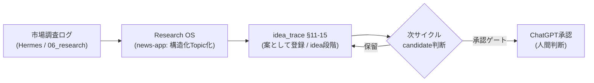

# vloop 2026-05-29 13:31 — Epic #63 idea_trace に Research OS 由来の案を統合

## 実行日時
2026-05-29 13:31 JST

## 実行件数
- 主作業 2 系統（1 Epic 群として処理）:
  1. news-app Research OS のレビュー記録・生成テンプレを Vault へ反映（pending だった 5 ファイルを commit/push）
  2. Epic #63: idea_trace に「市場調査(Research OS)」を情報源チャネルとして追加し、案 #11-15 を idea 段階で登録
- 関連更新: 入口ページ・早見表・流れ図・_review_queue

## 対象Epic
- #63 全アプリ案の情報源・着想理由・採用判断を一発で追える専用ページを作る（主）
- #62 トークン速度ツール案の trace（#63 に内包・既存記録で完了条件充足）

## できるようになったこと
- 案の追跡（idea_trace）が「最新の情報源 = 市場調査(Research OS)」まで辿れるようになった。
- 市場調査ログ（2026-05-26/27）の構造化 Topic から派生したアプリ案 5 件（ASO Monitor / 学習スライド自動投稿 / AI Study Battle / MCP Profile Pack / Agent Cost Logger）を、情報源・気づき・採用理由・APIなし範囲・収益化導線・判断履歴・次の判断つきで一覧できる。
- 「情報源 → 気づき → 案 → 有力候補 → 試作 → 評価 → 判断」の流れに Research OS が前段ソースとして接続された。
- news-app Research OS の作業レビュー 3 本と生成テンプレが Vault（GitHub）に永続化され、ChatGPT レビューから参照可能になった。

## 変更ファイル
- 05_monetization/idea_trace.md（§11-15 追加 / 流れ図 / frontmatter updated 2026-05-29）
- 05_monetization/案の情報源と採用理由.md（早見表 15 件 / Research OS 注記）
- 03_prompts/research-topic-template.md（新規・Hermes/Codex 用 Research Topic 生成プロンプト）
- 20_reviews/2026-05-28_research-topic-cards.md（新規）
- 20_reviews/2026-05-28_research-structured-db.md（新規）
- 20_reviews/2026-05-29_research-os.md（新規）
- 20_reviews/_review_queue.md（未レビュー先頭に 3 件）
- 03_prompts/claude-commands/logs/vloop_2026-05-29_1331.md（本ログ）

## commit hash
- c374bb3 vloop: news-app Research OS のレビュー記録と生成テンプレを Vault へ反映
- 5be1d2d vloop: Epic #63 idea_trace に市場調査(Research OS)由来の案#11-15を追加
- （本ログは別 commit で追従）

## push
- 成功（origin/main: 59bf1ed..5be1d2d）。ログ commit も push 予定。

## 一括サマリー
news-app で 3 セッションかけて構築した「構造化 Research OS」を、Vault 側の収益化案パイプライン（idea_trace = Epic #63）に接続した。市場調査ログが単なる読み物ではなく、追跡可能な「案の情報源」として idea_trace に流れ込む状態になった。新規 5 案は idea 段階に留め、candidate 化判断は次サイクル + ChatGPT 承認ゲートに委ねる（AI 承認はしない）。pending だった Research OS のレビュー記録・生成テンプレも Vault へ永続化した。

## 1枚図サマリー

> 用語注: Research OS = 市場調査ログを「1トピック=1カード」に構造化して閲覧する news-app の仕組み / idea_trace = 全アプリ案の情報源・採用理由を1ページで追う表 / candidate = 承認前の有力候補 / 承認ゲート = ChatGPT + 人間が方向性OKを出す関門 / vloop = Claude側でEpicをまとめて進める実行コマンド

## 成果物紹介
- 案の追跡表（正本）: 05_monetization/idea_trace.md（§11-15 が新規）
- 日本語入口: 05_monetization/案の情報源と採用理由.md（早見表 15 件）
- 生成テンプレ: 03_prompts/research-topic-template.md
- Research OS の閲覧導線（news-app）: /research/topic/[id]・/research/tag/[tag]・/research/todo-candidates

## 仮説
- 市場調査由来の 5 案は「APIなしで MVP 可能」かつ「既存資産（Scrape Lab / mahjong / progress）流用可」なものを優先選定した（idea_trace の APIなし重視方針に合わせた仮説）。
- ASO Monitor と過去の AI App Radar / Indie App ASO Monitor は同一系統と判断し 1 案に統合した。

## 未対応点
- #11-15 の candidate 化（市場確認・MVP 現実性・収益化スコアリング）は次サイクル。
- news / tools カテゴリの構造化フォーマット化は別途。
- 00_inbox の未整理 zip（2026-05-16 投函物）は本作業の対象外（未追加のまま）。

## 停止理由
- Epic #63 の本サイクル分（最新情報源 Research OS の取り込み + idea 登録 + 入口更新 + commit/push + Issue コメント + ログ）を完了した。
- 残る #11-15 の candidate 化は「追加の市場確認が必要」かつ「ChatGPT 承認ゲート（人間判断）前」のため、AI 単独で進めると承認ルール違反になる → 正当な停止条件（人間判断が必要）。

## 次の一手
- 次サイクルで #11-15 のうち APIなし即試作可能な 1-2 件（学習スライド自動投稿 / ASO Monitor）を Epic #61（試作ループ）に乗せて MVP モック化 → candidate 化判断。
- Research OS の todo-candidates（/research/todo-candidates）と idea_trace の双方向リンクを強化。

## ChatGPTレビュー依頼文
```text
kaeru07/vault の Epic #63（idea_trace）をレビューしてください。
- 05_monetization/idea_trace.md §11-15（市場調査 Research OS 由来の新案 5 件）
- 観点: (1) 情報源→気づき→採用理由の流れが妥当か (2) idea 段階に留めた判断は適切か (3) candidate 化すべき案の優先順位 (4) APIなし成立の見立ては妥当か
- 関連: commit 5be1d2d / c374bb3、Issue #63 #62
candidate 化や承認はこちらの判断で行うので、方向性のみコメントしてください。
```

## Issue状態分類（Step 9）

### 今回の対象Issue
- #63（主 Epic）/ #62（内包）

### 処理済みIssue（状態分類込み）
- #63: open（前進・コメント済み / レビュー: not_reviewed）— Epic 継続。本サイクルで Research OS 取り込み完了、candidate 化は残る
- #62: open（完了条件は充足 / コメント済み / レビュー: not_reviewed）— close 候補だが close 判断はユーザー（user_check）

### 未処理Issue一覧（省略禁止）
- #91 Epic AI工場オペレーションセンター: open / not_reviewed（progress アプリ変更を伴う大型・別サイクル）
- #90 Progressでvloop/Vault/Issue/Queue一元確認: open / not_reviewed
- #89 Vault private 化: open / not_reviewed（外部公開設定 = 人間判断）
- #88 Vault×iPhone同期不一致調査: open / not_reviewed
- #87 vloop_queue案件別: open / not_reviewed
- #86 麻雀案件 司令塔ページ化: open / not_reviewed
- #85 Vault定期棚卸し: open / not_reviewed
- #84 案件別ToDoテンプレ: open / not_reviewed
- #83 iPhone実機UX監査: open / not_reviewed（実機必要）
- #82 user_check放置ToDo監査: open / not_reviewed
- #81 レビュー済み状態一覧化: open / not_reviewed
- #80 案件別ToDo運用反映: open / not_reviewed
- #79 重複ToDo統合: open / not_reviewed
- #78 START_HERE導線整理: open / not_reviewed
- #77 埋もれ次アクション抽出: open / not_reviewed
- #76 案件別ToDoと承認待ち統合: open / not_reviewed
- #75 二重管理防止: open / not_reviewed
- #74 完了ToDoを完了ログへ: open / not_reviewed
- #73 漏れToDo回収: open / not_reviewed
- #72 収益化:麻雀鳴き読み問題集AI（pending_approval）: open / not_reviewed（承認 = 人間判断）
- #71 Issue主導で勝手に進めない運用固定: open / not_reviewed
- #70 実体未作成ToDo自動キュー登録: open / not_reviewed
- #69 内部用語の日本語化: open / not_reviewed
- #68 現在地Mermaid標準化: open / not_reviewed
- #67 検討 Hermes×Codex 組込: open / not_reviewed
- #66 vloop停止条件監査: open / not_reviewed
- #65 レビュー完了状態をIssueに明記: open / not_reviewed
- #64 Issue完了判定ルール: open / not_reviewed
- #61 Epic 新規アプリ案ループ: open / not_reviewed（#11-15 candidate 化の受け皿・次サイクル筆頭）
- #60 Epic トークン速度ツールAPIなし試作: open / not_reviewed
- #59 Vault棚卸し旧新統一: open / not_reviewed
- #58 iPhone用START_HERE作り直し: open / not_reviewed
- #57 iPhone導線実運用確認: open / not_reviewed
- #56 iPhone入口同期調査: open / not_reviewed
- #55 Vault見方ガイド整備: open / not_reviewed
- #54 ChatGPT承認待ち入口確定: open / not_reviewed
- #53 Epic C candidate-001 承認判断準備: open / not_reviewed（承認 = 人間判断）
- #52 Epic B 上位5案 candidate化: open / not_reviewed

### 各Issueの状態（今回関連分）
- done: なし（本サイクルは Epic 前進のため）
- user_check: #62（完了条件充足・close 判断待ち）
- open: #63（Epic 継続）+ 上記未処理一覧すべて
- merged / obsolete / blocked: なし

### 停止理由（正当性判定）
- 停止理由: Epic #63 の本サイクル分を完了。残る #11-15 candidate 化は追加市場確認 + ChatGPT 承認ゲート（人間判断）が必要。
- 正当性: **正当**（「candidate / pending_approval を AI 判断で approved にしない」「人間判断が必要」に該当）。1 件だけで止まったのではなく、Epic #63 を最新情報源まで前進させ commit/push/コメント/ログまで完了している。

### 次に処理すべきIssue
- #61（新規アプリ案ループ）で #11-15 の APIなし即試作可能案を MVP 化 → candidate 判断。並行して #62 は close 可否をユーザー確認。
