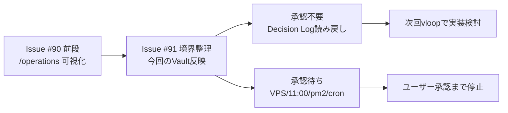

# vloop 一括サマリー 2026-05-30_1632

## 実行日時
- 2026-05-30 16:32 JST

## 実行件数
- 1 Epic / 2 Issue 確認（#90 前段完了確認、#91 本文・コメント確認）
- Vault 反映 1 件（#91 次フェーズ実行境界）

## 対象Epic
- Issue #91: Epic: AI工場オペレーションセンター（自動実行・承認・継続実行基盤）
- 前段確認: Issue #90: Progressアプリでvloop運用・Vault・GitHub Issue・Queue状況を一元確認できるようにする

## できるようになったこと
- #90 の前段完了内容（Progress `/operations`、正本整理、承認ゲート保護、起動時読み順）を #91 の土台として再確認した。
- #91 の残機能を「承認不要で進めてよい範囲」と「承認待ちに残す範囲」に分離した。
- VPS 起動時 / 毎朝 11:00 / Claude 上限回復後の自動起動、pm2 / cron / systemd 実操作、外部公開、認証情報・課金利用は `[ ]` 承認待ちに残した。
- 次に承認不要で進める候補を Decision Log 読み戻し導線に絞った。

## 変更ファイル
- `20_reviews/2026-05-30_issue-91-ops-center-next-phase.md`
- `20_reviews/vloop運用-progress統合-役割整理.md`
- `20_reviews/案件別ToDo一覧.md`
- `20_reviews/vloop_queue.md`
- `20_reviews/_review_queue.md`
- `03_prompts/claude-commands/logs/vloop_2026-05-30_1632.md`

## commit hash
- Vault 内容反映: `805063e`
- 本ログ: 別 commit で追記（最終 hash は Issue コメントと最終報告に記載）

## push
- 本ログ commit 後に push 予定

## 検証結果
- `git pull origin main` 実行済み。結果: Already up to date.
- `gh api` で Issue #90 / #91 本文・コメント確認済み。
- `git diff --stat` / `git diff` で変更内容確認済み。
- 機密混入チェック実施。検出は既存文脈の `token` / `.env` / `API キー` 言及のみで、実値なし。

## 停止理由
- #91 のうち、今回安全に実行できる Vault 正本反映は完了。
- 残る自動起動・pm2/cron実操作・外部公開・認証情報利用は承認待ち対象。
- 停止理由の正当性: 正当（vloop停止条件監査ルール §1-3「認証情報・課金・外部公開など人間判断が必要」および §1-2「破壊的変更が必要」に該当し得るため、実操作は停止）

## 未対応点
- #91 の自動起動トリガは未実装。
- pm2 / cron / systemd の実操作は未実施。
- approval 投入元は未実装。
- Decision Log 読み戻し導線は設計対象として分離したが、ny01 側実装は未着手。
- #90 / #91 は close していない。

## 次の一手
1. ny01 側で `operational-decisions.ndjson` を次回実行文脈として読むローカル導線を実装する。
2. 承認待ちがある Epic を自動実行対象から除外するガードを追加する。
3. 自動起動トリガは、ユーザー承認後に cron / pm2 / systemd のどれを採用するか決める。

## Issue単位の状態分類

| Issue | 状態 | レビュー状態 | 根拠 |
|---|---|---|---|
| #90 | user_check | reviewed_followup | 前段実装と役割整理は commit `6291e14` / `166dfe4` で完了済み。close はユーザー判断。 |
| #91 | open | reviewed_followup | 今回、実行境界を Vault に反映。自動起動、approval 投入元、Decision Log 読み戻し実装が残る。 |

## 未処理Issue一覧

| Issue | 状態 | 次に処理すべき理由 |
|---|---|---|
| #91 | open | Decision Log 読み戻し導線は承認不要で次に進められる。自動起動系は承認待ち。 |
| #90 | user_check | ユーザーがレビューして close 判断。 |

## 次に処理すべきIssue
- #91。理由: high-priority Epic で、承認不要範囲として Decision Log 読み戻し導線が残っているため。

## 1枚図サマリー

用語注:
- `/operations` = AI工場の管制画面
- Decision Log = 承認結果を次回実行へ引き継ぐ記録
- pm2 / cron = サーバー上で自動実行や常駐を行う仕組み
- vloop = Claude 側で Epic をまとめて進める実行コマンド

## ChatGPTレビュー依頼文

Issue #91「AI工場オペレーションセンター」について、`20_reviews/2026-05-30_issue-91-ops-center-next-phase.md` の境界整理をレビューしてください。

確認観点:
1. 承認不要範囲（read-only改善、approval/Decision Logローカル整備、ExecutionRun由来ToDo下書き）は十分に安全か。
2. 承認待ち範囲（VPS起動時/毎朝11:00/上限回復後の自動起動、pm2/cron/systemd実操作、外部公開、認証情報・課金利用）に漏れがないか。
3. 次に実装する最小単位を Decision Log 読み戻し導線に絞る判断は妥当か。
