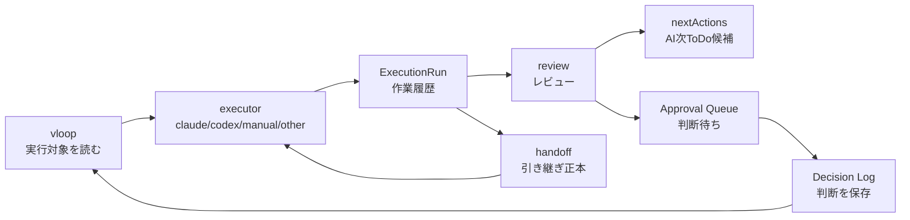

# vloop 一括サマリー 2026-05-30_1745

## 実行日時
- 2026-05-30 17:45 JST

## 実行件数
- 1 Epic（Issue #91）
- Progress 実装 1 セット
- Vault 設計反映 1 セット

## 対象Epic
- Issue #91: AI工場オペレーションセンター（自動実行・承認・継続実行基盤）

## できるようになったこと
- Claude / Codex 固定ではなく `executor` 抽象で設計した。
- `project-tasks` / `work-queue` / `ExecutionRun` に executor 任意フィールドを持てるようにした。
- `/api/operations/automation` を追加し、既存 queue / project-tasks / ExecutionRun / Approval / Decision Log / handoff を read-only 集約した。
- `/operations` に Decision Log、AI次ToDo候補、handoff、executor別状態、再開 readiness を表示した。
- 集中作業プロンプトを executor 中立にし、Claude上限時は会話履歴ではなく handoff を正本にするルールを追加した。

## 変更ファイル
- Progress:
  - `progress/types/progress.ts`
  - `progress/types/session.ts`
  - `progress/types/execution-run.ts`
  - `progress/lib/types/operations.ts`
  - `progress/lib/operations-store.ts`
  - `progress/app/api/operations/automation/route.ts`
  - `progress/app/operations/page.tsx`
  - `progress/app/api/tasks/route.ts`
  - `progress/app/api/tasks/[taskId]/route.ts`
  - `progress/app/api/execution-runs/route.ts`
  - `progress/lib/progress-writer.ts`
  - `progress/lib/session-writer.ts`
  - `progress/components/queue/PromptCopy.tsx`
- Vault:
  - `20_reviews/2026-05-30_ai-factory-automation-mvp.md`
  - `20_reviews/vloop_queue.md`
  - `20_reviews/案件別ToDo一覧.md`
  - `20_reviews/_review_queue.md`
  - `03_prompts/claude-commands/logs/vloop_2026-05-30_1745.md`

## commit hash
- Progress / ny01: commit 後に追記
- Vault: commit 後に追記

## push
- commit 後に push 予定

## 検証結果
- Vault `git pull origin main`: Already up to date
- Progress `npm run lint`: 成功
- Progress `npx tsc --noEmit`: 成功
- Progress `npm run build`: 成功
- Dev server: `http://127.0.0.1:3011`
- `HEAD /operations`: 200 OK
- `GET /api/operations/automation`: 200 OK
- `GET /api/operations/health`: 200 OK
- ExecutionRun: `20260530-174639` 登録成功

## 未対応点
- Approval Queue へ判断待ちを自動生成する処理は未実装。
- Decision Log を executor 起動プロンプトへ自動注入する処理は未実装。
- ExecutionRun `nextActions` から `pending_approval` ToDo 下書きを生成する処理は未実装。
- Claude→Codex の実自動切替は未実装。
- systemd / cron / pm2 実操作は未実施。
- Factory成果物台帳、収益化機能、市場調査連携は今回対象外。

## 停止理由
- 今回の承認不要範囲（調査、executor抽象設計、read-only readiness API、Progress表示、Vault反映、検証）を完了。
- 残りは自動切替・自動起動・approval自動生成など次段階の実装。

## 停止理由の正当性判定
- 正当。
- 根拠: 今回のMVP範囲は完了。自動起動や実プロセス制御はユーザー承認待ち条件に該当し得るため未実施。

## Issue単位の状態分類

| Issue | 状態 | レビュー状態 | 根拠 |
|---|---|---|---|
| #91 | open | reviewed_followup | executor抽象と readiness 表示は実装済み。Decision Log 読み戻し、AI生成ToDo永続化、Claude→Codex実切替が残る。 |
| #90 | user_check | reviewed_followup | 前段可視化は完了済み。close はユーザー判断。 |

## 未処理Issue一覧

| Issue | 状態 | 次に処理すべき理由 |
|---|---|---|
| #91 | open | AI工場自動化の残実装がある。次は handoff 生成 / Decision Log 読み戻し / AI生成ToDo下書き化。 |
| #90 | user_check | ユーザー close 判断待ち。 |

## 次に処理すべきIssue
- #91。理由: 自動化完成が最優先で、承認不要の次段階が残っているため。

## 1枚図サマリー

## ChatGPTレビュー依頼文

Issue #91「AI工場オペレーションセンター」について、今回の executor 抽象 MVP をレビューしてください。

確認観点:
1. Claude / Codex 固定を避ける executor 設計として十分か。
2. 新規キューを作らず既存 `project-tasks` / `work-queue` / `ExecutionRun` を拡張する方針は安全か。
3. `/api/operations/automation` の read-only readiness が、vloop再開・handoff・AI生成ToDo・Approval Queue・Decision Log の現在地確認として足りるか。
4. 次に進めるべき実装は handoff生成、Decision Log読み戻し、ExecutionRun nextActionsのpending_approval化のどれを優先すべきか。
