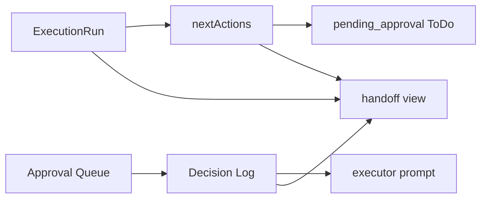

# vloop 一括サマリー 2026-05-30_1820

## 実行日時
- 2026-05-30 18:20 JST

## 実行件数
- 1 Epic（Issue #91）
- Progress 実装 1 セット
- Vault 設計反映 1 セット

## 対象Epic
- Issue #91: AI工場オペレーションセンター

## できるようになったこと
- Approval Queue を `approvals.json` へ自動生成するAPIを追加した。
- Decision Log を `operational-decisions.ndjson` から読み戻し、executorへ渡す context APIを追加した。
- 集中作業プロンプトが Decision Log context を読み込み、次回executorへ注入するようにした。
- ExecutionRun `nextActions` を `project-tasks.json` の `pending_approval` ToDoへ変換できるようにした。
- handoffを独立正本にせず、ExecutionRun + Decision Log + Next Actions + Approval Queue から生成されるビューにした。

## 変更ファイル
- Progress:
  - `progress/lib/types/operations.ts`
  - `progress/lib/operations-store.ts`
  - `progress/types/progress.ts`
  - `progress/lib/progress-writer.ts`
  - `progress/app/api/tasks/route.ts`
  - `progress/app/api/tasks/[taskId]/route.ts`
  - `progress/app/api/operations/approvals/generate/route.ts`
  - `progress/app/api/operations/decisions/context/route.ts`
  - `progress/app/api/operations/next-actions/route.ts`
  - `progress/app/api/operations/handoff/route.ts`
  - `progress/app/operations/page.tsx`
  - `progress/components/queue/PromptCopy.tsx`
- Vault:
  - `20_reviews/2026-05-30_ai-factory-automation-phase2.md`
  - `20_reviews/vloop_queue.md`
  - `20_reviews/案件別ToDo一覧.md`
  - `20_reviews/_review_queue.md`
  - `03_prompts/claude-commands/logs/vloop_2026-05-30_1820.md`

## commit hash
- Progress / ny01: commit 後に追記
- Vault: commit 後に追記

## push
- commit 後に push 予定

## 検証結果
- `git pull origin main`（ny01 / vault）: Already up to date
- `npm run lint`: 成功
- `npx tsc --noEmit`: 成功
- `npm run build`: 成功
- `GET /api/operations/decisions/context`: 200 OK
- `GET /api/operations/handoff`: 200 OK
- `GET /api/operations/next-actions?limit=3`: 200 OK
- `POST /api/operations/next-actions`: 200 OK
- `HEAD /operations`: 200 OK
- pending_approval生成: `ExecutionRun 20260530-174639` 由来で3件生成、再実行時 `created: 0 / skipped: 3`
- ExecutionRun登録: `20260530-182220`

## 未対応点
- Approval Queue生成APIは実装済みだが、架空判断を残さないため実データPOST検証は未実施。
- executorがblockedになった瞬間に自動でApproval Queue生成APIを呼ぶ導線は未実装。
- pending_approval ToDoのapprove / hold / reject UI改善は未実装。
- Claude→Codex自動切替は後回し。
- systemd / cron / pm2 実操作は未実施。

## 停止理由
- 今回優先された Approval Queue生成、Decision Log読み戻し、pending_approval生成、handoff位置付け整理のMVPを完了。
- 残りは次フェーズの導線強化とUI改善。

## 停止理由の正当性判定
- 正当。
- 根拠: 今回指定の優先3点は実装・検証済み。Claude→Codex自動切替と自動起動は明示的に後回し。

## Issue単位の状態分類

| Issue | 状態 | レビュー状態 | 根拠 |
|---|---|---|---|
| #91 | open | reviewed_followup | Phase2は完了。blocked時のApproval自動呼び出し、pending_approval UI改善、Codex切替が残る。 |
| #90 | user_check | reviewed_followup | 前段可視化は完了済み。close はユーザー判断。 |

## 未処理Issue一覧

| Issue | 状態 | 次に処理すべき理由 |
|---|---|---|
| #91 | open | 自動化完成へ向け、blocked時Approval生成導線とpending_approval UI改善が残る。 |
| #90 | user_check | ユーザー close 判断待ち。 |

## 次に処理すべきIssue
- #91。理由: 自動化完成が最優先で、承認不要の次段階が残っているため。

## 1枚図サマリー

## ChatGPTレビュー依頼文

Issue #91 の AI工場自動化 Phase2 をレビューしてください。

確認観点:
1. handoffを正本にせず、ExecutionRun / Decision Log / Next Actions / Approval Queue から生成するビューにした整理は妥当か。
2. Approval Queue生成API、Decision Log context API、nextActions→pending_approval生成APIの責務分離は安全か。
3. pending_approvalを自動生成しても queued にしない設計で承認ゲートは守れているか。
4. 次は blocked時Approval自動生成導線とpending_approval UI改善のどちらを優先すべきか。
