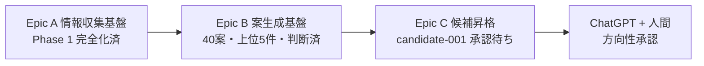

# Epic 一覧と完了条件

> Issue #50。vloop が「小 ToDo 消化」ではなく **Epic 完了**を優先するための、Epic の正本ステータス表。
> 運用ルールは [[../03_prompts/Epic単位運用]]（#42）、本ファイルは **各 Epic の完了条件と現在地**。

## Epic 完了優先の原則（Issue #50）

- vloop は小 Phase 完了で止まらない。Epic 完了条件まで進める
- 同じ目的の作業は新 Issue を増やさず既存 Epic 内で続行
- 止まってよいのは: 課金 / 外部公開 / 破壊的変更 / 規約リスク / 実行環境なし / Epic 完了 / 利用制限
- 止まってはいけないのは: 小 Phase 完了 / 追加調査残 / candidate 判断残 / レビューまとめ未作成

---

## Epic A: 情報収集基盤

**目的**: 無料情報源から毎日トレンドを収集し daily/ に蓄積する。

| Phase | 完了条件 | 現状 |
|---|---|---|
| 設計 | 取得方法 / 保存規約 / cron 設計 / 失敗継続 / ログ | ✅ 完了（#25/#29/#30/#36/#37/#39） |
| MVP 実動作 | 1 源で daily 生成 → 案生成 → 上位抽出 | ✅ 完了（#44/#45/#46・2026-05-21） |
| Phase 1 完全化 | 3 源以上で daily 44 件 / 40 案 / 上位 5 件 | ✅ 完了（#48・2026-05-21・HN+Reddit+iTunes） |
| 自動化移行 | cron 7 判定基準を 3 日連続クリア → cron 投入 | ⏳ 進行中（#47 基準あり / 3 日連続は 1 日目クリア） |

**Epic A 残**: cron 移行 3 日連続条件（あと 2 日）+ research-run / idea-run コマンド本体実装（別アプリリポジトリ・人間承認後）

**所属 Issue**: #25 #29 #30 #32 #33 #36 #37 #38 #39 #44 #45 #46 #47 #48

---

## Epic B: 案生成基盤

**目的**: daily から案を生成し、上位を candidate 化判断する。

| Phase | 完了条件 | 現状 |
|---|---|---|
| 設計 | idea_pool 生成ルール / 30 案 / dedup / スコア | ✅ 完了（#26/#34） |
| 30 案生成 | daily から 30 案以上 | ✅ 完了（#45・40 案 / #48・3 源版） |
| 上位抽出 | sortKey 降順上位 5 件 | ✅ 完了（#48） |
| candidate 化判断 | 上位案を追加調査し candidate 化 or hold | ✅ 完了（#49・#039 統合 / #030 hold） |
| 実行フェーズ（収益化スコアリング） | 上位 5 案を収益化 6 軸でスコアリング → candidate 判断確定 | ✅ 完了（#52・#039 が 24/30 突出） |

**Epic B 残**: 各源 n 増（30→100/日）で根拠強化 → 新規 candidate 起票の再判定（次サイクル以降）

**所属 Issue**: #26 #27 #34 #35 #49 #52

---

## Epic C: 候補昇格と承認待ち

**目的**: candidate を ChatGPT 承認待ちに整備し、approved 後に progress 投入する。

| Phase | 完了条件 | 現状 |
|---|---|---|
| 承認ゲート設計 | 承認フロー / コマンド標準 / 承認待ちテンプレ | ✅ 完了（#18/#19/#24） |
| candidate-001 判断材料 | 承認パック / 公開ブロッカー / 7 日プラン / progress 投入設計 | ✅ 完了（#22/#23/#15/#16）+ #49 補強 |
| ChatGPT 承認待ち整備 | ChatGPT承認待ち.md に candidate-001 ブロック（最新材料） | ✅ 完了（#50 サイクルで #49 補強反映） |
| Epic C 仕上げ（承認判断可能状態） | 市場確認 / 実装現実性 / 収益導線 / 着手可否を承認パックに増補 | ✅ 完了（#53・承認パック §9-§14 増補） |
| ChatGPT 方向性承認 | candidate-001 approve / hold / reject | ⏳ **ChatGPT + 人間待ち**（vloop スコープ外） |
| approved → progress 投入 | 人間が status 確定 → progress ToDo 化 | ⏳ 人間待ち |

**Epic C 残**: ChatGPT が candidate-001 を方向性承認 → 人間が status 確定（**vloop は判断材料整備まで・承認はしない**）。判断材料は #53 で完備

**所属 Issue**: #18 #19 #22 #23 #24 #27 #35 #53

---

## Epic 横断 / 運用

| Issue | 内容 | 状態 |
|---|---|---|
| #28 | 案工場完全自動化フロー（A+B+C 統合 Runbook） | ✅ 設計完了 |
| #42 | Epic 単位運用ルール | ✅ 完了 |
| #50 | vloop Epic 完了優先運用 | ✅ 完了（vloop.md / 標準運用 / 本ファイル / レビュー運用） |
| #40 #41 #43 | ChatGPT レビュー手順・1 枚図サマリー | ✅ 完了 |

---

## 現在地（2026-05-22 時点）

> Epic A / B は設計 + 実動作完了。Epic C は candidate-001 の判断材料完備で **ChatGPT 承認待ち**。
> vloop の次の主作業は Epic A の「cron 移行 3 日連続条件」消化（実取得を毎日 1 回）。

## 次の一手

1. ChatGPT が candidate-001 を方向性承認（Epic C / `candidate-001 approve|hold|reject`）
2. vloop は Epic A の cron 移行 3 日連続条件を消化（毎日 1 回 Phase 1 実行）
3. Epic B は各源 n 増で根拠強化（新規 candidate 起票の再判定）

## 関連

- [[../03_prompts/Epic単位運用]]（#42 運用ルール）
- [[案工場_完全自動化フロー]]（#28 A+B+C 統合 Runbook）
- [[cron移行判定基準]]（#47 Epic A 自動化移行）
- [[../20_reviews/ChatGPT承認待ち]]（Epic C 入口）
- [[../03_prompts/claude-commands/vloop]]（#50 Epic 完了優先）
- Issue: kaeru07/vault#50
