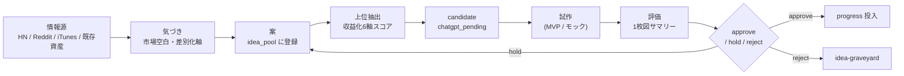

# idea_trace — 全アプリ案の情報源・着想理由・採用判断

> Issue #63。全案について「**情報源 → 気づき → 案 → 候補 → 試作 → 評価 → 判断**」を 1 ページで追えるハブ。
> 詳細はリンク先（candidate / app / 試作 / レビュー）へ。本ページは**索引と着想経路の正本**。

> [!important] このページの読み方
> - 案ごとにカード形式。**情報源**と**採用理由**と**APIなし範囲**を最重要視する
> - candidate / hold / reject の判断はここに残し、詳細は scenarios / 06_research に飛ばす
> - 新案を追加するときは末尾テンプレをコピーする

---

## 凡例

| 記号 | 意味 |
|---|---|
| 🟢 | approved（人間 + ChatGPT 承認済み・進行可） |
| 🟡 | candidate（ChatGPT 承認待ち / hold 含む） |
| 🔵 | idea（idea_pool 段階） |
| 🧪 | prototype（試作あり） |
| 🛑 | reject / 棚上げ |
| 💸 | 有料 API 必須範囲あり（要注意） |
| 🆓 | API なしで成立する範囲のみ |

---

## 案カード一覧（主要 10 件・vloop2 で N-03 / N-04 追加）

### 1. 🟡🆓 candidate-001: 何切るAI（mahjong + AI 解説 Web）

| 項目 | 内容 |
|---|---|
| 状態 | candidate / chatgpt_pending（candidate-001 統合補強で #039 統合済み） |
| 情報源タイプ | 既存資産 + iTunes Search JP（#039 補強） |
| 情報源 | [[../02_apps/mahjong]]（既存資産・スコア計算 + 牌効率） / iTunes Search `term=何切る` 10 件 / [[../06_research/2026-05-22_上位5案追加調査]] §3-1 |
| 気づき | 「何切る」専業アプリは 10 件以上だがレビュー数最大 354 と**ニッチで激戦区ではない**。AI 冠は 1 件のみ（14 reviews）→ **AI 解説で差別化軸が取りやすい** |
| 採用理由 | 既存資産 mahjong を流用できる / Web 化で iPhone 不要 / Shorts 化との相性（何切る解説 1 分動画）/ 学習用途で広告向き |
| APIなし範囲 | 何切る問題提示・解説テキスト・操作 UI・ローカル牌効率計算（既存 mahjong-trainer の流用）・サンプル解説テキスト同梱 |
| 有料 API 範囲 💸 | AI 解説の動的生成（ChatGPT API 等を呼ぶ場合）→ MVP は**事前生成テキストで回避** |
| 収益化導線 | アプリ広告 + Web 広告 + Shorts 送客（投稿 → アプリ送客） |
| 試作状況 | 既存 mahjong-trainer あり / Web 版 AI 解説は ChatGPT 承認後に着手予定 |
| 試作リンク | [[../02_apps/mahjong]] / [[scenarios/candidate-001]] |
| 判断履歴 | 2026-05-22 candidate-001 起票 → 2026-05-22 #039 統合補強（収益化スコア 24/30）→ 2026-05-24 ChatGPT 承認待ち |
| 次の判断 | ChatGPT が candidate-001 を approve / hold / reject |
| 関連 Issue | candidate-001 統合 → [[scenarios/candidate-001_ChatGPT承認パック]] |

---

### 2. 🟡🆓🧪 token-speed-tool: LLM トークン速度・ベンチ可視化ツール（Issue #60/#62 / **candidate-005 正規化済**）

| 項目 | 内容 |
|---|---|
| 状態 | **candidate-005 として scenarios 正規化済**（[[scenarios/candidate-005]]）/ MVP モック動作確認済 |
| 情報源タイプ | HN（Hacker News）+ Claude Code / Codex 実体験 + ローカル LLM 比較ニーズ |
| 情報源 | HN「How fast is N tokens/s really」（ideaId 20260521-003 / [[idea_pool/2026-05-21.ndjson]]）/ HN「Show HN: CPU only transcription」（関連・20260521-002）/ Claude Code 利用時のトークン速度体感差 / ローカル LLM（Ollama / llama.cpp）速度比較ニーズ |
| 気づき | tokens/sec という単一指標だけでなく**「初回応答時間 / 総生成時間 / 出力量」を体感スコア化**したい需要が AI 開発者層にある。既存ベンチサイトは数値羅列で読みづらい |
| 採用理由 | API を呼ばずに**手入力 + ローカルログ貼付 + 公開ベンチ取り込み**で成立する / iPhone でも閲覧可能 / Shorts 化（速度比較動画）と相性 / 体感スコアという独自軸で差別化 |
| APIなし範囲 🆓 | 手入力フォーム / ローカル LLM ログ解析（貼り付け） / 公開ベンチ手動取り込み / tokens/sec / TTFT（Time To First Token）/ 体感スコア計算 / 比較テーブル / グラフ表示 / JSON エクスポート/インポート / localStorage 保存 |
| 有料 API 範囲 💸 | 実 LLM 呼び出しによる自動ベンチ（OpenAI / Anthropic API）→ **MVP では呼ばない**。将来オプションで「Bring your own key」検討 |
| 収益化導線 | アプリ広告（無料層）/ note 販売（ベンチ結果まとめ）/ Shorts（速度比較動画）/ プレミアム機能（複数モデル一括比較・履歴無制限） |
| 試作状況 🧪 | 本サイクル（2026-05-24）で MVP 静的 HTML モック作成 → [[../90_prototypes/token-speed-tool/README]] |
| 試作リンク | [[scenarios/candidate-005]] / [[scenarios/candidate-005_公開ブロッカー]] / [[scenarios/candidate-005_7日実行プラン]] / [[scenarios/candidate-005_progress投入設計]] / [[../20_reviews/candidate-005_ChatGPT承認パック]] / [[token-speed-tool]] (仕様) / [[../90_prototypes/token-speed-tool/README]] (モック) |
| 判断履歴 | 2026-05-21 idea_pool 登録（粗 score 10）→ 2026-05-22 上位 5 案に入る → 2026-05-22 hold（AI 分野継続性難で）→ 2026-05-24 vloop1「APIなし前提」で再評価・MVP モック試作 → 2026-05-24 vloop2 candidate-005 として正規化（28/40・25/30）→ **2026-05-24 vloop3 承認材料 4 ファイル完備（公開ブロッカー / 7 日プラン / progress 投入設計 / ChatGPT 承認パック）= candidate-001 と同水準** |
| 次の判断 | ChatGPT が candidate-005_ChatGPT承認パック を方向性レビュー → 人間が approved 判断 → progress 投入 |
| 関連 Issue | #60 試作 / #62 trace / #61 試作ループ |

---

### 3. 🔵🆓 何切る特化 AI 解説 Web（#039 → candidate-001 統合扱い）

| 項目 | 内容 |
|---|---|
| 状態 | candidate-001 統合（新規 candidate 起票なし） |
| 情報源タイプ | iTunes Search JP |
| 情報源 | iTunes Search `term=何切る&country=jp&entity=software` 10 件取得（[[../06_research/2026-05-22_上位5案追加調査]] §3-1） |
| 気づき | 何切る専業 10 件、AI 冠は 1 件のみ。ニッチだが空白あり |
| 採用理由 | candidate-001 補強として最有効。既存 mahjong 資産流用度大 |
| 統合先 | candidate-001（カード 1） |

---

### 4. 🟢 nanikiru-shorts: 麻雀「何切る？」動画チャンネル

| 項目 | 内容 |
|---|---|
| 状態 | 開発中 / 公開準備 |
| 情報源タイプ | 既存資産 + YouTube Shorts 仮説 |
| 情報源 | [[../02_apps/nanikiru-shorts]] / 議論喚起型 UI が差別化仮説 |
| 気づき | コメント数が高い動画形式（議論喚起）+ 1 分テンポ + 既存 mahjong 問題集の再利用 |
| 採用理由 | 既存 mahjong 問題が再利用できる / 投稿フリクション低い / candidate-001 と送客連動 |
| APIなし範囲 🆓 | 動画生成パイプライン（テンプレベース）/ 投稿スケジューラ |
| 有料 API 範囲 | なし（動画素材生成ローカル / 既存問題集流用） |
| 収益化導線 | YouTube Shorts 広告 / アプリ送客 |
| 試作状況 | 既存パイプラインあり |
| 判断履歴 | 2026-05 進行中 / Phase A 案工場と連動 |
| 次の判断 | テンプレ A/B 量産 → 10 本試験投稿 |

---

### 5. 🔵🆓 mahjong-trainer / quiz / analyzer

| 項目 | 内容 |
|---|---|
| 状態 | 開発中（candidate-001 と統合扱い） |
| 情報源タイプ | 既存資産 |
| 情報源 | [[../02_apps/mahjong]] |
| 気づき | 牌効率計算 + JSON 問題集量産で広告 + 後課金が可能 |
| 採用理由 | 既存資産活用度 100% / Web 化と App 版の両展開可 |
| APIなし範囲 🆓 | 問題提示・解説・スコアリング・JSON 配布 |
| 有料 API 範囲 | なし（AI 解説は事前生成可） |
| 収益化導線 | アプリ広告 + 後課金 + Web 広告 |
| 判断履歴 | candidate-001 統合・本流 |

---

### 6. 🔵💸 Qwen3.7-Max エージェント評価アプリ（#001）

| 項目 | 内容 |
|---|---|
| 状態 | hold（収益化スコア 16/30・継続性 2/5） |
| 情報源タイプ | HN（ai-news） |
| 情報源 | HN「Qwen3.7-Max the agent frontier」（ideaId 20260521-001）/ [[../06_research/2026-05-22_上位5案追加調査]] §2 |
| 気づき | エージェント比較ニーズはあるが**継続性が低い**（モデル更新で陳腐化早い）/ 評価には追加 API キー必須 |
| 採用理由 | （hold） — モデル更新サイクルが早すぎ収益持続性に難 |
| APIなし範囲 | エージェント比較テーブル表示のみ（手入力データ）。**自動評価には API キー必須**💸 |
| 有料 API 範囲 💸 | 各社 LLM API 課金 |
| 判断履歴 | 2026-05-21 idea 登録 → 2026-05-22 hold（継続性難） |
| 次の判断 | 6 ヶ月後再評価（AI モデル淘汰後） |

---

### 7. 🛑 動画文字起こし Web SaaS freemium（#030）

| 項目 | 内容 |
|---|---|
| 状態 | hold（競合確立・スコア 15/30 最下位） |
| 情報源タイプ | HN |
| 情報源 | HN「Show HN: CPU only transcription」（20260521-030 派生）/ iTunes Search `term=transcription` 15 件 |
| 気づき | Notta 24550 / Plaud 14996 / Texter 7813 / Otter 5169 と日本市場で 5 桁レビュー 4 社が確立 |
| hold 理由 | (1) 競合確立（5 桁レビュー 4 社）/ (2) 差別化軸未特定 / (3) 既存資産流用度低 / (4) 収益試算困難 |
| APIなし範囲 | 文字起こし自体は API or ローカル Whisper 必須 → APIなし MVP は実質不可能 |
| 判断履歴 | 2026-05-22 hold（[[../06_research/2026-05-22_上位5案追加調査]] §3-2 4 理由） |

---

### 8. 🔵🆓🧪 N-03: LLM Chooser（Claude / Codex / Gemini / ローカル 使い分けチャート）

| 項目 | 内容 |
|---|---|
| 状態 | idea / 試作モック完成（次サイクルで candidate 判断） |
| 情報源タイプ | ユーザー発案 + 試作ループ Phase2 選定（N-03 ID） |
| 情報源 | [[試作ループ検証]] Phase2 で N-01 と並ぶ 3 候補入り |
| 気づき | 「どの LLM を使うべきか」の判定フローは静的 HTML 1 枚で十分成立する。AI 利用者層に SNS 拡散しやすい |
| 採用理由 | candidate-005（token-speed-tool）と**相互送客**できる / 単独でも note 化容易 |
| APIなし範囲 🆓 | 質問分岐 / カード表示 / 比較表 / すべて静的 HTML+JSON ベース（API 呼び出しゼロ）|
| 有料 API 範囲 💸 | なし |
| 収益化導線 | 広告 + テンプレ販売（チートシート md）+ Shorts 送客 |
| 試作状況 🧪 | [[../90_prototypes/llm-chooser/README]]（クイズ 4 種・全 LLM カード・機能比較表 9 項目 × 4 LLM） |
| 試作リンク | [[../90_prototypes/llm-chooser/README]] |
| 判断履歴 | 2026-05-24 vloop1 N-03 として 14 案に追加 → vloop2 静的 HTML 試作完了 |
| 次の判断 | ChatGPT が判定基準（個人観察ベース）の妥当性レビュー / iPhone 表示確認 / candidate 化判断 |
| 関連 Issue | #61 試作ループ |

---

### 9. 🔵🆓🧪 N-04: Vault Search Cheatsheet（iPhone Obsidian + GitHub Vault 検索チートシート）

| 項目 | 内容 |
|---|---|
| 状態 | idea / 試作モック完成 |
| 情報源タイプ | 既存資産（Vault の見方ガイド）+ ユーザー発案 |
| 情報源 | [[../00_inbox/Vaultの見方_どこを見れば何がわかるか]] / 試作ループ Phase2 で N-04 選定 |
| 気づき | iPhone Obsidian の日本語ファイル名検索の制約 / GitHub Web 検索仕様の差は、**1 枚物の早見表で吸収できる** |
| 採用理由 | 既存資産を Web 化するだけで成立 / Vault ユーザ層と直接接続 / 自己メンテも容易 |
| APIなし範囲 🆓 | 静的 HTML 1 枚（検索ボックスでテーブル絞り込み） |
| 有料 API 範囲 💸 | なし |
| 収益化導線 | 広告（Obsidian / Vault ユーザ層・低 CPC だが読了率高）+ テンプレ販売（拡張版 md）+ note |
| 試作状況 🧪 | [[../90_prototypes/vault-search-cheatsheet/README]]（20 件キーワード対応表 + iPhone/GitHub Tips + トラブル対応） |
| 試作リンク | [[../90_prototypes/vault-search-cheatsheet/README]] |
| 判断履歴 | 2026-05-24 vloop1 N-04 として 14 案に追加 → vloop2 静的 HTML 試作完了 |
| 次の判断 | 既存「Vault の見方ガイド」との内容重複整理 / iPhone 表示確認 / candidate 化判断 |
| 関連 Issue | #61 試作ループ / #55 見方ガイド / #58 START_HERE |

---

### 10. 🔵🆓 Scrape Lab v2（情報源パイプライン）

| 項目 | 内容 |
|---|---|
| 状態 | 開発中（情報源側基盤） |
| 情報源タイプ | 既存資産 |
| 情報源 | [[../02_apps/scrape-lab-v2]] / [[../06_research/トレンド収集エンジン設計]] |
| 気づき | 案工場の前段（情報源収集）として必要 |
| 採用理由 | 直接収益化ではなく**他案の燃料**として価値あり |
| APIなし範囲 🆓 | HN / Reddit / iTunes Search 取得（全て無料 API or スクレイピング） |
| 有料 API 範囲 | なし |
| 収益化導線 | 間接（他案の根拠を強化） |
| 判断履歴 | Epic A 情報収集基盤として進行中 |

---

## 着想経路の流れ（1 枚図）



> 用語注: tokens/sec = 1 秒あたりの生成トークン数 / TTFT = 初回応答までの秒数 / candidate = 承認前の有力候補 / approve = ChatGPT + 人間が方向性承認 / hold = 保留（捨てない）/ APIなし = 外部 LLM/SaaS API を呼ばない構成

---

## APIなし / 有料 API 必要範囲の早見表

| 案 | APIなしで成立する範囲 | 有料 API 必須範囲 | MVP は APIなしで可能か |
|---|---|---|---|
| candidate-001 何切る AI | UI / 牌効率 / 事前生成解説 | 動的 AI 解説（任意） | ✅ 可 |
| candidate-005 token-speed-tool | 手入力 / ログ貼付 / 体感スコア / 比較 | 自動ベンチ（オプション） | ✅ 可（MVP モック動作確認済） |
| mahjong-trainer | 全機能 | なし | ✅ 可 |
| nanikiru-shorts | 全機能 | なし | ✅ 可 |
| N-03 LLM Chooser | 全機能（クイズ + 早見表 + 比較表） | なし | ✅ 可（静的 HTML 完成） |
| N-04 Vault Search Cheatsheet | 全機能（検索ボックス + 対応表 + Tips） | なし | ✅ 可（静的 HTML 完成） |
| Qwen3.7-Max 評価 | 手入力比較表のみ | 自動評価（必須） | ⚠ 限定的 |
| 文字起こし SaaS | UI のみ | 文字起こしエンジン（必須） | ❌ 不可 |
| Scrape Lab v2 | 全機能 | なし | ✅ 可 |

---

## カード追加テンプレ（新案を増やすとき使う）

```markdown
### N. 🔵🆓 案名（短く）

| 項目 | 内容 |
|---|---|
| 状態 | idea / candidate / prototype / hold / reject |
| 情報源タイプ | HN / Reddit / iTunes / Scrape Lab / 既存資産 / ユーザー発案 / 作業報告 |
| 情報源 | [[リンク or URL]] / どこから来た情報か |
| 気づき | この情報から何を読み取ったか（1〜2 行） |
| 採用理由 | なぜ案として採用したか |
| APIなし範囲 🆓 | 列挙 |
| 有料 API 範囲 💸 | 列挙（なければ「なし」） |
| 収益化導線 | 広告 / note / Shorts / 課金 等 |
| 試作状況 | なし / モック / MVP / 公開済 |
| 試作リンク | [[...]] |
| 判断履歴 | 日付ベースで時系列 |
| 次の判断 | 次に何を決める必要があるか |
| 関連 Issue | #N / #M |
```

---

## 関連

- [[../00_START_HERE|START HERE]]
- [[収益化候補一覧]]（旧索引・本ページと併用）
- [[scenarios/README]]（candidate 詳細）
- [[epics]]（Epic 進捗）
- [[idea_pool/_README]]（idea_pool 仕様）
- [[../06_research/2026-05-22_上位5案追加調査]]（収益化スコアリング根拠）
- [[token-speed-tool]]（#60 / #62 着地ファイル）
- [[試作ループ検証]]（#61）
- [[../90_prototypes/token-speed-tool/README]]（#60 MVP モック）
- Issue: kaeru07/vault#63 / #60 / #61 / #62
