> [!note] 用語注（Issue #69）
> - candidate / 有力候補 = 収益化する価値があるかもしれない案
> - pending_approval = 承認待ち（ChatGPT 方向性レビュー + あなた approve 判断待ち）
> - approved = 承認済み（実装着手 OK）
> - progress 投入 = progress（作業履歴アプリ・localhost:3010）への ToDo 追加
> - ストア公開 = Google Play / App Store への正式公開
> - AdMob = Google 提供のモバイルアプリ向け広告 SDK
> - 公開ブロッカー = 公開を阻む技術・素材・文面などの問題（B1〜B5 で番号付け）
> - ASO 文面 = アプリストア向けの説明文（検索流入を増やすための文言）
> - 妥当性評価メタ = 調査の根拠を「どこで・いつ・何件・情報源種別」で記録したもの

## 収益化シナリオ（1文）
既存のほぼ完成している麻雀「何切る」アプリの公開ブロッカー（公開を阻む問題）を解消してストア公開し、AdMob（Google の広告 SDK）広告で収益を得る。

## 調査根拠（妥当性評価メタ）
- どこを調べたか: Google Play「麻雀 何切る」ストア検索、麻雀アプリまとめ/ランキング記事 / 2026-05-18 / n=10 / 情報源種別: 公式（ストア一次）+二次
- 収益性の根拠: 専業の何切るアプリが複数継続運用＝市場成立。広告モデルが一般的。**ただし実DL数・収益額はストア非公開（推測）→ 人間が一次確認**
- 競合の根拠: 同カテゴリ上位に確立アプリ約5本（牌効率/AI/ウザク式/一択）。レッドオーシャン寄りだが差別化軸（AI解析/流派特化等）は成立
- 鮮度: 良好（2026年閲覧/2026-01ランキング）/ 再現性: 高（同検索語で再現）
- スコア: 収益3 速度4 流用4 広告4 動画4 継続3 競合回避2 根拠4 = 28/40

## 最初の1作業（progress送り用・1つに分解）
- 作業: 対象となる既存麻雀何切るアプリを1本特定し、ストア公開を阻む技術ブロッカーを1件洗い出す（実装はしない／棚卸しのみ）
- 完了条件: 対象アプリ名と「公開を阻んでいる具体ブロッカー1件」が文書化されている

## AI/人間の分担
- AI: 既存アプリ棚卸し・公開ブロッカー調査・実装ドラフト・ストア文面ドラフト・検証
- 人間承認が必要: approved 昇格 / ストア公開可否 / 広告アカウント設定 / 課金設計

## 差別化軸の補強（2026-05-22 / Issue #49 / Epic B 追加調査）

iTunes Search JP（無料 API）の一次データ確認結果（[[../../06_research/2026-05-22_上位5案追加調査]] §3-1）:

- **何切る専業アプリは 10 件以上**存在し、市場として確立済（ウザク式 354 / 一択 227 / 牌効率 176 ほか）
- レビュー数は最大 354 と限定的で **ニッチ市場・激戦区ではない**（雀魂 807969 のような巨人不在）
- **AI を冠した何切るアプリは「麻雀何切るAI」1 件（14 reviews）のみ** → AI 解説の差別化軸はまだ取りやすい
- Education カテゴリにも「みんなの何切る」が存在 → 学習用途の需要あり

### 追加する差別化軸（candidate-001 統合）

1. **Web 版を持つ**（既存 mahjong は Next.js なので Web 公開と相性◯）
2. **AI 解説機能**（何切る選択の根拠を LLM で解説）— 既存「麻雀何切るAI」より深い説明を狙う
3. **Education カテゴリも視野**（学習用途として教育系広告との相性）

## ステータス履歴
- 2026-05-18 candidate（AI起票・Issue #3 初回定期調査）
- 2026-05-18 pending_approval（妥当性評価完了・情報源公式一次で条件充足。**approved/progress送りは人間判断待ち**）
- 2026-05-22 補強（Issue #49 / Epic B 追加調査・iTunes Search 何切る市場データで差別化軸を実データ裏付け）
- 2026-05-22 Epic C 仕上げ（Issue #53・市場確認/実装現実性/収益導線/着手可否を承認パックに増補。ChatGPT 承認判断可能状態に到達。**status は pending_approval のまま・approved 化は人間判断待ち**）

## 🗺 現在地図（Issue #68 / 状態色分け Mermaid）

```mermaid
flowchart LR
  P1["着想<br/>(2026-05-18)"]:::done --> P2["候補化<br/>(candidate)"]:::done
  P2 --> P3["市場補強<br/>(2026-05-22 iTunes Search)"]:::done
  P3 --> P4["承認パック §1-§14<br/>(2026-05-22)"]:::done
  P4 --> P5["ChatGPT 方向性レビュー<br/>+ あなた approve 判断"]:::user
  P5 -->|"approved"| P6["B1 build 検証<br/>(Day1)"]:::next
  P6 --> P7["B2 デプロイ確認<br/>(Day2)"]:::next
  P7 --> P8["B3 ストア文面 / B4 素材 / B5 動画<br/>(Day3-6)"]:::next
  P8 --> P9["公開 + AdMob 収益化"]:::next

  classDef done fill:#22c55e,color:#0b1224
  classDef user fill:#facc15,color:#0b1224
  classDef next fill:#a78bfa,color:#0b1224
  classDef blocked fill:#ef4444,color:#fff
```

> 用語注: ✅ 緑=完了 / 🧑 黄=あなた確認待ち / ⏭ 紫=次サイクル（approved 後）/ B1〜B5 = 公開ブロッカー（公開を阻む問題）の種別番号 / AdMob = Google の広告 SDK

## 関連
- 調査レポート: [[../../06_research/2026-05-18_収益化定期調査_初回]] / [[../../06_research/2026-05-22_上位5案追加調査]]
- [[../収益化シナリオ承認フロー]] / [[../progress連携基準]]
- Issue: kaeru07/vault#3 / 連動: kaeru07/vault#5 / 補強: kaeru07/vault#49
