## 収益化シナリオ（1 文）

iPhone Obsidian + GitHub Vault の**検索パターン早見表**を静的 HTML 1 枚にまとめて公開し、Vault ユーザー層への広告 + テンプレ販売 + note で収益化する。

## 対象アプリまたは資産

- 新規: vault-search-cheatsheet（[[../../90_prototypes/vault-search-cheatsheet/README|MVP モック]]）
- 既存資産: 「Vault の見方ガイド」（[[../../00_inbox/Vaultの見方_どこを見れば何がわかるか]]）

## 想定収益源

- 静的サイト広告（Google AdSense・Vault / Obsidian ユーザー層は **読了率高**だが絶対 PV 小）
- テンプレ販売（「Vault 検索チートシート Markdown 拡張版」）
- note 販売（「個人開発 Vault 運用ガイド」）

## 既存資産流用ポイント

- 試作完成済（検索ボックス + 20 件キーワード対応表 + iPhone/GitHub Tips + トラブル対応フロー）
- 既存「Vault の見方ガイド」と素材重複（**整理が必要**）
- 外部 CDN ゼロ・file:// 動作・sticky header 対応

## 最初の 1 作業（progress 送り用・1 つに分解）

- 作業: 既存「Vault の見方ガイド」との内容重複整理（実装はしない・差分メモのみ）
- 完了条件: 重複箇所 + 統合方針 1 行メモ

## 完了条件

- MVP モックが動作する（✅ 達成）
- API なし範囲が確定（✅ 全機能 API なし）
- iPhone 実機表示確認（⏳ 未達 / B1）
- 既存「Vault の見方ガイド」との重複整理（⏳ 未達）
- ChatGPT 方向性レビュー（⏳ 未達）
- 補助 4 ファイル（公開ブロッカー / 7 日プラン / progress 投入設計 / 承認パック）（⏳ 次サイクル）
- approved（⏳ approved 化禁止ルール / 人間判断）

## 調査根拠（妥当性評価メタ）

- どこを調べたか: vloop2 試作ループ検証 Phase2 で 14 案中 N-04 として 3 位選定 / 既存 Vault 見方ガイド + iPhone Obsidian 検索仕様 + GitHub Web 検索仕様
- 情報源種別: 内部一次（既存 Vault 資産）+ 個人運用観察
- 競合根拠: 個人 Obsidian Vault 向け検索チートシートの SaaS / Web 化は確認できず（**ニッチ市場**）
- 鮮度: 2026-05-24 / 再現性: 既存資産流用可
- スコア: 収益 2 速度 5 流用 5 広告 2 動画 3 継続 4 競合回避 4 根拠 3 = **28/40**

## 妥当性評価スコア / status

- scoreTotal: **28/40**（candidate-001 / 005 と同点・candidate-004 25/40 より上位）
- 収益化 6 軸スコア: Shorts 化 3 / MVP 速度 5 / 広告向き 2 / note 化 4 / 継続性 4 / 実装易しさ 5 = **23/30**
- status: **candidate**（試作完成済 + 既存資産流用度最大 + 継続性 4/5 だが、**広告 CPC 低い想定**で revenueImpact は low）
- **approved 化しない**（人間 + ChatGPT 承認待ち）

## AI / 人間の分担

- AI（Claude Code）:
  - MVP 試作（✅ 完了）
  - 既存「Vault の見方ガイド」との重複整理ドラフト（次サイクル可）
  - 補助 4 ファイル化ドラフト（次サイクル可）
- 人間承認が必要:
  - approved 昇格判断
  - 外部公開判断（Vercel デプロイ等）
  - 既存資産との統合方針承認
  - note 販売開始判断

## ステータス履歴

- 2026-05-24 vloop2 N-04 として 14 案に追加 → 試作候補 3 位選定 → 静的 HTML 試作完成
- 2026-05-24 vloop6 **candidate-007 として scenarios 正規化**（本ファイル）

## 既存「Vault の見方ガイド」との関係

- 重複範囲: 検索キーワード / Vault の構造 / iPhone Obsidian 操作
- 差別化点: 検索パターン早見表 / 検索ボックスでの絞り込み機能 / トラブル対応フロー
- 統合方針候補:
  - (A) 既存ガイドを残し、本候補は HTML Web 版として併存
  - (B) 既存ガイドを Markdown 索引化し、本候補が実体ページ
  - (C) 既存ガイドへ統合し、本候補は HTML サンプルのみ残す
- → 次サイクルで方針決定（ChatGPT 方向性レビュー時に質問）

## 🗺 現在地図（Issue #68 / 状態色分け Mermaid）

```mermaid
flowchart LR
  P1["着想<br/>(2026-05-24 vloop2 N-04)"]:::done --> P2["候補化<br/>(candidate / 2026-05-24 vloop6)"]:::done
  P2 --> P3["MVP モック試作<br/>(検索ボックス + 20 件早見表)"]:::done
  P3 --> P4["承認パック §1-§15<br/>(2026-05-25 vloop9)"]:::done
  P4 --> P5["ChatGPT 方向性レビュー<br/>+ 統合方針 A/B/C 決定<br/>+ あなた approve 判断"]:::user
  P5 -->|"approved + 統合方針決定"| P6["B1 iPhone 実機 + B9 規約整理<br/>(Day1)"]:::next
  P6 --> P7["B2 既存ガイド統合実施<br/>(Day2)"]:::next
  P7 --> P8["B3 Vercel デプロイ + B5 UX + B4 蓄積運用 + B7 テンプレ + B8 note<br/>(Day3-7)"]:::next
  P8 --> P9["公開 + AdSense + テンプレ販売 + note 販売"]:::next

  classDef done fill:#22c55e,color:#0b1224
  classDef user fill:#facc15,color:#0b1224
  classDef next fill:#a78bfa,color:#0b1224
```

> 用語注: ✅ 緑=完了 / 🧑 黄=あなた確認待ち / ⏭ 紫=次サイクル（approved 後）/ B1〜B9 = 公開ブロッカー / 統合方針 A/B/C = 既存「Vault の見方ガイド」との統合 3 案（A 併存 / B 既存索引化（推奨）/ C 既存に統合）/ note 販売 = note.com 等で有料記事として販売

## 関連

- [[../../06_research/2026-05-25_vault-search-cheatsheet-統合方針比較]] — B2 統合方針 A/B/C 比較（vloop10 新規 / Claude 推奨案 B）
- [[../../90_prototypes/vault-search-cheatsheet/README]] — MVP モック
- [[../../00_inbox/Vaultの見方_どこを見れば何がわかるか]] — 既存資産（重複整理対象）
- [[../idea_trace]] §9 — 案の追跡表での位置付け
- [[../試作ループ検証]]
- [[candidate-006]] — 並走候補（N-03）
- [[../既存資産_収益転用候補]] / [[../ranking-rule]] / [[../収益化シナリオ承認フロー]]
- Issue: kaeru07/vault#61（前提 #55 / #58 / #63）
