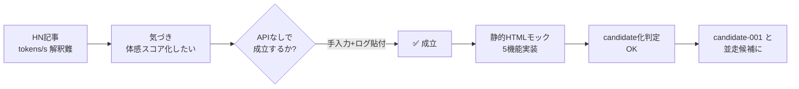

# token-speed-tool — LLM トークン速度・ベンチ可視化ツール

> Issue #60（APIなし設計試作）+ Issue #62（情報源・着想理由 trace）の**両方を 1 ファイルで集約**する。
> 着想経路 → 仕様 → MVP → 判断履歴 → 試作リンクを上から下に読める形にする。

> [!important] 一文要約
> **「外部 LLM API を呼ばずに、tokens/sec / TTFT / 体感スコアを比較できるブラウザツール」**。
> 手入力 + ログ貼り付け + 公開ベンチ取り込みで成立する。MVP モックは [[../90_prototypes/token-speed-tool/README]] にある。

---

# Part 1 — Trace（Issue #62）

## 1-1. 情報源整理（Phase1）

| 情報源 | タイプ | 読み取った気づき | 信頼度 |
|---|---|---|---|
| HN「How fast is N tokens/s really」（ideaId 20260521-003） | hn | tokens/sec の体感差を可視化したい需要が AI 開発者層にある。記事自体は技術解説中心で**「ツール化」は空白** | medium |
| HN「Show HN: CPU only transcription」（20260521-002） | hn | ローカル LLM 実行ログから tokens/sec を抽出する**前処理パイプライン**の発想に繋がる（同種パターン） | medium |
| Claude Code / Codex 利用体験（社内・実体験） | own | Codex は応答開始は速いが総生成時間が長い / Claude Code は逆 → **TTFT と total を分けて見たい**ニーズが自分自身の中にあった | high |
| ローカル LLM（Ollama / llama.cpp）速度比較ニーズ | community | 「うちの 4090 で Qwen は ○ tokens/sec」のような断片情報が SNS に散在。**一元化できれば note 化しやすい** | medium |
| iTunes Search `term=benchmark llm`（参考） | itunes | LLM ベンチ専業アプリは iOS ストアにほぼ存在せず → **モバイル / Web の空白市場** | low（小サンプル）|

### 重要観察

- **既存ベンチサイト**は数値羅列で UX が悪い（OpenRouter / Artificial Analysis 等）。**「体感スコア」という独自軸**で UX 改善が可能
- 「自動ベンチ」は API キー必須で課金リスクあり → **手入力 + ローカルログ貼付**に絞れば API なしで成立
- 競合確立組（文字起こし SaaS 等）と違い、**まだ確立プレイヤーがいない**

## 1-2. 着想理由の明文化（Phase2）

### なぜ「トークン速度・LLMベンチ可視化」に辿り着いたか

1. HN の「How fast is N tokens/s really」記事で**tokens/sec の解釈難**が話題になっていた
2. 自身が Claude Code / Codex を使う中で「同じ tokens/sec でも体感が違う」と感じていた
3. 既存ベンチサイトは数値羅列で読みづらく**比較体験が悪い** → UX 改善の余地

### なぜ「APIなしで成立しそう」と判断したか

- tokens/sec / TTFT / total の**計算は受け取った値の四則演算**で済む（LLM 呼び出し不要）
- ログ貼付解析は**正規表現と JSON パース**で完結（パターン認識のみ）
- 公開ベンチデータ（OpenRouter スクショ等）は**手動取り込み**で十分（自動取得は規約リスク）
- 保存は **localStorage / JSON エクスポート**で完結（バックエンド不要）

### なぜ収益化候補として気になったか

- AI 開発者層は**広告クリック率が高め**（IT 系メディア平均）
- **Shorts 化と相性**（速度比較動画は数秒で結論が見える）
- **note / テンプレ販売**化しやすい（「ベンチ結果まとめ」note を月次で出せる）
- **既存資産との接続**: nanikiru-shorts のテンプレ + Claude Code 運用ナレッジが流用可能

### 何切る AI（candidate-001）との違い

| 軸 | candidate-001（何切る AI） | token-speed-tool |
|---|---|---|
| 主市場 | 麻雀学習者 | AI 開発者 / LLM 利用者 |
| 既存資産 | mahjong-trainer | （新規）|
| 競合状況 | 何切る専業 10 件・AI 冠 1 件 | ベンチ専業ツールほぼ無し |
| 収益化直接性 | 高（既存アプリ広告 + Shorts 送客） | 中（広告 + note + 将来 SaaS）|
| MVP 速度 | 中（既存アプリ拡張） | 高（静的 HTML で成立）|
| 継続性 | 高（麻雀ニーズは陳腐化しない） | 中（モデル更新で再ベンチ需要が続く可能性） |

→ **両立可能・競合しない**。candidate-001 が本命、token-speed-tool は**並走候補**として位置付け。

## 1-3. 判断履歴（Phase3 / 時系列）

| 日付 | フェーズ | 判断内容 | 根拠 |
|---|---|---|---|
| 2026-05-21 | idea | idea_pool 登録（20260521-003 / 粗 score 10） | [[idea_pool/2026-05-21.ndjson]] |
| 2026-05-22 | 上位 5 案抽出 | 5 位（10 点）で上位入り | [[../06_research/2026-05-22_上位5案追加調査]] §1 |
| 2026-05-22 | hold | 「AI 分野継続性難 + 競合確立想定」で深掘り対象外 → hold | 同 §2 |
| 2026-05-22 | スコアリング再評価 | 収益化 6 軸で 17/30（中位） | 同 §9 |
| 2026-05-24 | 再着手 | ユーザー指示「APIなし前提でどこまでできるか調査」→ Issue #60 起票 | Issue #60 本文 |
| 2026-05-24 | trace 起票 | 「情報源・着想理由を追える形に」→ Issue #62 起票 | Issue #62 本文 |
| **2026-05-24 本サイクル** | **MVP 試作 + candidate 化** | APIなしで成立する範囲を確定 + 静的 HTML モック作成 + サンプルデータで比較表示 | 本ファイル Part 2 / 90_prototypes |

## 1-4. データ構造への trace 反映（Phase4）

試作アプリ内で各データに以下のフィールドを持たせる:

```json
{
  "id": "ent-001",
  "model": "claude-sonnet-4-6",
  "env": "Claude Code CLI",
  "promptType": "code-generation",
  "inputChars": 1200,
  "outputChars": 3400,
  "ttftSec": 1.8,
  "totalSec": 12.4,
  "tokensPerSec": 27.4,
  "uxScore": 78,
  "source": "self-measured",
  "sourceType": "own-log",
  "confidence": "high",
  "collectedAt": "2026-05-24T01:10:00+09:00",
  "memo": "Claude Code で長文コード生成・実測"
}
```

### sourceType の値（コントロールドボキャブラリ）

- `own-log` — 自分のローカル LLM / Claude Code / Codex 実行ログ
- `paste-log` — 他者が貼り付けた実行ログ
- `public-bench` — 公開ベンチサイトからの手動取り込み（出典必須）
- `manual-input` — 手入力（メモベース）
- `estimated` — 推測値（実測ではない）

### confidence の値

- `high` — 自分が実測 / 一次ログがある
- `medium` — 他者の信頼できるログ / 複数ソース一致
- `low` — 単発の手入力 / 推測値

### 表示時のルール

- `confidence: low` は**バッジ表示**（黄色）/ `estimated` は灰色で「推測値」明示
- `source` を必ず表示。実測値と推測値を**視覚的に区別**

## 1-5. 見やすい一覧化（Phase5）

本ファイル冒頭 §1-1 の表が **「情報源 → 気づき」一覧**。
[[idea_trace]] §2 が**全案の中での位置付け**を提供する。

---

# Part 2 — MVP 仕様（Issue #60）

## 2-1. APIなしでできる範囲（Phase1）

### ✅ できる（API 呼び出しゼロ）

- ベンチ結果の手入力フォーム（モデル / 環境 / 入出力 / 時間 / メモ）
- Claude Code / Codex / ローカル LLM 実行ログ貼付の簡易解析（正規表現 + JSON パース）
- tokens/sec の自動計算（出力 / total）
- TTFT（Time To First Token）の表示
- 体感スコア計算（重み付け合成: tokens/sec × 0.4 + (1/TTFT) × 0.4 + 出力量 × 0.2）
- 比較テーブル（モデル × 環境）
- グラフ表示（Chart.js or 静的 SVG）
- JSON エクスポート / インポート
- localStorage 保存
- 公開ベンチ手動取り込み（CSV / JSON 貼付）
- サンプルデータ同梱（initial-data.json）
- iPhone 縦表示対応（レスポンシブ）

### ⚠ できない / 制限あり（API 必須）

- 実 LLM を呼んで自動ベンチ → ❌ MVP では実装しない
- 公開ベンチサイトの自動取得 → ❌ 規約リスク・MVP では手動取り込み
- ユーザー間データ共有 → ❌ 静的構成では困難（Phase2 で検討）

## 2-2. MVP 機能定義（Phase2）

### 対象ユーザー

1. Claude Code / Codex / Gemini / ローカル LLM を比較したい AI 開発者
2. プロンプト改善の効果を体感で測りたい AI 利用者
3. LLM 体感速度の客観データが欲しいテックブロガー
4. ローカル LLM（Ollama / llama.cpp）のハード別速度を共有したいコミュニティ層

### MVP 機能

| # | 機能 | 必須/任意 |
|---|---|---|
| 1 | ベンチ入力フォーム | 必須 |
| 2 | サンプルデータ表示（同梱） | 必須 |
| 3 | 比較テーブル | 必須 |
| 4 | 体感スコア計算 | 必須 |
| 5 | JSON エクスポート | 必須 |
| 6 | JSON インポート | 必須 |
| 7 | localStorage 保存 | 必須 |
| 8 | グラフ表示（tokens/sec 比較） | 任意 |
| 9 | ログ貼付解析（Claude Code / Codex フォーマット対応） | 任意 |
| 10 | iPhone 縦表示 | 必須 |

### 入力データ形式

§1-4 の JSON 構造を採用（id / model / env / promptType / inputChars / outputChars / ttftSec / totalSec / tokensPerSec / uxScore / source / sourceType / confidence / collectedAt / memo）。

### 表示画面

```
┌────────────────────────────────┐
│ Token Speed Tool（APIなし版）       │
├────────────────────────────────┤
│ [+ 新規追加]  [Import JSON]  [Export]│
├────────────────────────────────┤
│ Model     | Env      | tok/s | TTFT | Score│
│ ----------|----------|-------|------|-----│
│ Sonnet 4.6| Code CLI | 27.4  | 1.8s |  78 │
│ Codex     | Web      | 22.1  | 0.9s |  72 │
│ Gemini    | API      | 35.0  | 1.2s |  85 │
│ Ollama Q  | Local    | 14.0  | 0.4s |  68 │
├────────────────────────────────┤
│ [グラフ: tokens/sec 比較 横棒]        │
├────────────────────────────────┤
│ [ログ貼付エリア]                     │
│  → 自動解析 → フォームに反映           │
└────────────────────────────────┘
```

### 保存方式

- 一次: `localStorage` キー `tst.entries`（JSON 配列）
- 二次: ユーザーが Export ボタンで JSON ファイル DL
- 三次: ユーザーが Import ボタンで JSON ファイルアップロード

### APIなしで成立する収益導線

- アプリ広告（無料層 / Google AdSense or 自家広告）
- Shorts 送客（速度比較動画 → サイト送客）
- note 販売（「2026 年 Q2 LLM ベンチ結果まとめ」等）
- 将来オプション: プレミアム機能（履歴無制限 / 一括 CSV 取り込み）

## 2-3. 最小モック試作（Phase3）

本サイクルで [[../90_prototypes/token-speed-tool/README]] に静的 HTML モックを作成。
- `index.html`（UI 一式 / Chart 不使用・素 HTML+CSS+JS）
- `sample-data.json`（初期 5 件のサンプルベンチ）
- `README.md`（試作の使い方・既知制約）

### 試作で実装した機能

- ✅ 機能 1: 入力フォーム
- ✅ 機能 2: サンプルデータ表示
- ✅ 機能 3: 比較テーブル
- ✅ 機能 4: 体感スコア計算（uxScore = tokens/sec × 0.4 + (10/TTFT) × 0.4 + (outputChars/100) × 0.2 を 0-100 に正規化）
- ✅ 機能 5/6: JSON エクスポート / インポート
- ✅ 機能 7: localStorage 保存
- ⏳ 機能 8: グラフ表示（CSS 横棒で簡易実装・Chart.js 不使用）
- ⏳ 機能 9: ログ貼付解析（最小: 「tokens/sec: N」「first token: Ns」パターンのみ）
- ✅ 機能 10: iPhone 縦表示（viewport meta + CSS Grid）

### iPhone 表示確認観点

- 入力フォームが縦 1 列で並ぶか
- 比較テーブルが横スクロール可能か（モデル名 + 主要 3 指標を見せる）
- Export / Import ボタンが指で押せるサイズか

## 2-4. 収益化判断（Phase4）

| 観点 | 判定 | 根拠 |
|---|---|---|
| 広告向きか | ✅ 高 | AI 開発者層 + 機能完結型 + 滞在時間あり |
| note 化できるか | ✅ 高 | 「2026 Q2 LLM ベンチまとめ」「ローカル LLM 速度実測」note 化容易 |
| Shorts 化できるか | ✅ 高 | 「Claude vs Codex 速度比較 1 分」等 |
| 継続更新できるか | 🟡 中 | モデル更新ごとにデータ更新必要・自分以外の貢献者必要 |
| 既存 AI 開発工場と相性 | ✅ 高 | Claude Code / Codex 実体験データを直接投入できる |
| candidate 化する価値 | ✅ ある | APIなしで成立 + 競合空白 + 収益導線複数 |

### **candidate 化判定: ✅ candidate 化する**

ただし candidate-001（本命）と並走の **候補-005 相当**として位置付け。
ChatGPT 承認は本サイクル外（次サイクルで [[scenarios]] への正規 candidate ファイル化を検討）。

## 2-5. レビューまとめ（Phase5）

### 1 枚図サマリー



> 用語注: tokens/s = 1 秒あたり生成トークン数 / TTFT = 初回応答秒数 / モック = 試作の最小実装 / candidate = 承認前の有力候補

### できるようになったこと

- HN 起点で「APIなしでベンチ可視化が成立する」と判断できる根拠が揃った
- 体感スコア式（tokens/sec × 0.4 + (10/TTFT) × 0.4 + (outputChars/100) × 0.2）で**独自軸**を定義
- 静的 HTML モックで「サンプル 5 件で比較表示」「JSON 入出力」「localStorage 保存」を確認できる
- candidate-001（何切る AI）と**競合しない並走候補**として位置付けが明確に
- source / sourceType / confidence データ構造で**実測・推測・参考値を区別**する仕組みができた

### APIなしでできること / できないこと

- ✅ できる: 手入力 / 体感スコア / 比較テーブル / グラフ / Export-Import / localStorage / iPhone 表示
- ❌ できない: 自動ベンチ / 公開ベンチ自動取得 / ユーザー間共有 / 履歴永続化（サーバ側）

### 実装済み範囲

- [[../90_prototypes/token-speed-tool/README]]: 静的 HTML モック + サンプル JSON + 使い方
- 機能 1-7（必須すべて）+ 機能 8/10（任意の一部）

### 次に作るなら

1. グラフを Chart.js 化（CDN 利用）
2. ログ貼付解析の対応フォーマット拡張（Ollama / llama.cpp / OpenAI Playground）
3. 公開ベンチ取り込みのインポーター（手動 CSV / JSON）
4. iPhone 実機での操作確認
5. note 化用「2026 年 Q2 LLM ベンチ結果まとめ」（手動執筆）
6. ChatGPT 承認パック化（candidate-005 相当）

---

## 関連

- [[idea_trace]] §2（本案の位置付け）
- [[../90_prototypes/token-speed-tool/README]]（MVP モック）
- [[scenarios/README]]（candidate 一覧）
- [[../06_research/2026-05-22_上位5案追加調査]]（前回の上位 5 案 hold 判断）
- [[idea_pool/2026-05-21.ndjson]]（idea ID 20260521-003）
- [[試作ループ検証]]（#61）
- Issue: kaeru07/vault#60 / #62 / #61 / #63
