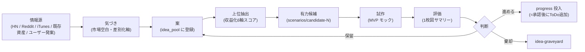

# 案の情報源と採用理由

> Issue #63 + #69（ユーザー向け日本語化）。
> **正本は [[idea_trace|🧭 idea_trace（案の追跡表）]]** ですが、iPhone Obsidian でこちらの日本語名で検索した人のために、本ページが入口になっています。

> [!important] このページは何のためにある？
> 「全アプリ案について、どの情報源から、どんな気づきがあり、なぜ採用 or 保留 or 棄却したか」を 1 ページで追える状態を作るため。
> 詳細カード（10 件分）は正本 [[idea_trace]] にあります。本ページは**早見表 + 入口**。

---

## 🗺 全体の流れ（1 枚図）

> 用語注: tokens/sec = 1 秒あたり生成トークン数 / TTFT = 初回応答までの秒数 / 有力候補 = ChatGPT 方向性承認待ちの案 / progress 投入 = 承認後に作業 ToDo として progress アプリに追加 / iPhone Obsidian = iPhone で見ている Vault ノートアプリ

---

## ⚡ 早見表（10 件・正本 [[idea_trace]] から要約）

| # | 案 | 主要な情報源 | 採用 / 保留理由 | 今の状態 |
|---|---|---|---|---|
| 1 | candidate-001 麻雀「何切る」アプリ + AI 解説 Web | 既存資産 mahjong + iTunes Search「何切る」10 件 | AI 冠は 1 件のみ = 空き軸 / 既存資産流用度大 | **判断するための資料一式 完備（承認パック）** [[scenarios/candidate-001]] |
| 2 | candidate-005 LLM トークン速度ベンチ可視化（APIなし） | HN「How fast is N tokens/s」+ Claude/Codex 体感 | API 無しで成立 / 既存ベンチサイトは UX 悪い | **判断するための資料一式 完備（承認パック）** [[scenarios/candidate-005]] |
| 3 | #039 何切る特化 AI 解説 Web | iTunes Search JP | candidate-001 統合補強 | 統合済（candidate-001 に内包） |
| 4 | nanikiru-shorts 麻雀何切る Shorts | 既存資産 + YouTube Shorts 仮説 | 既存問題集再利用 + candidate-001 送客 | 開発中 [[../02_apps/nanikiru-shorts]] |
| 5 | mahjong-trainer / quiz / analyzer | 既存資産 | candidate-001 と統合扱い | 開発中 |
| 6 | Qwen3.7-Max エージェント評価 | HN | 継続性 2/5 で保留 | 保留 |
| 7 | 動画文字起こし Web SaaS | HN + iTunes Search | Notta 等 4 社確立で激戦区 | 棄却（保留） |
| 8 | N-03 LLM Chooser（使い分けチャート） | ユーザー発案 + 試作ループ | candidate-005 と相互送客 | 試作完成（[[../90_prototypes/llm-chooser/README]]）/ candidate 化判断は次サイクル |
| 9 | N-04 Vault Search Cheatsheet | 既存資産 + ユーザー発案 | Vault ユーザ層直接接続 | 試作完成（[[../90_prototypes/vault-search-cheatsheet/README]]）/ candidate 化判断は次サイクル |
| 10 | Scrape Lab v2 | 既存資産 | 他案の情報源パイプライン | 開発中（間接収益化） |

---

## 📦 各案の詳細（カード形式・10 件）

各案の以下情報は [[idea_trace]] §1-§10 を参照:

- 状態（idea / 有力候補 / 試作あり / 保留 / 棄却）
- 情報源タイプ（HN / Reddit / iTunes / 既存資産 / ユーザー発案 / 作業報告）
- 情報源（リンクと一次データ）
- 気づき（その情報源から何を読み取ったか）
- 採用理由（なぜ案として採用したか）
- API 無しでできる範囲 🆓
- 有料 API が必要な範囲 💸
- 収益化導線（広告 / note / Shorts / 課金）
- 試作状況
- 試作リンク
- 判断履歴（時系列）
- 次の判断
- 関連 Issue

---

## 🆓 API 無しで成立する案の早見表

| 案 | API 無しで成立する範囲 | 有料 API が必要な範囲 | MVP は API 無しで可能か |
|---|---|---|---|
| candidate-001 何切る AI | UI / 牌効率 / 事前生成解説 | 動的 AI 解説（任意）| ✅ 可 |
| candidate-005 token-speed-tool | 手入力 / ログ貼付 / 体感スコア / 比較 | 自動ベンチ（オプション）| ✅ 可（MVP モック動作確認済）|
| N-03 LLM Chooser | 全機能（クイズ + カード + 比較表）| なし | ✅ 可（静的 HTML 完成）|
| N-04 Vault Search Cheatsheet | 全機能（検索ボックス + 対応表）| なし | ✅ 可（静的 HTML 完成）|
| mahjong-trainer | 全機能 | なし | ✅ 可 |
| nanikiru-shorts | 全機能 | なし | ✅ 可 |
| Qwen3.7-Max 評価 | 手入力比較表のみ | 自動評価（必須）| ⚠ 限定的 |
| 文字起こし SaaS | UI のみ | 文字起こしエンジン（必須）| ❌ 不可 |
| Scrape Lab v2 | 全機能 | なし | ✅ 可 |

---

## 📎 関連

- 正本: [[idea_trace]]
- 入口: [[../00_START_HERE]]
- 有力候補一覧: [[scenarios/README]]
- 候補 5 件のうち判断するための資料が揃ったもの: [[../20_reviews/ChatGPT承認待ち]]
- 試作モック 3 件: [[../90_prototypes/token-speed-tool/README]] / [[../90_prototypes/llm-chooser/README]] / [[../90_prototypes/vault-search-cheatsheet/README]]
- 自動化された案生成: [[idea_pool/_README]]（粗 score 10 以上の上位案）
- 試作ループの実証: [[試作ループ検証]]
- 次に作るもの: [[../20_reviews/次に実体化するToDo]]
- Issue: kaeru07/vault#63 / #69 / #70
