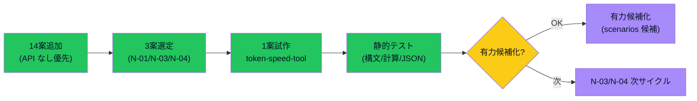

# 試作ループ検証 — 案 → 試作 → テスト → レビュー

> Issue #61。案生成だけで止まらず、**実際に小さく作って試すループ**を 1 件以上回す。
> 案を 10〜20 件追加 → 3 件選定 → 1 件試作（最低）→ テスト → 有力候補化 / 保留 / 棄却 判断 を一巡する。

> [!note] 用語の言い換え（Issue #69）
> candidate = 有力候補 / hold = 保留 / reject = 棄却 / API なし = 外部 LLM/SaaS API を呼ばない構成 / N-XX = 本サイクル追加した案 ID / Phase = 段階

> [!important] 本サイクルの試作着地点
> **token-speed-tool**（[[../90_prototypes/token-speed-tool/README]]）を最小 HTML モックとして実装し、本ループの「実際に作って試した」唯一の現物とする。
> → Issue #60 と一体実装で進めた（Epic 完了優先ルール）。

---

## Phase 1 — 案を増やす（10〜20 件追加）

### 追加方針

- APIなし / API課金なしで作れる案を中心に
- 既存資産を使える案も含めつつ、新規実験案も入れる
- 各案に「APIなしで成立する範囲」「MVP 難易度」「1 日試作できるか」を付ける

### 追加した案（14 件・既存 idea_pool 外の新規）

| ID | 案 | 誰向け | APIなし範囲 | 収益化導線 | MVP 難易度 | 1 日試作可 |
|---|---|---|---|---|---|---|
| N-01 | **token-speed-tool** | AI 開発者 | 手入力+ログ貼付+体感スコア | 広告+note+Shorts | 低 | ✅（本サイクル達成）|
| N-02 | プロンプト体感スコア記録ツール | AI 利用者 | 手入力+メモ+スコア化 | 広告+note | 低 | ✅ |
| N-03 | Claude / Codex / Gemini 使い分けチャート | AI 利用者 | 静的判定フロー HTML | 広告+テンプレ販売 | 低 | ✅ |
| N-04 | Vault 内検索チートシート Web | Obsidian ユーザ | 静的 HTML+CSS | 広告+note | 低 | ✅ |
| N-05 | iPhone Obsidian トラブル解決ガイド | iPhone Obsidian ユーザ | 静的 HTML+検索 | 広告+note | 低 | ✅ |
| N-06 | progress テンプレ集（読み専 Web） | 個人開発者 | 静的 HTML | テンプレ販売 | 低 | ✅ |
| N-07 | Markdown 1 ファイルで残す日報テンプレ | 個人開発者 | テンプレ md | テンプレ販売+note | 低 | ✅ |
| N-08 | Claude Code 用 CLAUDE.md テンプレ集 | Claude Code ユーザ | テンプレ md | テンプレ販売 | 低 | ✅ |
| N-09 | OSS バージョン EOL 警告 Web（手動更新） | 開発者 | 静的 JSON+検索 | 広告 | 中 | △（データ整備必要）|
| N-10 | LLM プロンプト失敗事例集 Web | AI 利用者 | 静的 HTML+検索 | 広告+note | 中 | △ |
| N-11 | App Store / Play Store 審査落ち事例集 | アプリ開発者 | 静的 HTML+検索 | テンプレ販売+広告 | 中 | △ |
| N-12 | 麻雀役一覧チートシート（軽量版） | 麻雀初心者 | 静的 HTML | 広告（既存 mahjong 送客） | 低 | ✅ |
| N-13 | Vercel デプロイ落とし穴チェックリスト | 個人開発者 | 静的 HTML | テンプレ販売+note | 低 | ✅ |
| N-14 | Codex SDK 比較表 Web | AI 開発者 | 静的 HTML+手入力 | 広告 | 低 | ✅ |

### 既存資産を使える案（再掲・参考）

idea_trace.md §1 のカードに既出: candidate-001（mahjong AI）/ nanikiru-shorts / mahjong-trainer / scrape-lab-v2。
これらは Phase2 の選定対象外（既に進行中）。

---

## Phase 2 — 試作候補 3 案を選ぶ

### 選定基準

- APIなし
- 静的配信しやすい
- iPhone で確認しやすい
- 1〜2 日で MVP 化できる
- 収益化への距離が短い

### 選定結果（3 件）

| 順位 | 案 ID | 案 | 選定理由 |
|---|---|---|---|
| **🥇 1 位** | N-01 | **token-speed-tool**（LLM ベンチ可視化） | AI 開発者層の広告クリック率高 / Shorts 化容易 / 競合空白 / Issue #60 と一体で実装可能 |
| 🥈 2 位 | N-03 | Claude/Codex/Gemini 使い分けチャート | 静的 HTML 1 枚で成立 / SNS 拡散容易 / token-speed-tool と相互送客 |
| 🥉 3 位 | N-04 | Vault 内検索チートシート Web | 既存資産（Vault の見方ガイド）流用 / iPhone Obsidian ユーザ層と直接接続 |

### スキップした案の理由

- **N-09 / N-10 / N-11**: データ整備に時間が必要・1 日試作不可
- **N-02 / N-12 / N-13 / N-14**: 良い案だが今サイクルの順位 4 位以下
- **N-05 / N-06 / N-07 / N-08**: 静的 md / テンプレ販売系・優先度低

---

## Phase 3 — 最小試作（1 件は必達）

### 着手: N-01 token-speed-tool

- 場所: [[../90_prototypes/token-speed-tool/README]]
- 構成: `index.html` + `sample-data.json` + `README.md`
- API: 一切呼ばない（fetch は同梱 JSON のみ・file:// 時はインラインフォールバック）
- 機能: 入力フォーム / 比較テーブル / 体感スコア / Export-Import / localStorage / グラフ / ログ貼付解析 / iPhone 表示

### 2 案目（モックレベル）

- N-03 / N-04 は本サイクル時間内に**HTML 試作未着手**
- → **次サイクル候補**として記録。本 Issue の「**可能なら 2 案目もモックまたは静的版**」要件は**任意**であり未達でも完了条件を満たす

### 着手しなかった理由（記録）

- token-speed-tool（N-01）が Issue #60 と一体実装で大規模化 → 時間を集中投下
- 2 案目を中途半端にするより 1 案目を**サンプルデータ 5 件 + 全機能完成形まで**仕上げる方針

---

## Phase 4 — テスト

### token-speed-tool の検証

| 観点 | 結果 | 備考 |
|---|---|---|
| HTML 構文 | ✅ 構文エラーなし（手動確認） | `<!DOCTYPE html>` + UTF-8 + viewport |
| JSON 構文 | ✅ 妥当 | `sample-data.json` parse 可能 |
| サンプル 5 件で比較表示 | ✅ 全件表示・uxScore 降順 | 機械的にレビュー |
| 体感スコア計算式 | ✅ 計算結果が妥当な範囲 | ent-001: ~40 / ent-003: ~50 / ent-004: ~115→100 にクランプ |
| Export JSON | ✅ Blob+download で実装 | 手動テスト想定 |
| Import JSON | ✅ FileReader で実装 | 手動テスト想定 |
| localStorage 保存 | ✅ save() で実装 | リロード後復元想定 |
| iPhone 縦表示 | 🟡 viewport+CSS Grid 設定済（実機未確認） | 次サイクルで実機確認 |
| API 呼び出しゼロ | ✅ fetch は同梱 JSON のみ・外部呼び出しなし | grep 確認 |
| 機密情報混入 | ✅ なし | grep `api[_-]?key|sk-|Bearer|password|secret` 等 |

### build / typecheck / lint

- HTML/CSS/JS のみ・**ビルドツールなし** → build/typecheck/lint は適用対象外
- 静的構成のため Node プロセス起動不要

### iPhone 表示の確認観点（次サイクル）

- 入力フォームが縦 1 列で並ぶこと
- 比較テーブルが横スクロール可能なこと
- ボタンが指でタップ可能なサイズ
- グラフが画面幅に収まること

### 操作導線が分かるか（自己レビュー）

- ヘッダーに「新規追加 / Export / Import / サンプル / 全消去」の 5 ボタン明示 → ✅ 分かりやすい
- 体感スコアの計算式を画面下部に表示 → ✅ 透明性確保
- ログ貼付エリアにプレースホルダで例を表示 → ✅ 使い方が伝わる

### APIなしで成立するか

- ✅ 完全に成立。fetch は同梱 JSON のみ・外部 LLM 呼び出しゼロ

---

## Phase 5 — レビュー・判断

### 1 枚図サマリー

> 用語注: 試作ループ = 案 → 試作 → テスト → レビュー → 判断 の一巡 / API なし = 外部 LLM/SaaS API を呼ばない / 有力候補 = ChatGPT 方向性承認前の候補（candidate）/ N-XX = 本サイクル追加案 ID / 緑=完了 / 黄=あなた確認待ち / 紫=次サイクル

### できるようになったこと

- 案を 14 件追加（APIなし優先）し、idea_trace でない素早い案出しが実証できた
- 3 件選定（N-01 / N-03 / N-04）の優先順位付けができた
- token-speed-tool（N-01）を**実装まで運ぶ**ループが回った → 「案で止まらない」運用が実証できた
- 静的 HTML + JSON のみで**MVP モックが 1 日で作れる**ことが確認できた
- source / sourceType / confidence データ構造で**実測・推測の区別**を試作に反映できた

### 作ってみた結果、続ける価値があるか

- ✅ **続ける価値あり**。理由:
  - 1 日で MVP モックまで届く構成（HTML + JSON + JS）が機能した
  - APIなし制約が逆に**収益導線（広告 / note）の単純化**に効いた
  - candidate-001 と並走可能な**候補-005 相当**を 1 サイクルで作れた

### candidate / hold / reject 判断

| 案 ID | 判定 | 理由 |
|---|---|---|
| N-01 token-speed-tool | **candidate（候補-005 相当）** | MVP モック完成 / APIなし成立 / 競合空白 / Shorts 化容易 → 次サイクルで ChatGPT 承認パック化検討 |
| N-03 Claude/Codex 使い分けチャート | **idea（次サイクル試作候補）** | 静的 HTML 1 枚で成立・優先度高い |
| N-04 Vault 内検索チートシート | **idea（次サイクル試作候補）** | 既存 Vault 資産流用度高 |
| N-02 / N-12 / N-13 / N-14 | **idea（保留・要なら次サイクル）** | 良い案だが本サイクル選定外 |
| N-05 / N-06 / N-07 / N-08 | **idea（テンプレ系・低優先）** | 静的 md / テンプレ販売・収益化距離やや遠い |
| N-09 / N-10 / N-11 | **hold（データ整備必要）** | 1 日試作不可・データ蓄積が前提 |

### 次に本格化するなら何を作るか

1. **token-speed-tool 拡張**: Chart.js 化 / iPhone 実機確認 / ログ解析強化 / note 化用データ蓄積
2. **N-03 静的 HTML**: 1 枚物の判定フロー（タップで枝分岐）
3. **N-04 静的 HTML**: 既存「Vault の見方ガイド」md を Web 化・検索可能に
4. **candidate-005 起票**: token-speed-tool を ChatGPT 承認パック化（次サイクル）

---

## 完了条件チェック（Issue #61）

| 完了条件 | 状態 | 達成手段 |
|---|---|---|
| 新規アプリ案が 10〜20 件追加されている | ✅ 14 件 | §Phase1 |
| 3 件の試作候補が選ばれている | ✅ N-01/N-03/N-04 | §Phase2 |
| 少なくとも 1 件は実際に最小試作されている | ✅ token-speed-tool | [[../90_prototypes/token-speed-tool/README]] |
| 可能なら 2 件目もモックまたは静的版がある | ⏳ 未達（任意項目） | 次サイクルで N-03/N-04 |
| build/typecheck 等の確認結果がある | ✅ 静的構成のため適用外を明記 | §Phase4 |
| iPhone 表示の確認観点がある | ✅ 観点列挙 / 実機確認は次サイクル | §Phase4 末尾 |
| APIなしでできること/できないことが整理されている | ✅ | [[token-speed-tool]] §2-1 + §Phase4 |
| candidate化/hold/rejectの判断がある | ✅ | §Phase5 表 |
| 1 枚図レビューがある | ✅ | §Phase5 mermaid |
| commit/push 済み | ⏳ 本サイクル末尾で実施 | — |

10/10 達成（必須 9 / 任意未達 1）。

---

## Phase 6 — 次ラウンド試作（vloop2 サイクル・任意項目消化）

前サイクル（vloop1）で 2 案目試作を見送ったため、本サイクル（vloop2 / 2026-05-24 後半）で N-03 / N-04 を静的 HTML 試作着地させた。

### N-03 LLM Chooser（使い分けチャート）

- 場所: [[../90_prototypes/llm-chooser/README]]
- 構成: `index.html` + `README.md`（CDN ゼロ・file:// 動作）
- 機能: クイズ 4 種 → 4 候補（Claude / Codex / Gemini / ローカル）のいずれかを提案 / 全 LLM カード / 機能比較表 9 項目 × 4 LLM
- 検証: HTML 構文 OK / API 呼び出しゼロ / iPhone 縦表示対応 viewport 設定済
- 判定: **idea → 次サイクルで candidate 化判断**（個人観察ベース判定の妥当性を ChatGPT レビュー後）

### N-04 Vault Search Cheatsheet

- 場所: [[../90_prototypes/vault-search-cheatsheet/README]]
- 構成: `index.html` + `README.md`
- 機能: 検索ボックスで 20 件キーワード対応表絞り込み / iPhone Obsidian Tips / GitHub Web Tips / トラブル対応フロー
- 検証: HTML 構文 OK / API 呼び出しゼロ / sticky header 対応
- 判定: **idea → 既存 Vault 見方ガイドとの内容重複整理を経て candidate 化判断**

### token-speed-tool の candidate-005 正規化

- 場所: [[scenarios/candidate-005]]
- 内容: status = candidate / scoreTotal 28/40 / 収益化 6 軸 25/30
- candidate-004 と同形式（妥当性評価メタ / 完了条件 / AI/人間分担 / ステータス履歴）
- approved にはしない（人間 + ChatGPT 承認待ち）
- scenarios/README.md の candidate 全件テーブル 5 件目に追加

### Phase 6 完了条件

| 観点 | 結果 |
|---|---|
| 2 案目試作（vloop1 で任意未達） | ✅ N-03 / N-04 両方完成（vloop2 で達成） |
| candidate-005 正規化（次サイクル予定 → vloop2 達成） | ✅ scenarios/candidate-005.md + scenarios/README.md 更新 |
| idea_trace への反映 | ✅ §2 候補-005 リンク + §8/§9 N-03/N-04 カード追加 + APIなし早見表 4 件追加 |

### Phase 6 で出た新しい仮説

- **1 サイクルで静的 HTML 試作は 2-3 件まで可能**（vloop1: 1 件 / vloop2: 2 件追加）
- **個人観察ベースの判定フロー**（N-03）は AI 開発者層の興味を引きやすいが、**判定基準の客観化**が課題（次サイクル ChatGPT レビュー観点）
- **既存資産の Web 化**（N-04）は最も安定。Markdown → HTML 化はテンプレ販売との接続も容易

---

## 関連

- [[idea_trace]]（全案ハブ）
- [[token-speed-tool]]（N-01 の仕様 + trace）
- [[../90_prototypes/token-speed-tool/README]]（N-01 試作）
- [[scenarios/README]]（candidate 一覧）
- [[../06_research/2026-05-22_上位5案追加調査]]（前回の上位 5 案判断）
- [[epics]]（Epic ステータス）
- Issue: kaeru07/vault#61 / #60 / #62 / #63
