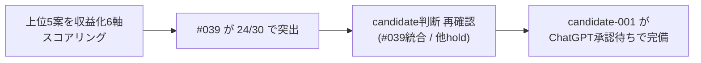

# 上位 5 案追加調査と candidate 化判断（Epic B）

> Issue #49。Phase 1 完全化（Issue #48）で抽出した上位 5 案について、**1〜2 件のみ深掘り**して candidate 化判断する。
> 「無理に全件調査しない / 根拠不足のまま candidate 化しない / API 課金しない」を厳守。

## 1. 上位 5 案の整理（Phase 1）

| 順位 | ideaId | 粗score | 案 | 元トレンド | 想定ユーザー | 収益手段 | 動画導線 | 既存重複 |
|---|---|---|---|---|---|---|---|---|
| 1 | 20260521-002 | 13 | CPU only transcription を nanikiru-shorts に組み込み | HN (Show HN) | 自分（社内効率化） | 既存資産改善 | 投稿頻度↑ | nanikiru-shorts と統合 |
| 2 | 20260521-039 | 12 | 何切る特化 AI 解説 Web 版 | iTunes Search（mahjong 一般で何切る専業が少ない発見） | 麻雀学習者 | アプリ広告 + Web 広告 | 何切る解説 Shorts | **candidate-001 補強候補** |
| 3 | 20260521-001 | 11 | Qwen3.7-Max エージェント評価アプリ | HN (Qwen3.7-Max) | LLM 利用者 / 開発者 | アプリ広告 | エージェント比較 Shorts | なし |
| 4 | 20260521-030 | 11 | 動画文字起こし Web SaaS freemium | HN (Show HN CPU 文字起こし) | 動画クリエイター | freemium + 広告 | 文字起こし精度 Shorts | なし |
| 5 | 20260521-003 | 10 | LLM トークン速度比較ツール | HN (How fast is N tokens/s) | LLM 利用者 | アプリ広告 | 速度比較 Shorts | なし |

## 2. 追加調査対象の選定（Phase 2）

5 件から **2 件のみ**選定（Issue #49「無理に全件調査しない」遵守）:

| 対象 | 選定理由 |
|---|---|
| **#039 何切る特化 AI 解説 Web** | candidate-001 補強の可能性が高い。既存資産流用度大。iTunes Search で「何切る」直接検索可能（無料）|
| **#030 動画文字起こし Web SaaS freemium** | 新規 candidate-005 候補性が高い。iTunes Search で「transcription」直接検索可能（無料） |

スキップした 3 件:
- **#002 CPU 文字起こし統合**: 自分向け効率化で公開予定なし → candidate 化対象外
- **#001 Qwen3.7-Max エージェント評価**: 市場検証に追加 API キー必要 + 競合確立（LangChain / LangSmith 等）想定 → 後回し
- **#003 LLM トークン速度比較**: 同上（OpenAI Playground / Token Counters 等の競合想定） → 後回し

## 3. 市場検証メモ（Phase 3 / iTunes Search JP）

### 3-1. #039 何切る特化 AI 解説 Web → 候補-001 補強

**検索: `iTunes Search?term=何切る&country=jp&entity=software`（無料・無認証）**

| 順 | アプリ | レビュー数 | カテゴリ |
|---|---|---|---|
| 1 | 麻雀ウザク式何切る？ | 354 | Games |
| 2 | 麻雀 一択何切る | 227 | Games |
| 3 | 麻雀何切る牌効率 | 176 | Games |
| 4 | 清一色1000 | 177 | Games |
| 5 | 麻雀 何切るマスター | 40 | Games |
| 6 | 麻雀IQテスト | 27 | Games |
| 7 | 手軽に麻雀力を検定 ～近代麻雀公認 何切る？～ | 20 | Games |
| 8 | 麻雀何切るAI | 14 | Games |
| 9 | 麻雀立体何切るアーカイブ | 1 | Games |
| 10 | みんなの何切る | 0 | Education |
| 参考 | 麻雀の点数計算と牌効率 麻雀計算機Ⅱ | 1091 | Games |

**観察**:
- 何切る専業アプリは **10 件以上** 存在。市場として確立
- レビュー数は最大 354（限定的）。**ニッチ市場で激戦区ではない**（雀魂 807969 のような巨人不在）
- AI を冠したものは「麻雀何切るAI（14 reviews）」が 1 件のみ → **AI 解説の差別化軸はまだ取りやすい**
- Education カテゴリ（みんなの何切る）が存在 = 学習用途の需要あり

**candidate-001 補強の方向性**:
- candidate-001 は mahjong アプリ（既存）の公開ブロッカー解消が主目的
- そこへ **「Web 版 + AI 解説機能」を差別化軸として追加**することで chatgpt_pending 強化
- 新規 candidate-005 起票はせず、candidate-001 統合扱い

### 3-2. #030 動画文字起こし Web SaaS freemium → hold

**検索: `iTunes Search?term=transcription&country=jp&entity=software`（無料・無認証）**

| 順 | アプリ | レビュー数 | カテゴリ |
|---|---|---|---|
| 1 | Notta - 自動文字起こし | 24550 | Productivity |
| 2 | Plaud: AI Note Taker | 14996 | Productivity |
| 3 | Texter 議事録 | 7813 | Business |
| 4 | Otter - 英語文字起こし | 5169 | Productivity |
| 5 | ボイスメモと文字起こし: Spiik | 901 | Utilities |
| 6 | SpeakApp AI: Voice Notes | 260 | Productivity |
| 7 | Summary: AI議事録 | 258 | Productivity |
| 8 | Transcriber - 音声文字変換 | 249 | Utilities |
| 9 | Transcribe | 118 | Utilities |
| 10 | Live Transcribe | 60 | Utilities |
| 11 | iTranscribe | 34 | Productivity |
| 12 | Rev: Record & Transcribe | 10 | Productivity |
| 13 | Whisper Transcription | 10 | Utilities |
| 14 | OtterNotes AI: Audio to Text | 0 | Productivity |
| 15 | 文字起こしボイスレコーダー | 3 | Productivity |

**観察**:
- **確立プレイヤー多数**: Notta (24550) / Plaud (14996) / Texter (7813) / Otter (5169) など 5 桁レビューが 4 件
- **激戦区**: 同分野で 15 件以上の競合・新規参入の差別化が困難
- 既存資産流用度低い: 文字起こし自体は新規開発（既存 nanikiru-shorts は動画生成・文字起こしではない）
- 無料層 freemium 戦略は既に Notta が抑えている

**判定: hold（candidate 化しない）**

hold 理由:
1. 競合確立プレイヤー 4 社（Notta / Plaud / Texter / Otter）が日本市場で 5 桁レビュー保有
2. 新規参入の差別化軸が未特定（既存方針「無料 + 広告」だけでは Notta freemium と同一）
3. 既存資産流用度が低い（nanikiru-shorts は動画生成・文字起こし機能なし）
4. 収益化インパクト試算が困難（既存 4 社が n 件 / 月 を共有する市場で新規が取れる割合不明）

## 4. candidate 化判断（Phase 4）

### 結論: 新規 candidate 起票なし

| 案 | 判定 | 反映先 |
|---|---|---|
| #039 何切る特化 AI 解説 Web | **candidate-001 統合候補**（補強・新規起票なし） | [[../05_monetization/scenarios/candidate-001]] §差別化軸 / [[../20_reviews/candidate-001_ChatGPT承認パック]] §補強 |
| #030 動画文字起こし Web SaaS freemium | **hold**（理由 4 点・上記参照） | idea_pool のステータス更新（idea のまま継続） |

### candidate-001 補強の実装内容

- candidate-001.md に「Web 版 + AI 解説」を差別化軸として追記
- 何切る専業 10 件以上 + AI 系 1 件のみという市場データを candidate-001 補強根拠として記録
- ChatGPT 承認パックの「市場根拠」セクションを 1 段強化（iTunes Search 一次データを引用）

### #030 hold の運用

- idea_pool には残す（将来「nanikiru-shorts に文字起こし機能を組み込む」候補との接続で再評価可能性あり）
- 6 ヶ月後 or Notta が大きく値上げした際に再評価（idea-graveyard には移さない）

## 5. ChatGPT 承認待ちへの反映

- 本サイクルで新規 candidate 起票なし → ChatGPT承認待ち.md への新規ブロック追記なし
- candidate-001 の chatgpt_pending ブロックに **補強根拠 1 行を追記**（本ファイルへの参照）

## 6. 完了条件と現状（Issue #49）

| 完了条件 | 現状 | 達成手段 |
|---|---|---|
| 上位 5 案の比較表 | ✅ | §1 |
| 追加調査対象 1〜2 件 | ✅ 2 件選定（#039 / #030） | §2 |
| 市場検証メモ | ✅ | §3-1, §3-2 |
| candidate 化または hold 理由明記 | ✅ §4（#039 統合 / #030 hold 4 点） | — |
| ChatGPT 承認待ちに必要なら反映 | ✅ candidate-001 補強として反映予定 | §5 |
| commit/push 済 | 本ファイル commit/push 済 | — |

6 つすべて充足。

## 7. 注意点（Issue #49 禁止事項遵守）

- ✅ 5 件すべての深掘りはしていない（2 件のみ）
- ✅ 根拠不足のまま candidate 化していない
- ✅ API 課金なし（iTunes Search 無料 API のみ）
- ✅ 実装に進んでいない（市場検証のみ）
- ✅ 承認扱いにしていない（candidate-001 統合「候補」/ #030 は hold）

## 8. 次の一手

1. candidate-001.md に「Web 版 + AI 解説」差別化軸 + iTunes Search 何切る市場データ を追記
2. ChatGPT 承認パック（candidate-001_ChatGPT承認パック.md）に補強根拠を追記
3. idea_pool 2026-05-21.ndjson の #030 status を `idea_hold` に更新（or 注記追加）
4. ChatGPT が candidate-001 chatgpt 承認判断（補強強化版で）

---

# Epic B 実行フェーズ（Issue #52）— 収益化スコアリング

> Issue #52。#49 の市場検証（§1〜§8）に続き、上位 5 案を**収益化観点 6 軸**でスコアリングし candidate 判断を確定する。

## 9. 収益化スコアリング（6 軸・各 1〜5）

軸: Shorts化しやすさ / MVP速度 / 広告向き / note化しやすさ / 継続性 / 実装の易しさ（高いほど易しい）

| 案 | Shorts化 | MVP速度 | 広告向き | note化 | 継続性 | 実装易しさ | 合計/30 | 収益化直接性 |
|---|---|---|---|---|---|---|---|---|
| #039 何切る特化 AI 解説 Web | 5 | 4 | 4 | 3 | 4 | 4 | **24** | 高（candidate-001 統合） |
| #003 LLM トークン速度比較ツール | 3 | 3 | 3 | 3 | 2 | 3 | 17 | 中 |
| #002 CPU 文字起こし統合 | 2 | 4 | 1 | 2 | 4 | 3 | 16 | 低（自分向け・公開せず） |
| #001 Qwen3.7-Max エージェント評価 | 3 | 2 | 3 | 4 | 2 | 2 | 16 | 中 |
| #030 動画文字起こし Web SaaS | 3 | 2 | 3 | 2 | 3 | 2 | 15 | 低（競合確立・§3-2 hold） |

### スコアリングの観察

- **#039 が 24/30 で突出**。Shorts 化（何切る解説 Shorts は鉄板）+ 実装易しさ（既存 mahjong 流用）+ 広告向き（学習系）が高得点。収益化直接性も高い
- #001 / #003 は AI 系で**継続性が低い**（モデルが頻繁に変わり陳腐化が早い）→ 収益化の持続性に難
- #002 は MVP 速度・継続性は高いが**公開せず（自分向け効率化）= 収益化直接性が低い**
- #030 は最下位 15/30。§3-2 の hold 判断（競合確立 4 社）を収益化スコアでも裏付け

## 10. candidate 判断の確定（Issue #52 Phase 3）

#49 §4 の判断を収益化スコアリングで再確認した結果、**変更なし**:

| 案 | 判定 | 根拠（市場検証 §3 + スコアリング §9） |
|---|---|---|
| #039 | **candidate-001 統合補強**（確定） | 市場ニッチ + AI 空白（§3-1）+ 収益化スコア 24/30 最高 |
| #002 | hold（自分向け改善・candidate 化対象外） | 公開せず・収益化直接性低 |
| #001 / #003 | hold（継続性難・AI 分野陳腐化） | スコア 16-17/30・継続性 2/5 |
| #030 | hold（競合確立・§3-2 4 理由） | スコア 15/30 最下位 |

**新規 candidate 起票なし**（Issue #52「根拠不足は hold 理由を書く」遵守）。candidate-001 統合補強は #49 で candidate-001.md / 承認パックへ反映済。ChatGPT 承認待ちへの反映も #50 サイクルで完了済（[[../20_reviews/ChatGPT承認待ち]] candidate-001 ブロック §根拠 補強）。

## 11. レビューまとめ（Issue #52 Phase 4）

### 1 枚図サマリー

> 用語注: candidate = 承認前の有力候補 / Shorts = 短尺動画 / MVP = 最小機能の試作 / hold = 保留

### できるようになったこと

- 上位 5 案を「市場検証（#49）」だけでなく「収益化 6 軸スコアリング（#52）」の 2 軸で評価できた
- #039（何切る特化 AI 解説 Web）が収益化スコア 24/30 で突出と定量確認 → candidate-001 統合補強の判断が市場・収益化の両面で裏付けられた
- 残り 4 案の hold が収益化スコアでも最下位群（15-17/30）と確認でき、保留判断の精度が上がった

### 次の一手

1. ChatGPT が candidate-001 を方向性承認（candidate-001 approve / hold: 理由 / reject: 理由）
2. 各源 n 増（30→100/日）で新規案の根拠を強化 → 次サイクルで新規 candidate 化を再判定
3. Epic B は本フェーズで完了条件を満たした（スコア比較表 / 深掘り / candidate 判断 / レビューまとめ）

### 実行ログ

- Issue #49: 上位 5 案市場検証（iTunes Search 2 クエリ）→ #039 統合 / #030 hold
- Issue #52: 収益化 6 軸スコアリング → #039 突出を定量確認・candidate 判断は #49 から変更なし
- 新規実取得なし（#49 の iTunes データ + #48 の 3 源データを再利用）

## 関連

- [[../05_monetization/scenarios/candidate-001]]（補強反映先）
- [[../20_reviews/candidate-001_ChatGPT承認パック]]（補強反映先）
- [[../20_reviews/ChatGPT承認待ち]]（candidate-001 承認待ちブロック）
- [[../05_monetization/idea_pool/2026-05-21.ndjson]]（#030 hold 反映）
- [[../05_monetization/epics]]（Epic B ステータス）
- [[daily/2026-05-21_実運転証跡]]（#48 Phase 1 完全化）
- [[../05_monetization/案プール自動昇格ルール]]（昇格基準）
- Issue: kaeru07/vault#49 / #52（前提 #48 / #44 / #45）
