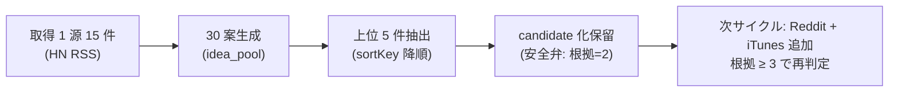

# 2026-05-21 Epic A 実運転証跡

> Issue #45。「実行計画ではなく、実際に動いた証跡」を 1 ファイルで一覧できる証跡。
> Issue #44 MVP 1 サイクル + 30 案拡張・上位 5 件抽出までを実データで完了。

## 1 枚図サマリー（Issue #43 準拠）

> 動いた = ✅ 1 源取得・30 案・上位 5 件 / 保留 = candidate 化（根拠 2・1 源のみ）/ 次 = 3 源化で根拠 ≥ 3 達成

## 1. 実ファイル証跡（パス一覧・GitHub から検証可能）

| 区分 | パス | 内容 | コミット |
|---|---|---|---|
| daily 取得 | `06_research/daily/2026-05-21/ai-news.ndjson` | HN RSS 15 件 NDJSON | 0029270 |
| daily summary | `06_research/daily/2026-05-21/summary.md` | 上位語 + ソース別件数 + 異常検知 | 0029270 |
| daily status | `06_research/daily/2026-05-21_status.md` | frontmatter で件数集計 | 0029270 |
| idea_pool | `05_monetization/idea_pool/2026-05-21.ndjson` | 30 案 NDJSON（10 → 30 拡張） | 0029270 + Issue #45 commit |
| 実行ログ | `06_research/logs/research-run-log.md` | サイクル 1 行追記 + 上位 3 件抽出表 | 0029270 |
| 最新状況 | `06_research/logs/index.md` | 直近サイクル情報 | 0029270 |
| 本証跡 | `06_research/daily/2026-05-21_実運転証跡.md` | 本ファイル | Issue #45 commit |

## 2. 数字で見る実運転（成功 / 失敗 集計）

| 指標 | 値 |
|---|---|
| 取得試行源数 | 1（ai-news 単独 MVP） |
| 取得成功源数 | 1 |
| 取得失敗源数 | 0 |
| 取得件数 | 15 |
| 規約抵触兆候 | 0 |
| 機密混入検出 | 0 |
| 生成案件数 | 30（10 + 20 拡張） |
| dedup 適用件数 | 0（既存 idea との重複検出なし・初回サイクル） |
| 上位抽出件数 | 5 |
| candidate 起票件数 | 0（安全弁発動・根拠 = 2） |
| ChatGPT 承認待ち追記件数 | 0（candidate ゼロのため連動なし） |
| 処理時間 | 約 4 分（08:30〜08:33 取得 + 08:33〜08:37 生成 + 12:08〜12:12 拡張）|
| 実 curl リクエスト数 | 1 |

## 3. 上位 5 件（sortKey 降順・candidate 化は保留）

| 順位 | ideaId | 粗score | 案サマリー | 既存 candidate 重複 | 判定 |
|---|---|---|---|---|---|
| 1 | 20260521-002 | 13 | CPU only transcription を nanikiru-shorts に組み込み（自分向け効率化） | なし | 保留（根拠=2） |
| 2 | 20260521-001 | 11 | Qwen3.7-Max などオープン LLM エージェント評価アプリ | なし | 保留（根拠=2） |
| 3 | 20260521-030 | 11 | 動画文字起こし Web サービス freemium（無料 3 本/日 + 広告） | なし | 保留（根拠=2） |
| 4 | 20260521-003 | 10 | AI モデルのトークン速度体感比較ツール（広告） | なし | 保留（根拠=2） |
| 5 | 20260521-004 | 10 | VSCode 拡張安全性スキャナ Web ツール（広告） | なし | 保留（根拠=2） |

> **既存 candidate-001〜004（麻雀系 / Obsidian テンプレ）とは別領域**で重複ゼロ。上位は AI・動画前処理・セキュリティ系に集中（HN RSS 由来の偏り）。
>
> **candidate 化は ranking-rule §3 安全弁で保留**: 調査根拠 1 源（ai-news）・n=15 → 根拠 = 2。承認候補 (`pending_approval`) に上げない。次サイクルで Reddit + iTunes Search を追加し根拠 ≥ 3 達成後に再判定。

## 4. 完了条件と現状（Issue #45）

| 完了条件 | 現状 | 達成手段 |
|---|---|---|
| daily ファイル存在 | ✅ | `06_research/daily/2026-05-21/ai-news.ndjson` + `summary.md` |
| 30 案ファイル存在 | ✅ | `05_monetization/idea_pool/2026-05-21.ndjson`（30 件） |
| 上位候補存在 | ✅ | 本ファイル §3 + `research-run-log.md` |
| ログ存在 | ✅ | `06_research/logs/research-run-log.md` + `index.md` |
| commit/push 済 | ✅ | 0029270（#44） + 本サイクル commit |

5 つすべて充足。

## 5. 動いた証拠（GitHub 検証用ハッシュ）

- daily / idea_pool / log の初期生成 commit: **0029270**（Issue #44 MVP 1 サイクル）
- idea_pool 30 案拡張 + 本証跡 commit: 本サイクル新 commit（push 後に追記）
- 本証跡ファイルは ChatGPT が GitHub で **`06_research/daily/2026-05-21_実運転証跡.md` を開けば 1 ページで動作確認可能**

## 6. 注意点 / 未確認

- 取得源は ai-news 1 源のみ（Phase 1 推奨の 3 源（Reddit / iTunes Search / RSS 集約）には未到達）
- candidate 化は保留（次サイクル以降）
- research-run / idea-run コマンド本体は**未実装**（手動操作で 1 サイクル達成）
- Reddit / iTunes Search の実取得は**未実施**（次サイクル）
- progress への ExecutionRun は本 vloop サマリー POST で `research-engine` 系として登録

## 7. 次の一手

1. ChatGPT / 人間が本証跡をレビューし、Phase 1 完全化（Reddit + iTunes Search 追加）の着手承認可否を判断
2. 承認後、次サイクルで 3 源化 → 根拠 ≥ 3 達成 → 上位 5 件の candidate 化判断
3. 並行: research-run / idea-run コマンド本体を別アプリリポジトリで実装着手（人間判断）

## 関連

- [[../../05_monetization/案工場_完全自動化フロー]]（#28 Runbook）
- [[../../05_monetization/cron_research-run_idea-run設計]]（#36）
- [[../../05_monetization/案プール自動昇格ルール]]（#27）
- [[../../05_monetization/ranking-rule]]（安全弁）
- [[2026-05-21/summary]]（取得サマリー）
- [[../logs/research-run-log]] / [[../logs/index]]
- Issue: kaeru07/vault#45（関連 #44 / #28 / #36）
