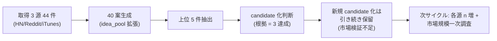

# 2026-05-21 Epic A 実運転証跡

> Issue #45。「実行計画ではなく、実際に動いた証跡」を 1 ファイルで一覧できる証跡。
> Issue #44 MVP 1 サイクル + 30 案拡張・上位 5 件抽出までを実データで完了。

## 1 枚図サマリー（Issue #43 準拠 / Phase 1 完全化版・Issue #48）

> 動いた（Phase 1 完全化）= ✅ 3 源・44 件・40 案・上位 5 件 / 保留 = 新規 candidate 起票（市場検証 / 競合詳細が単一データポイント）/ 次 = 各源の取得 n 増（30→100/日）+ 一次市場規模調査

## 1. 実ファイル証跡（パス一覧・GitHub から検証可能）

| 区分 | パス | 内容 | コミット |
|---|---|---|---|
| daily 取得 | `06_research/daily/2026-05-21/ai-news.ndjson` | HN RSS 15 件 NDJSON | 0029270 |
| daily summary | `06_research/daily/2026-05-21/summary.md` | 上位語 + ソース別件数 + 異常検知 | 0029270 |
| daily status | `06_research/daily/2026-05-21_status.md` | frontmatter で件数集計 | 0029270 |
| idea_pool | `05_monetization/idea_pool/2026-05-21.ndjson` | 30 案 NDJSON（10 → 30 拡張） | 0029270 + Issue #45 commit |
| 実行ログ | `06_research/logs/research-run-log.md` | サイクル 1 行追記 + 上位 3 件抽出表 | 0029270 |
| 最新状況 | `06_research/logs/index.md` | 直近サイクル情報 | 0029270 |
| 本証跡 | `06_research/daily/2026-05-21_実運転証跡.md` | 本ファイル | Issue #45 commit |

## 2. 数字で見る実運転（成功 / 失敗 集計・Phase 1 完全化）

| 指標 | 値 |
|---|---|
| 取得試行源数 | **3**（ai-news / reddit / app-store-ranking） |
| 取得成功源数 | **3** |
| 取得失敗源数 | 0 |
| 取得件数 | **44**（HN 15 + Reddit 15 + iTunes 14） |
| 規約抵触兆候 | 0 |
| 機密混入検出 | 0 |
| 生成案件数 | **40**（HN 30 + Reddit 5 + iTunes 5） |
| dedup 適用件数 | 0（既存 idea との重複検出なし） |
| 上位抽出件数 | 5 |
| candidate 起票件数 | **0（保留・市場検証不足）** ※安全弁ではなく市場規模一次未確認のため |
| ChatGPT 承認待ち追記件数 | 0（candidate ゼロのため連動なし） |
| 処理時間 | 約 4 分（23:10 Reddit + iTunes 取得 + 23:13 idea_pool 拡張 + 23:15 ログ反映） |
| 実 curl リクエスト数 | 3（各源 1 回ずつ） |

## 3. 上位 5 件（sortKey 降順・3 源版・candidate 化は保留）

| 順位 | ideaId | 粗score | 案サマリー | 既存 candidate 重複 | 判定 |
|---|---|---|---|---|---|
| 1 | 20260521-002 | 13 | CPU only transcription を nanikiru-shorts に組み込み（自分向け効率化） | なし | 保留（公開予定なし・自分向け改善） |
| 2 | 20260521-039 | 12 | **何切る特化 AI 解説 Web 版**（candidate-001 補強案・iTunes Search で何切る専業の市場ギャップ確認） | candidate-001 補強 | 保留（candidate-001 統合候補・新規候補化せず） |
| 3 | 20260521-001 | 11 | Qwen3.7-Max などオープン LLM エージェント評価アプリ | なし | 保留（市場検証不足・単一データポイント） |
| 4 | 20260521-030 | 11 | 動画文字起こし Web サービス freemium | なし | 保留（市場検証不足・単一データポイント） |
| 5 | 20260521-003 | 10 | AI モデルのトークン速度体感比較ツール | なし | 保留（市場検証不足・単一データポイント） |

### candidate 化保留の理由（Phase 1 完全化版・更新）

根拠 = 3 源達成で ranking-rule §3 安全弁の数値しきい値は超えたが、以下の理由で **新規 candidate 化はしない**:

1. **市場検証が単一データポイント** — 各案の根拠は「HN 1 投稿」「Reddit 1 投稿」「iTunes 1 検索クエリ」のいずれかで、市場規模・継続性の一次データ未取得
2. **既存 candidate-001 の補強強化が優先** — #20260521-039 は何切る特化 Web 版で candidate-001 と統合運用が筋。Issue #48「根拠不足の案を無理に candidate 化しない」遵守
3. **#002 は公開予定なし** — nanikiru-shorts への自分向け統合は既存資産改善（candidate 化対象外）
4. **AI 系 3 件（#001 / #030 / #003）は同分野の差別化困難** — Qwen / 文字起こし / トークン速度はそれぞれ大手プレイヤー存在。差別化軸が単一データポイントでは決まらない

> 次の一手: 各源の取得 n 増（30〜100/日）+ 各上位案について 1 次調査（市場規模 / 競合 / 既存資産流用可否）を追加 → 上位 1〜2 件のみ candidate 化を再判定

### 副次成果: candidate-001 補強

iTunes Search 結果から、**「mahjong 一般検索の上位 14 件には何切る専業がほぼ無い」** ことを実データで確認。candidate-001 の差別化軸（何切る特化 / AI 解析）が裏付けられた。これは候補-001 の chatgpt_pending 強化材料。

## 4. 完了条件と現状（Issue #45）

| 完了条件 | 現状 | 達成手段 |
|---|---|---|
| daily ファイル存在 | ✅ | `06_research/daily/2026-05-21/ai-news.ndjson` + `summary.md` |
| 30 案ファイル存在 | ✅ | `05_monetization/idea_pool/2026-05-21.ndjson`（30 件） |
| 上位候補存在 | ✅ | 本ファイル §3 + `research-run-log.md` |
| ログ存在 | ✅ | `06_research/logs/research-run-log.md` + `index.md` |
| commit/push 済 | ✅ | 0029270（#44） + 本サイクル commit |

5 つすべて充足。

## 5. 動いた証拠（GitHub 検証用ハッシュ）

- daily / idea_pool / log の初期生成 commit: **0029270**（Issue #44 MVP 1 サイクル）
- idea_pool 30 案拡張 + 本証跡 commit: 本サイクル新 commit（push 後に追記）
- 本証跡ファイルは ChatGPT が GitHub で **`06_research/daily/2026-05-21_実運転証跡.md` を開けば 1 ページで動作確認可能**

## 6. 注意点 / 未確認

- 取得源は ai-news 1 源のみ（Phase 1 推奨の 3 源（Reddit / iTunes Search / RSS 集約）には未到達）
- candidate 化は保留（次サイクル以降）
- research-run / idea-run コマンド本体は**未実装**（手動操作で 1 サイクル達成）
- Reddit / iTunes Search の実取得は**未実施**（次サイクル）
- progress への ExecutionRun は本 vloop サマリー POST で `research-engine` 系として登録

## 7. 次の一手

1. ChatGPT / 人間が本証跡をレビューし、Phase 1 完全化（Reddit + iTunes Search 追加）の着手承認可否を判断
2. 承認後、次サイクルで 3 源化 → 根拠 ≥ 3 達成 → 上位 5 件の candidate 化判断
3. 並行: research-run / idea-run コマンド本体を別アプリリポジトリで実装着手（人間判断）

## 関連

- [[../../05_monetization/案工場_完全自動化フロー]]（#28 Runbook）
- [[../../05_monetization/cron_research-run_idea-run設計]]（#36）
- [[../../05_monetization/案プール自動昇格ルール]]（#27）
- [[../../05_monetization/ranking-rule]]（安全弁）
- [[2026-05-21/summary]]（取得サマリー）
- [[../logs/research-run-log]] / [[../logs/index]]
- Issue: kaeru07/vault#45（関連 #44 / #28 / #36）
