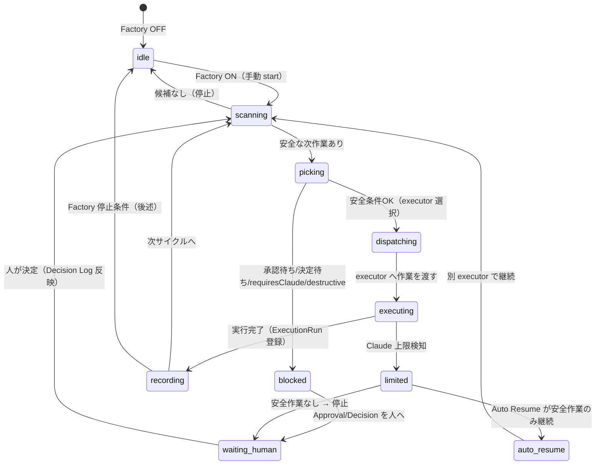
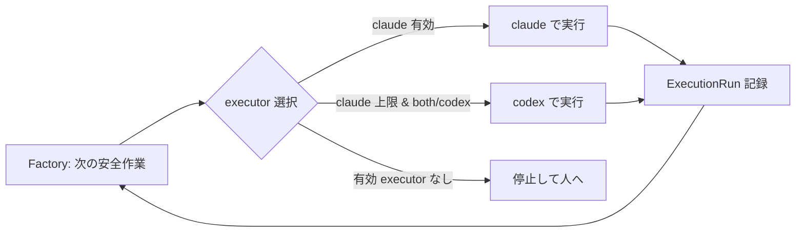

# Factory オーケストレーション設計（設計のみ・本体未実装）

> 状態: **設計フェーズ**。Factory 本体は実装しない。Auto Resume / Approval即処理 が安定してから着手する。
> 原則: **Progress を唯一の管制塔**とする。新しい正本を作らない。**executor 非依存**（Claude/Codex/将来の executor を差し替え可能）。handoff/プロンプトは生成ビューであり正本にしない。

---

## 1. 目的

承認不要な ToDo を**無人で連続実行**する上位レイヤ。
Progress が持つ既存正本（Epic / ExecutionRun / Next Actions / Approval Queue / Decision Log）だけを入力に、
「安全な作業 → 実行 → 結果記録 → 次の安全な作業」をループさせる。

Factory は**新しい判断ロジックを持たない**。安全判定は Auto Fallback の既存ゲートを再利用し、
再開可否は Auto Resume を再利用する。Factory は「いつ・どの executor で・何件回すか」の**進行制御だけ**を担う。

---

## 2. データフロー（既存正本のみ）

```
Progress（管制塔 / 唯一の正本群）
  Epic（案件・goal・decisionPolicy）
    └─ ExecutionRun（実行履歴＝正本）
         └─ nextActions[]（次にやること）
              └─ Next Actions 候補（safe 判定）
                   └─ 次 ToDo（pending_approval or queued）
                        └─ Approval Queue / Decision Log（人の判断）
```

Factory はこのフローを**読むだけ**で回す。書き込みは ExecutionRun（結果）と Automation Log（イベント）のみ。

---

## 3. Factory 状態遷移図



**Factory 停止条件**: 安全な候補が尽きた / Claude 上限かつ fallback executor なし / 連続失敗 N 回 / ユーザーが stop / Approval・Decision 待ちのみが残った。

---

## 4. Factory 対象 / 対象外

| Factory 対象（無人可） | Factory 対象外（人 or Claude 専任） |
|---|---|
| lint 修正 | Approval 待ち |
| typecheck 修正 | Decision 待ち |
| build 修正 | requiresClaude=true |
| docs 整理 | 課金 / billing |
| Vault 整理 | deploy / デプロイ |
| UI 微修正 | migration / スキーマ変更 |
| 方針決定済みの実装 | destructive（削除 / drop / truncate） |
| | secret / token / .env 利用 |

判定は **`classifyCodexEligibility`（既存・共有）** を流用。Factory 専用の判定は作らない。

---

## 5. 各レイヤとの境界（責務分離）

### 5.1 Auto Resume との境界
- **Auto Resume**: Claude 上限という「停止イベント」への反応。安全作業だけを **1 回** 継続できるか評価・記録する（反応的・単発）。
- **Factory**: 上限の有無に関わらず、安全作業を **連続** で回す上位ループ（能動的・継続）。
- 関係: Factory は内部で Auto Resume の評価関数（`evaluateAutoResume`）を**呼ぶ**。Auto Resume の安全判定を再利用し、Factory が「次サイクルへ進むか」を決める。Auto Resume は Factory なしでも単独で動く（疎結合）。

### 5.2 Automation との境界
- **Automation**: 人が start/stop し、executorMode / Auto Resume / Auto Fallback の**設定を決める**実行制御レイヤ（設定 + 単発トリガ）。
- **Factory**: Automation の設定を**前提に**無人ループを回す実行レイヤ。
- 関係: Factory は Automation の設定（executorMode 等）を読むが、設定は変更しない。Factory の ON/OFF も Automation の 1 スイッチとして置く（新画面を作らない）。

### 5.3 Approval との境界
- **Approval**: 人の判断が要る作業を堰き止めるゲート。Factory は **Approval 待ちを絶対に自動実行しない**。
- 関係: Factory は安全判定で `pending_approval` / `approval_required` を検出したら、その作業をスキップし、Approval Queue に残したまま次の安全作業へ進む。承認は Epic 詳細の即処理（Phase2）または横断受信箱（/approvals）で人が行う。決定後に Decision Log 経由で次サイクルへ戻る。

### 5.4 Decision Log との境界
- Factory は Decision Log を**読み**、確定済み判断と矛盾する作業はしない（`buildDecisionContext` を再利用）。Decision Log への書き込みは Approval 決定時のみ（既存経路）。

---

## 6. Claude / Codex / Both 運用時の流れ（executor 非依存）

Factory は executor を**抽象**として扱う。「rate-limited でない有効 executor を選ぶ」だけで、特定 executor に依存しない。

| executorMode | 通常時 | Claude 上限時 |
|---|---|---|
| `claude` | Claude で連続実行 | **停止**（fallback executor なし）→ 人へ通知 |
| `codex` | Codex で連続実行 | 影響なし（Claude 不使用）→ Codex 継続 |
| `both` | Claude 優先で連続実行 | Auto Resume が Codex へ切替えて安全作業のみ継続 |



**将来の executor 追加**: `pickExecutor(config, limitedSet)` を 1 箇所に集約し、優先順位リストを設定で持たせれば、Claude/Codex 以外（例: 別 LLM・別 CLI）も同じループに載る。Factory・Auto Resume はこの関数だけに依存する。

---

## 7. DecisionPolicy 標準化（Phase2 検討メモ）

現状 `Epic.decisionPolicy` は `autonomous / approval_required / budget_sensitive / destructive_sensitive` の 4 値。
Factory の入口判定をシンプルにするため、運用上は **3 段階**へ寄せられる:

| 標準値 | 意味 | Factory 挙動 |
|---|---|---|
| `autonomous` | 無人で進めてよい | Factory 対象（安全判定 OK なら実行） |
| `approval_required` | 承認が要る | Factory 対象外（Approval Queue へ） |
| `manual` | 人が手で進める | Factory 対象外（無人化しない） |

`budget_sensitive` / `destructive_sensitive` は `approval_required` の**サブカテゴリ**として Approval の `category` で表現すれば、Epic 単位の policy は 3 値に統一できる（後方互換: 既存 4 値は読み取り時にマッピング）。**この標準化は Factory 着手時に決定（今は提案のみ）。**

---

## 8. Factory 完成まで残っているもの

1. Factory ループ本体（scan → pick → dispatch → record → loop）
2. Factory ON/OFF と進行状況の Automation 内 UI（新画面は作らない）
3. 連続失敗・無限ループのサーキットブレーカ（停止条件の実装）
4. executor 抽象 `pickExecutor(config, limitedSet)` の共通化（Auto Resume と共有）
5. DecisionPolicy 3 値標準化の確定とマッピング
6. 無人実行の実体（executor を実際に起動する手段 / 半自動なら通知 + 人トリガ）
7. Factory 専用 ExecutionRun source（`factory_loop`）の付与と可観測性

> いずれも **新しい正本を作らず**、ExecutionRun / Automation Log / 既存正本の上で完結させる。
