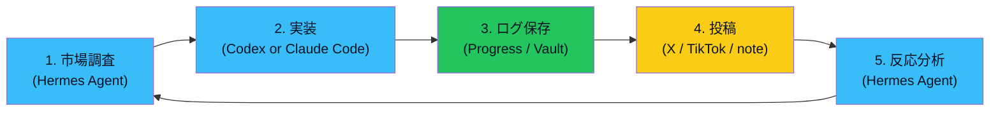
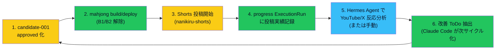

# Hermes Agent × Codex を市場調査→実装→改善サイクルに組み込む検討

> Issue #67 の検討材料整備。**実装・正式採用・API キー設定はしない**（人間判断）。本ファイルは「どこに組み込めるか」「組み込んだら何ができるか」「コストとリスク」を整理する。

> [!warning] Hermes Agent に関する未確認情報の扱い
> - 投稿で見かけた「17 歳が電卓アプリを 30 分で作って月 300 万」部分は**未確認情報として扱う**（Issue #67 本文に明記済）
> - 「Hermes Agent」と称する Agent システムの**具体的な API 仕様 / 料金 / 実装能力**は本サイクル時点で**未検証**
> - 本ファイルは「もし Hermes Agent が想定通りに動くなら何ができるか」の**仮説検討**に留める

> [!note] 用語注（Issue #69）
> Hermes Agent = X/TikTok 等で言及されていた市場調査・SNS 反応分析等を行うとされる Agent（未確認）/ Codex = OpenAI の AI コーディング Agent / Claude Code = Anthropic の Agent CLI / progress = 作業履歴の正本（[[../05_monetization/progress連携基準]]）

---

## 1. 検討の出発点（Issue #67 整理）

### 想定する 5 段階運用ループ

> 用語注: 市場調査 = 競合確認・需要観察 / 反応分析 = 投稿後のコメント・再生・引用整理 / 緑=既存運用で対応可 / 水=Hermes / Codex / Claude Code が必要 / 黄=人間操作が必要

### Issue #67 の完了条件（再掲）

1. Hermes Agent × Codex をどこに組み込むか整理する
2. Progress アプリ側に必要な機能追加があるか判断する
3. Vault 側に保存すべきテンプレ / 運用ルールを決める
4. 最初に試す対象アプリを 1 つ選ぶ
5. 最小運用フローを 1 本作る
6. 収益化インパクト、実装コスト、API 課金有無を比較する

---

## 2. 既存運用との接続点分析

既存資産マップ:

| 既存資産 | 役割 | Hermes 系との接続点 |
|---|---|---|
| [[../03_prompts/Codexレビュー常用運用]] | Codex を読み取り専用レビュアーで常用 | ステージ 2 実装後の**レビュー段階**で Codex を継続活用 |
| [[../03_prompts/AgentSDKクレジット活用方針]] | Claude 有料プラン Agent SDK 月次クレジット | ステージ 2 / 5 で Claude Code 自動実行を補強 |
| [[../05_monetization/progress連携基準]] | progress に ExecutionRun 投入 | ステージ 3 ログ保存はそのまま使える |
| [[../05_monetization/案工場_完全自動化フロー]] | research-run / idea-run（Epic A）| ステージ 1 / 5 の Hermes 役を**部分的に置き換え可能**（HN / Reddit / iTunes 等の無料情報源）|
| [[../05_monetization/cron移行判定基準]] | research-run / idea-run の cron 化 | ステージ 5 反応分析を**定期実行**に乗せられる |
| [[../02_apps/nanikiru-shorts]] | Shorts 動画生成パイプライン | ステージ 4 投稿の**素材生成**を流用可能 |

### 既存運用との重複範囲

- **ステージ 1 市場調査**: 既存 research-run（HN / Reddit / iTunes）が 7 割カバー → Hermes は SNS 反応・レビュー分析の差分のみ追加
- **ステージ 2 実装**: 既存 Claude Code / Codex で十分（Hermes による実装代替はメリット薄）
- **ステージ 3 ログ保存**: progress + Vault で完備（変更不要）

### Hermes Agent が独自に価値を出せる範囲

- **SNS 反応分析**: 既存 research-run は HN / Reddit / iTunes Search のみ。X / TikTok / YouTube コメント解析は未対応
- **レビュー不満抽出**: App Store / Play Store のレビュー本文分析（既存研究で一部存在するが自動化されていない）
- **競合動向の継続監視**: 競合アプリのバージョン履歴・機能追加履歴の自動追跡

→ **Hermes が必要な領域は 5 段階のうちステージ 1 の SNS 反応 + ステージ 5 反応分析**に限定可能。他は既存資産で代替できる。

---

## 3. Progress アプリ側に必要な機能追加（完了条件 2）

### 必要かもしれない機能

| 機能 | 必要性 | 判断 |
|---|---|---|
| SNS 反応データの ExecutionRun 化 | 中 | 既存 `rawReport` で記録可能 → 専用フィールド不要 |
| 競合バージョン追跡ダッシュボード | 低 | 手動入力で当面成立。専用テーブル不要 |
| レビュー不満タグ分類 | 低 | tag 機能で代替可能 |
| 投稿実績との突合（ステージ 4 → 5）| 中 | progress に `socialPostUrl` / `socialReactions` フィールド追加検討 |

→ **当面は新機能追加不要**。`rawReport` テキストで 5 段階ループの記録ができる。Phase B（次サイクル以降）で `socialPostUrl` / `socialReactions` を追加検討。

---

## 4. Vault 側に保存すべきテンプレ / 運用ルール（完了条件 3）

### 新規テンプレ候補

- `90_templates/hermes-cycle-template.md`: 5 段階ループの 1 サイクル分を記録するテンプレ（次サイクル候補 / 採用判断後）

### 既存テンプレで代替可能

- `90_templates/market-research-template.md`: ステージ 1 / 5 で使える
- `90_templates/session-review-template.md`: ステージ 5 のレビュー段階に流用可能

→ **本サイクルでは新規テンプレ作成は見送り**。採用判断後に最小テンプレ 1 本作る。

### 運用ルール候補

- **Hermes Agent を呼ぶ条件**: candidate / 試作完成後のステージ 5 反応分析のみ（過剰呼び出し回避）
- **API キー管理**: AgentSDKクレジット活用方針 と同様 / Vault には書かない / 環境変数のみ
- **未確認情報の扱い**: Hermes 出力は**未確認情報**として扱い、収益化判断には ChatGPT or 人間のセカンドオピニオン必須
- **承認ルール**: Hermes 出力で candidate を approved 化しない（[[../05_monetization/ChatGPT承認ゲート標準]] 準拠）

---

## 5. 最初に試す対象アプリ 1 つ選定（完了条件 4）

### Issue #67 が挙げた 5 候補

| 候補 | Hermes 必要度 | 既存資産 | 投稿経路 | API 課金 |
|---|---|---|---|---|
| 麻雀何切るアプリ（candidate-001） | 中 | ✅ 既存 mahjong | ✅ nanikiru-shorts | Hermes API 課金リスク |
| 将棋囲いトレーナー | 中 | ✅ 既存 shogi-trainer | △ Shorts 検討段階 | 同上 |
| インバウンド向けアプリ | 高 | × 新規 | × 未着手 | 同上 + 新規開発コスト |
| AI 成果物レビュー / 可視化 | 低 | △（candidate-005 と近接）| △ | 同上 |
| App Store / Google Play 市場調査ツール | 高 | △（idea_pool 段階）| △ | 同上 + 規約リスク（スクレイピング）|

### 推奨選定: **麻雀何切るアプリ（candidate-001）**

理由:
- 既存資産（mahjong + nanikiru-shorts）が最も整っている
- ステージ 4 投稿経路（YouTube Shorts）が既に存在
- candidate-001 が既に ChatGPT 方向性レビュー待ち → approved 後の運用に Hermes ループを自然に乗せられる
- Hermes 必要度「中」= 既存 research-run（iTunes Search）で 7 割カバー、Hermes は YouTube コメント分析・X 反応分析の差分のみ
- ステージ 1-3 は既存運用で完結 / Hermes が必要なのはステージ 5 だけ → **テスト範囲が最小化できる**

### 採用しない候補と理由

- **将棋囲い**: アプリ完成度は高いが投稿経路（Shorts）が未着手 → ステージ 4 で詰まる
- **インバウンド向け**: 新規開発が必要 → 検証範囲が広すぎる
- **AI 成果物レビュー**: candidate-005（token-speed-tool）と機能重複 → 区別困難
- **App Store 市場調査ツール**: 既存 iTunes Search / Google Play Research で一部達成済 + スクレイピング規約リスク

---

## 6. 最小運用フロー 1 本（完了条件 5）

### candidate-001 を題材にした最小運用フロー

> 用語注: approved 化 = ChatGPT 方向性承認 + 人間 status 確定 / build/deploy = B1 build 検証 + B2 Vercel デプロイ / Shorts 投稿 = nanikiru-shorts パイプライン経由 / 反応分析 = 投稿動画の再生回数 / コメント / 引用などを Hermes で要約 / 改善 ToDo 抽出 = 次サイクルの作業候補化

### Hermes が無くても回せる迂回ルート

- ステージ 5 反応分析を**手動**で行う（YouTube Studio + X / TikTok アプリで直接観察）
- 初期 1 サイクルは Hermes なし → 2 サイクル目から API 課金判断
- → **Hermes 課金前に運用ループ全体を 1 回回せる**設計

---

## 7. 収益化インパクト・実装コスト・API 課金有無の比較（完了条件 6）

### 5 段階各ステージのコスト・課金有無

| ステージ | 担当 | 実装コスト | API 課金 | 代替可能性 |
|---|---|---|---|---|
| 1. 市場調査 | Hermes or 既存 research-run | 低（既存）| Hermes は要 / 既存は無料 | ✅ 既存で 7 割カバー |
| 2. 実装 | Claude Code / Codex | 中（人間時間）| Claude 月次クレジット / Codex 課金 | ❌ 代替なし |
| 3. ログ保存 | progress + Vault | 0（既存）| 0 | ❌ 代替なし（既存完結）|
| 4. 投稿 | 人間 | 中（人間時間）| 0（無料投稿）| ❌ 代替なし（人間判断必須）|
| 5. 反応分析 | Hermes or 手動 | 低-中 | Hermes は要 / 手動は 0 | ✅ 手動可 |

### 収益化インパクト（candidate-001 で運用した場合）

- **改善サイクル高速化**: 1 サイクル 1-2 週間 → Hermes で**反応分析だけ自動化**すれば 1 サイクル 1 週間程度に短縮可能（仮説）
- **改善 ToDo 抽出**: 手動で見落としていた SNS 反応・コメントを拾える可能性
- **コンテンツ最適化**: Shorts のサムネ・タイトル・コメント返信の改善ヒントが取れる仮説
- **絶対値**: candidate-001 自体が収益化インパクト high のため、**改善 1% でも月次収益への寄与は無視できない**仮説

### Hermes 採用のメリット閾値（仮説）

- 反応分析を手動で**月 8 時間以上**かけている → Hermes 採用検討（時給換算で API 課金を上回る可能性）
- 反応分析の**頻度が週 1 以上必要** → Hermes 採用検討（手動運用が破綻するため）
- 投稿数が**週 5 本以上** → Hermes 採用検討（手動分析が追いつかない）

→ candidate-001 の Shorts 投稿は**まだ初期**のため、**Hermes 採用は早い段階では不要**。週 5 本ペースに乗ってから検討推奨。

### API 課金リスク

- Hermes Agent の課金体系が未確認 → ユーザーが公式仕様を確認後に判断
- 暫定運用: Hermes なしで 1-2 サイクル回す → ROI 試算後に課金判断
- 課金リスク回避策: 月次予算上限を設ける（[[../03_prompts/AgentSDKクレジット活用方針]] と同様の枠管理）

---

## 8. 結論（検討材料の総括）

### Issue #67 完了条件 6 件への回答

1. **どこに組み込むか**: ステージ 5 反応分析が主役。ステージ 1 市場調査は既存 research-run で 7 割カバー
2. **Progress 側機能追加**: 当面不要。Phase B で `socialPostUrl` / `socialReactions` 検討
3. **Vault 側テンプレ / 運用ルール**: 採用判断後に最小テンプレ 1 本 + 運用ルール（過剰呼び出し回避 / 機密管理 / 承認ゲート）
4. **最初に試す対象アプリ**: **candidate-001 麻雀何切るアプリ**（既存資産 + 投稿経路 + approved 待ち）
5. **最小運用フロー**: §6 の 6 ステップ（approved → build/deploy → 投稿 → ログ → 反応分析 → 改善 ToDo）。Hermes なしでも 1 サイクル回せる迂回ルートあり
6. **収益化インパクト等**: 改善サイクル高速化への寄与は仮説段階。Hermes 課金は**週 5 本投稿に乗ってから**検討推奨

### Claude（AI）からの推奨

- 推奨: **本サイクルでは検討材料整備のみ。実採用は candidate-001 が approved になってから判断**
- 理由: ① candidate-001 が approved 待ち ② Hermes 課金体系未確認 ③ 投稿頻度が低い段階では手動で十分 ④ 既存 research-run で 7 割カバー済
- → Hermes Agent 採用を急ぐより、**candidate-001 を進めて Shorts 投稿を増やす方が収益化への近道**

### 次サイクル候補

- candidate-001 が approved 化されたら、§6 の最小運用フローを実行に移す
- 1-2 サイクル手動で回した後、Hermes 採用 ROI を再評価
- Hermes Agent の公式仕様確認は**ユーザーが必要時に実施**（AI は API キー設定しない）

---

## 9. 未対応点 / 仮説

- Hermes Agent の具体的 API 仕様 / 料金 / 実装能力は**未確認**
- 「Hermes が反応分析を自動化できる」前提は**仮説**。実証は採用後
- ROI 試算（時給換算 vs API 課金）は**仮説計算**。実数値は採用後の実測
- candidate-001 の Shorts 投稿数の現状値は本サイクルでは確認していない（nanikiru-shorts の運用状況は別途確認必要）
- 採用判断は人間（[[../05_monetization/ChatGPT承認ゲート標準]] / 課金関連）

---

## 10. 関連

- [[../03_prompts/Codexレビュー常用運用]] — Codex の役割（ステージ 2 レビュー）
- [[../03_prompts/AgentSDKクレジット活用方針]] — Claude Agent SDK 月次クレジット枠（ステージ 2）
- [[../05_monetization/progress連携基準]] — progress 投入基準（ステージ 3）
- [[../05_monetization/案工場_完全自動化フロー]] — Epic A 全体像（ステージ 1 既存資産）
- [[../05_monetization/cron移行判定基準]] — research-run cron 化（ステージ 1 / 5 自動化）
- [[../05_monetization/scenarios/candidate-001]] — 試用対象案
- [[../02_apps/nanikiru-shorts]] — ステージ 4 投稿パイプライン
- [[../05_monetization/案の情報源と採用理由]] — 案ハブ
- Issue: kaeru07/vault#67
