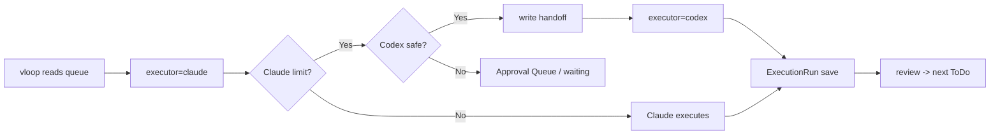

# AI工場自動化 MVP 設計（executor抽象化）

> 今回は収益化機能、Factory成果物台帳、市場調査連携を後回しにし、AI工場の自動化完成を最優先する。
> Claude / Codex 固定ではなく、`executor` 抽象で継続実行できる状態に近づける。

## 1. 既存調査結果

| 対象 | 既存の役割 | 調査結果 |
|---|---|---|
| `20_reviews/案件別ToDo一覧.md` | Vault ToDo 正本 | 実行 / 確認待ち / 承認待ち / 完了移動候補の正本 |
| `20_reviews/vloop_queue.md` | vloop 実行対象 | `[x]` のみ実行。`[ ]` は承認待ちで実行禁止 |
| `work-queue.json` | Progress 集中作業キュー | `queued` / `in_progress` が作業対象。vloop 正本ではない |
| `project-tasks.json` | 案件別タスク | `pending_approval` / `todo` / `done` 等を保持。`assignee: claude` 固定箇所あり |
| `execution-runs.json` | 作業履歴正本 | `nextActions` はあるが、次 ToDo として永続化する導線は未完成 |
| `approvals.json` | Approval Queue 相当 | A/B/C 選択式構造あり。空データで運用導線は未完成 |
| `operational-decisions.ndjson` | Decision Log 相当 | approval 決定時に追記する基礎あり。次回実行時の読み戻しは未完成 |
| `today-session.json` | 当日セッション / handoff | `handoffText` あり。構造化 handoff は未完成 |
| `codex-runs.json` | Codex 実験履歴 | Codex 手動実行の記録あり。ExecutionRun との統合は未完成 |

## 2. 自動化完成までの最短ルート

1. 既存正本を壊さず `/operations` を管制塔にする。
2. executor 任意フィールドを `project-tasks` / `work-queue` / `ExecutionRun` に追加する。
3. Approval Queue は `approvals.json` を使い、A/B/C + 推奨案 + 理由を必須化する。
4. Decision Log は `operational-decisions.ndjson` を使い、次回実行時に読み戻す。
5. AI生成ToDoは、まず ExecutionRun `nextActions` から候補表示し、未承認で自動 `[x]` 化しない。
6. handoff は `today-session.json` を当面の正本にし、将来 `handoff/` ファイル分割へ拡張する。
7. Claude 上限時は会話履歴ではなく handoff を正本にして Codex へ渡す。

## 3. vloop基盤採用方針

- Vault 正本: `20_reviews/案件別ToDo一覧.md`
- vloop 実行対象: `20_reviews/vloop_queue.md` の `[x]` + GitHub Issue の未反映ToDo
- Progress 作業対象: `work-queue.json` の `queued` / `in_progress`
- 完了正本: `execution-runs.json` + Vault 完了ログ
- 承認待ち: `approvals.json` と Vault `[ ]`
- 再開正本: `work-queue.json` + `operational-decisions.ndjson` + `today-session.json`

## 4. Approval Queue設計

既存 `approvals.json` を採用する。新規キューは作らない。

```json
{
  "approvalId": "appr-...",
  "epicId": "epic-91",
  "title": "判断タイトル",
  "priority": "critical | high | normal | low",
  "category": "goal_change | billing | destructive | production_risk | secret | external_publish | monetization | multi_option | executor_fallback",
  "options": [
    { "key": "A", "label": "推奨案", "detail": "短文説明" },
    { "key": "B", "label": "保留", "detail": "短文説明" }
  ],
  "recommended": "A",
  "reason": "推奨理由",
  "status": "pending"
}
```

承認待ち条件:

- Epicゴール変更
- 課金発生
- destructive変更
- 本番破壊リスク
- 認証情報や秘密情報利用
- 外部公開
- 収益化方針変更
- 複数案で結果が大きく変わる場合

## 5. Decision Log設計

既存 `operational-decisions.ndjson` を採用する。

```json
{
  "decisionId": "dec-...",
  "epicId": "epic-91",
  "topic": "判断タイトル",
  "decision": "A",
  "approvalId": "appr-...",
  "decidedAt": "2026-05-30T00:00:00.000Z"
}
```

役割:

- ユーザーが選択した方針を保存する
- 次回 vloop / executor 起動時に読む
- 収益化承認用の `05_monetization/decision-log.md` とは責務分離する

## 6. AI生成ToDo設計

最初は ExecutionRun `nextActions` を候補として扱う。

```json
{
  "sourceRunId": "20260530-...",
  "targetApp": "progress",
  "title": "次にやること",
  "reviewStatus": "not_reviewed",
  "createdAt": "2026-05-30T00:00:00.000Z"
}
```

ルール:

- 自動で `queued` / `[x]` にしない
- `project-tasks.json` へ入れる場合は原則 `pending_approval`
- doneCriteria が明確で承認不要条件に該当する場合だけ、ユーザー承認済みキューへ進める

## 7. Executor設計

executor 種別:

- `claude`
- `codex`
- `manual`
- `other`

タスク / キュー / 実行履歴に持たせる任意フィールド:

```json
{
  "preferredExecutor": "claude",
  "fallbackExecutor": "codex",
  "autoFallback": true,
  "canRunOnCodex": true,
  "requiresClaude": false,
  "executorUsed": "codex",
  "fallbackReason": "claude_limit"
}
```

Codex 自動切替可:

- 軽微な修正
- lint / typecheck / build 修正
- テスト追加
- ドキュメント整備
- Vault整理
- GitHub Issue整理
- UI微修正
- 方針決定済み実装
- 反復作業

Codex 自動切替不可:

- 課金
- 本番DB変更
- destructive操作
- 認証情報利用
- 外部公開
- 方針未決定の設計
- 高リスク作業

## 8. Handoff設計

既存:

- `/queue` に `handoffText`
- `today-session.json` に保存
- `/root/company/engineering/handoffs/handoff-template.md` が存在

MVPでは `today-session.json` を handoff 正本にする。

必須セクション:

1. 目的
2. 現在地
3. 変更済みファイル
4. 未完了作業
5. 禁止事項
6. 検証条件
7. Decision Log
8. 承認待ち事項

将来のファイル分割候補:

- `handoff/current-task.md`
- `handoff/changed-files.md`
- `handoff/decision-log.md`
- `handoff/remaining-work.md`
- `handoff/codex-prompt.md`

## 9. Claude→Codex自動切替設計



切替時の正本:

- 会話履歴ではなく handoff
- `work-queue.json`
- `operational-decisions.ndjson`
- `execution-runs.json`

## 10. Progress画面構成

`/operations` に以下を集約する。

1. ヘルスバー（実行可 / 実行中 / 承認待ち / 上限待ち / 停止 / 放置）
2. 自動実行状態（現状は pm2 API あり。ただし実操作は承認待ち）
3. 自動化基盤（Decision Log / AI次ToDo / handoff / Codex可）
4. Executor別状態（claude / codex / manual / other）
5. handoff 不足セクション
6. Approval Queue（A/B/C選択）
7. Epic進行

## 11. 将来の自動起動接続方法

今回の実装では systemd / cron / pm2 実操作はしない。

将来接続:

- VPS起動時: systemd または pm2 startup
- 毎朝11時: cron または systemd timer
- 利用制限回復後: executor status watcher
- 接続先: `/api/operations/automation` で readiness を確認してから autoexec start

## 12. MVP実装範囲

今回の Progress 実装範囲:

- executor 任意フィールドを型に追加
- `project-tasks` / `work-queue` / `ExecutionRun` に executor 情報を保持可能にする
- `/api/operations/automation` を追加
- `/operations` に自動化基盤 / executor / handoff 状態を表示
- 集中作業プロンプトを executor 中立に更新

## 13. 後回し範囲

- 収益化機能
- Factory成果物台帳
- 市場調査連携
- systemd / cron / pm2 実操作
- Claude→Codex の実自動起動
- ExecutionRun `nextActions` から `project-tasks` への自動登録
- handoff ファイル分割

## 14. 変更ファイル一覧

Progress:

- `progress/types/progress.ts`
- `progress/types/session.ts`
- `progress/types/execution-run.ts`
- `progress/lib/types/operations.ts`
- `progress/lib/operations-store.ts`
- `progress/app/api/operations/automation/route.ts`
- `progress/app/operations/page.tsx`
- `progress/app/api/tasks/route.ts`
- `progress/app/api/tasks/[taskId]/route.ts`
- `progress/app/api/execution-runs/route.ts`
- `progress/lib/progress-writer.ts`
- `progress/lib/session-writer.ts`
- `progress/components/queue/PromptCopy.tsx`

Vault:

- 本ファイル

## 15. 検証結果

- `git pull origin main`（Vault）: Already up to date
- `npm run lint`: 成功
- `npx tsc --noEmit`: 成功
- `npm run build`: 成功
- `GET /api/operations/automation`: 200 OK（Decision Log / AI次ToDo / executor / handoff / restartReadiness を返却）
- `HEAD /operations`: 200 OK（dev server `http://127.0.0.1:3011`）

## 16. 未対応点

- Decision Log 読み戻しを executor 起動プロンプトへ自動注入する処理は未実装
- Approval Queue へ判断待ちを自動生成する処理は未実装
- Claude→Codex の実自動切替は未実装
- systemd / cron / pm2 実操作は未実施
- ExecutionRun nextActions の永続 ToDo 化は未実装

## 17. 次の一手

1. `/api/operations/automation` の readiness を vloop 起動プロンプトへ入れる。
2. handoffText を必須セクション付きで生成する API を追加する。
3. ExecutionRun nextActions から `pending_approval` ToDo 下書きを作る API を追加する。
4. `requiresClaude=false` かつ `canRunOnCodex=true` の queued タスクを Codex 実行候補にする。

## 18. Progressレビュー用短報

AI工場自動化の MVP として、Claude/Codex 固定ではなく `executor` 抽象を導入した。既存の vloop / work-queue / project-tasks / ExecutionRun を壊さず、任意フィールドで `preferredExecutor` / `fallbackExecutor` / `autoFallback` / `canRunOnCodex` / `requiresClaude` / `executorUsed` を持てるようにした。`/operations` には Decision Log、AI次ToDo候補、handoff、executor別状態を read-only 表示する `/api/operations/automation` を追加。自動起動や pm2/cron 実操作は承認待ちに残し、次は handoff 生成と ExecutionRun nextActions の pending_approval 化を進める。
