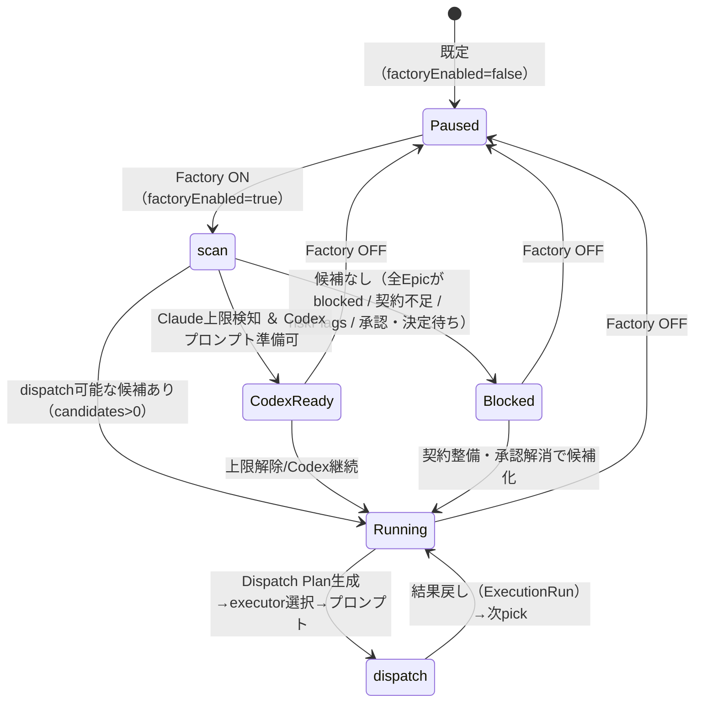

# 2026-05-31 Factory ON/OFF 実装

> Factory の完全自動運転を開始・停止できるスイッチ（factoryEnabled）を実装。
> OFF のとき一切 scan しない／ON のときのみ scan→pick へ進む。状態は Running/Paused/Blocked/CodexReady。

---

## 1. 作業目的

- Factory の自動運転を ON/OFF できるようにする。OFF=完全停止、ON=scan→pick 開始。
- まだ作らない: cron / pm2 自動実行 / systemd / Hermes / Executor 追加 / 完全無人化。

---

## 2. Factory 状態遷移図



OFF（Paused）では scan に入らない。ON のときだけ scan→pick→（手動/開発者）dispatch へ進む。

---

## 3. Factory ON/OFF 仕様

| 項目 | OFF（Paused） | ON |
|---|---|---|
| scanFactoryDispatch | **即空返し（一切 scan しない）** | 全 active Epic を scan → eligible を priority 順に pick |
| factoryRunState | Paused | Running（候補あり）/ Blocked（候補なし）/ CodexReady（上限&Codex可） |
| Factory進行状況カード | 自動運転 OFF | 自動運転 ON ＋ 対象Epic/件数/Claude利用状況/Fallback/次回予定 |
| 自動で動く範囲 | なし | scan→pick→Dispatch Plan生成→executor選択→プロンプト生成まで |
| executor 実起動 | — | しない（手動コピー運用 / 開発者モード。完全無人化は未実装） |

- 設定の所在: `automation-config.json` の `factoryEnabled`（既定 false）。新正本は増やさない。
- 後方互換: 旧 config に `factoryEnabled` が無くても getAutomationConfig が既定 false で補完。
- ON/OFF の切替: Factory進行状況カードのトグル → POST /api/operations/automation-config { factoryEnabled }。

---

## 4. 確認したいこと 4点への回答

1. **Factory ON でどこまで自動で動くか** → scan（全 active Epic）→ pick（priority 最優先）→ Dispatch Plan 生成 → executor 選択 → プロンプト生成可能、まで自動。executor の実起動・結果戻しは手動コピー運用（完全無人化は今回対象外）。
2. **Factory OFF でどこまで停止するか** → scanFactoryDispatch が即空返しし、pick / Dispatch Plan / プロンプト生成へ一切進まない。factoryRunState=Paused。Auto Resume / AutoFallback の安全機構は独立設定（Factory OFF でも上限検知自体は動く）。
3. **疎通テスト実施条件** → Factory ON ＋ 開発者モード ON ＋ Factory 対象 Epic（契約OK・riskFlags無・承認/決定待ち無・doneCriteria≥1）が1件以上。
4. **Loop 本体実装前に不足している部品** → Factory ループ本体（scan→pick→dispatch→record→次pick）、停止条件（サーキットブレーカ/連続失敗）、executor 抽象 pickExecutor の共通化、executor 実起動 or 通知＋人トリガ、Factory 専用 ExecutionRun source（factory_loop）と可観測性。

---

## 5. 変更ファイル

| ファイル | 変更内容 |
|---|---|
| lib/types/operations.ts | AutomationConfig.factoryEnabled / FactoryDispatchScan.factoryEnabled |
| lib/operations-store.ts | 既定値・update・getAutomationConfig を既定マージ（後方互換） |
| lib/factory-dispatch.ts | scanFactoryDispatch を factoryEnabled でゲート（OFF=空） |
| lib/factory-status.ts | factoryRunState(Running/Paused/Blocked/CodexReady) |
| components/automation/FactoryProgressCard.tsx | 状態バッジ + ON/OFFトグル |
| components/automation/FactoryDispatchPanel.tsx | OFF時ヒント・型修正 |
| app/api/operations/automation-config/route.ts | factoryEnabled を受理 |

---

## 6. 検証結果

- typecheck / build / lint: すべて OK
- 手動確認:
  - T1 OFF（既定）→ factoryRunState=Paused / scan candidates 0・blocked 0（一切 scan しない）
  - T2 ON ＋ epic-91 のみ（doneCriteria 無で不完全）→ scan 実行・candidates 0 / blocked 1 → Blocked
  - T3 ON ＋ dispatchable test epic → candidates 1 / picked=テストEpic → Running・currentEpic 表示
  - automation-config POST で factoryEnabled 永続化確認・旧 config 後方互換（factoryEnabled 無→既定 false）
  - 検証後 config(OFF) / epics(epic-91 のみ) 復元
- 機密チェック: OK

---

## 7. 疎通テスト手順（推奨）

1. テスト用 Epic（docs/epic-contract-test-epic.json）を /epic/new の JSONインポートで投入（contract OK・riskFlags無）。
2. Automation の Factory進行状況カードで「Factory 自動運転」を **ON**。
3. カードの状態が **Running**、対象Epic=テストEpic になることを確認。
4. 画面下部の DevModeToggle で **開発者モード ON**。
5. 「Factory Dispatch（準備・手動）」で picked Epic に対し「Claudeへ渡すプロンプト」or「Codexへ渡すプロンプト」を生成 → コピー。
6. Claude/Codex で実行 → 「実行結果を戻す」（dispatchPlanId 付き）で ExecutionRun 登録。
7. Factory を **OFF** に戻し、状態が **Paused**・scan が止まることを確認。
8. 開発者モード OFF に戻して通常運用（状態中心）に戻す。

---

## 8. 未対応 / 危険ポイント / 次の一手

- 未対応: Factory ループ本体・完全無人化・cron/pm2/systemd/Hermes/Executor追加（指示どおり）。
- 危険: 新正本なし・既存ロジック（scan判定/eligibility/安全ゲート）不変。ON でも executor 実起動はしない（手動コピー）。
- 次の一手: 上記疎通テストを1周実施し、問題なければ Factory ループ本体（停止条件付き）へ。

---

## 9. ChatGPT レビュー依頼文

````text
以下は Claude Code の作業報告です。レビューしてください。

対象アプリ: progress（AI工場の管制塔 / Next.js / port 3010）
作業: Factory ON/OFF実装（factoryEnabled・状態Running/Paused/Blocked/CodexReady・OFF時はscanしない）
runId: 20260531-180730
日付: 2026-05-31
GitHub commit: (progressアプリのコードは未commit / Vaultレビューのみ反映)

## 実施内容
- AutomationConfig.factoryEnabled（既定OFF・後方互換）。
- scanFactoryDispatch を OFF でゲート（一切 scan しない）、ON のみ scan→pick。
- factoryRunState（Running/Paused/Blocked/CodexReady）。
- Factory進行状況カードに ON/OFF トグルと状態バッジ。

## 検証
- OFF→Paused/scanなし、ON+不完全→Blocked、ON+dispatchable→Running。tsc/build/lint OK。検証後復元。

## 確認したい観点
- factoryEnabled を automation-config に持たせ新正本を増やさない設計は妥当か
- OFF時に scan を完全停止する実装位置（scanFactoryDispatch 先頭）は十分か
- factoryRunState の4状態判定（特に Blocked と CodexReady の優先順）は妥当か
- ON で「プロンプト生成まで自動・実起動は手動」の線引きは妥当か
- Loop本体へ進む前の不足部品の整理は妥当か
````

---

## 関連

- progress runId: 20260531-180730（正本）
- 関連 run: 20260531-174248（Codex引き継ぎ方針変更）, 20260531-165655（Factory Dispatch準備）
- Factory設計: [[../06_research/factory-orchestration-design]]
- テスト用Epic: [[../03_prompts/epic-contract-test-epic.json]]
- 関連アプリ: [[../02_apps/progress]]
