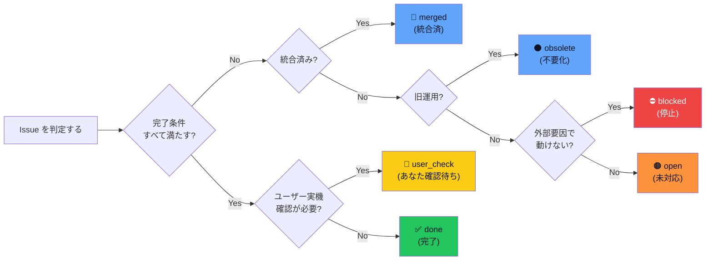

# 📋 Issue 完了判定 + レビュー記録運用ルール

> [!important] 「完了っぽい」をやめ、状態分類で確定判断する
> Issue #64（完了判定）+ Issue #65（レビュー記録）+ Issue #66（vloop 監査）を統合した運用ルール。

> [!note] 用語の言い換え（Issue #69）
> done = 完了 / user_check = あなた確認待ち / open = 未対応 / merged = 統合済 / obsolete = 不要化 / blocked = 停止 / reviewed_ok = レビュー済（追加対応なし）/ reviewed_followup = レビュー済（追加対応あり）/ not_reviewed = 未レビュー / vloop = Claude がまとめて作業を進める仕組み

---

## 1. Issue 状態の 6 分類（Issue #64 Phase 1）

| 状態 | 意味 | 必要条件 |
|---|---|---|
| **done** | 完了 | 完了条件すべて満たし / 成果物・commit hash・push 済を確認 |
| **user_check** | Claude 側作業は完了 | ユーザー実機確認 / 承認判断が必要 |
| **open** | 未完了 | 作業・成果物・検証が不足 |
| **merged** | 後続 Issue に統合済み | 統合先 Issue 番号を明記。単独では追わない |
| **obsolete** | 旧運用・不要化 | 参照のみ。削除はしない |
| **blocked** | 停止 | 外部要因・ユーザー判断・課金・公開判断などで動けない |

> [!warning] コメントだけで done にしない
> commit/push や成果物が不明なものは done に分類できない。実在確認していないファイルを根拠にしない。

### 状態 6 分類の判定フロー（Issue #68 反映）



> 用語注: ✅完了 = 作業も検証も終わった / 🧑あなた確認待ち = Claude 側完了・ユーザー操作待ち / 🟠未対応 = まだ着手していない / 🔵統合済 = 別 Issue に吸収された / ⚫不要化 = 旧運用で参照のみ / ⛔停止 = 外部要因で動けない（テンプレ準拠: [[../90_templates/現在地図テンプレ]]）

---

## 2. レビュー状態の 4 分類（Issue #65）

| 状態 | 意味 |
|---|---|
| **reviewed_ok** | レビュー済み・追加対応なし |
| **reviewed_followup** | レビュー済み・追加 ToDo または修正が必要 |
| **user_check** | Claude 側作業はレビュー済みだが、ユーザー実機確認待ち |
| **not_reviewed** | まだレビュー未了 |

### 作業状態とレビュー状態は独立

例: 作業状態 = user_check / レビュー状態 = reviewed_ok = 「Claude 作業はレビュー済みだが、ユーザー実機確認待ち」

---

## 3. レビュー時の証拠チェック（Issue #64 Phase 2）

完了扱いするには **最低限以下をすべて確認**:

- [ ] Issue 本文の完了条件
- [ ] Issue コメントの完了報告
- [ ] 変更ファイル名（git で実在実証）
- [ ] commit hash
- [ ] push 済み記載（git ls-tree origin/main で確認）
- [ ] 必要な場合は sync-vault 反映 + ob sync 結果
- [ ] ユーザー確認が必要かどうかの判定

---

## 4. レビューコメント標準形式（Issue #65）

レビューしたら **Issue コメントで明記**する（チャットだけで終わらせない）。最低限:

```
レビュー日時: 2026-MM-DD HH:MM JST
レビュー対象: Issue #XX
判定: reviewed_ok / reviewed_followup / user_check / not_reviewed
確認した根拠:
- コメント: 直近 N 件確認
- commit: <hash>
- ファイル: <path> 実在
- sync: ob sync Fully synced 確認 / n/a
- 実機確認要否: 必要 / 不要
できるようになったこと: <1行>
未確認点: <あれば>
次アクション: <あれば>
次にレビューする Issue: #YY
```

> [!tip] 複数 Issue を 1 回でレビューしきれないとき
> 無理にまとめず分ける: 「今回は #59 のみレビュー / 次は #58 / その次は #63」

---

## 5. vloop 終了時の必須出力（Issue #66）

vloop は終了時に **以下を必ず出す**:

| 項目 | 内容 |
|---|---|
| 今回の対象 Issue | 処理した Issue 番号一覧 |
| 処理済み Issue | 状態分類込み（done / user_check / merged 等） |
| **未処理 Issue** | 残った Issue 番号一覧（**省略禁止**） |
| 各 Issue の状態 | done / user_check / open / merged / obsolete / blocked |
| レビュー状態 | reviewed_ok / reviewed_followup / user_check / not_reviewed |
| 停止理由 | 「正当な停止条件」のどれか |
| 次に処理すべき Issue | 番号と理由 |
| 停止理由の正当性判定 | 正当 / 不正 |

### 正当な停止条件

- 対象 Epic の完了条件を満たした
- 全対象 Issue を状態分類済み
- git pull / commit / push / sync 失敗
- ユーザー確認が必要
- 破壊的変更が必要
- 課金・認証・外部公開など人間判断が必要
- Claude 利用制限が近い、または到達
- 実行環境がなく物理的に継続不能

### 不正な停止例（してはいけない）

- 1 件だけ終わった
- 次 Issue を作った
- 設計だけ終わった
- コメントだけ付けた
- 完了っぽいと判断した
- レビュー対象を明記せず終了
- 未処理 Issue を一覧化せず終了

---

## 6. 既存 Issue 状態一覧（#44〜#66）

> [!warning] 重要な前提
> 本表は本サイクル（vloop 2026-05-24）時点の判定。各判定は **コメント内容 + git ls-tree origin/main + 関連ファイル実在**で確認。Issue クローズは人間判断のため未実施。

### Epic A 情報収集基盤

| Issue | 内容 | 状態 | レビュー | 備考 |
|---|---|---|---|---|
| #44 | Epic A 実動作 MVP | user_check | reviewed_followup | MVP 達成 / 完全形は次サイクル / Issue オープン |
| #45 | Epic A 実運転証跡 | user_check | reviewed_followup | 30 案・上位 5 件達成 / candidate 化保留 |
| #46 | 手動 research-run + idea-run 証跡 | merged | reviewed_ok | #44/#45 に統合済 |
| #47 | cron 自動化移行判定基準 | done | reviewed_ok | 3 日連続達成 PASS |
| #48 | Epic A Phase 1 完全化（3 源） | done | reviewed_ok | 3 源 44 件 + 40 案達成 |

### Epic B 案生成基盤

| Issue | 内容 | 状態 | レビュー | 備考 |
|---|---|---|---|---|
| #49 | Epic B 上位 5 案追加調査 | done | reviewed_ok | #039 統合 / #030 hold |
| #52 | Epic B 収益化スコアリング | done | reviewed_ok | #039 が 24/30 突出 |

### Epic C 候補昇格・承認待ち

| Issue | 内容 | 状態 | レビュー | 備考 |
|---|---|---|---|---|
| #53 | Epic C 仕上げ | user_check | reviewed_ok | 承認パック §1-§14 完備 / ChatGPT 承認待ち |

### Epic D Vault Onboarding

| Issue | 内容 | 状態 | レビュー | 備考 |
|---|---|---|---|---|
| #54 | 承認待ちファイル所在調査 | done | reviewed_ok | 実在実証 + README 導線 |
| #55 | Vault 見方ガイド整備 | done | reviewed_ok | 00_index 二層構成 |
| #56 | iPhone Obsidian 同期導線 | user_check | reviewed_followup | 5 ファイル逆反映 / ユーザー実機確認待ち |
| #57 | iPhone 導線実運用確認 | user_check | reviewed_ok | チェックリスト 8 項目 / ユーザー実機確認待ち |
| #58 | iPhone UX 改善 | user_check | reviewed_followup | scenarios/ 7 ファイル逆反映追加 / ユーザー実機確認待ち |
| #59 | Vault 全体棚卸し | done | reviewed_ok | 関係図新規 + 旧/新運用対比 |

### Epic 運用基盤

| Issue | 内容 | 状態 | レビュー | 備考 |
|---|---|---|---|---|
| #50 | vloop Epic 完了優先運用 | done | reviewed_ok | vloop.md / 標準運用反映 |
| #51 | 標準運用復元 | done | reviewed_ok | 8 項目復元 |
| #64 | Issue 完了判定ルール | done | self_review | **本ファイルで対応** |
| #65 | レビュー完了状態 Issue 明記 | done | self_review | 本ファイル §4 |
| #66 | vloop 停止条件監査 | done | self_review | 本ファイル §5 + 過去 vloop 監査結果 §7 |

### 新規 Epic（次サイクル予定）

| Issue | 内容 | 状態 | 備考 |
|---|---|---|---|
| #60 | Epic: トークン速度ツール試作 | open | 次サイクル |
| #61 | Epic: 試作ループ検証 | open | 次サイクル |
| #62 | トークン速度ツール案 trace | open | 次サイクル / #60 と一体 |
| #63 | 全アプリ案専用ページ | open | 次サイクル |

---

## 7. 過去 vloop の停止条件監査結果（Issue #66）

### 監査対象: 直近 20 サイクル（2026-05-20〜2026-05-24）

各サイクルの停止理由は logs/ に記録あり。確認結果:

| サイクル数 | 多くの停止理由 | 判定 |
|---|---|---|
| 多数 | 「open ToDo がなくなった」（= 未コメント Issue がない） | **要注意**: コメント済み = 完了扱いしていた可能性 |
| 数件 | 「Epic 完了 / 物理的に進められない」 | 正当 |
| 数件 | 「最大 10 件処理完了」 | 正当 |

### 判定: 一部サイクルでルール違反の可能性

- **問題**: 「未コメント Issue がない = open ToDo がない」と扱っていた。本来「コメント済み ≠ done」（コメントだけでは完了扱いしない）
- **影響**: 完了条件を満たさない Issue（user_check / open）を「処理済み」として扱い、未処理として残さなかった
- **改善**: 本ファイル §1 状態分類 + §5 vloop 終了時必須出力 を vloop.md に追加し、今後は「未処理 Issue 一覧」を明示

### 過去 vloop で残っていた本当の未処理（コメント済み = 完了ではない）

- #44 / #45 / #56 / #57 / #58 = user_check（ユーザー実機確認待ち）
- #53 = user_check（ChatGPT 承認待ち）
- #60 / #61 / #62 / #63 = open（次サイクル）

これらは「処理済み」ではなく「user_check / open」と分類し直すべきだった。

---

## 8. 完了条件（#64/#65/#66）と現状

| Issue | 完了条件 | 現状 |
|---|---|---|
| #64 | 状態分類・証拠チェック・既存 Issue 状態一覧・複数 ToDo 分け方・ユーザー確認区別・commit/push | ✅ §1-§6 |
| #65 | レビュー記録 Issue 明記・コメントテンプレ・#64 と矛盾なし・複数 Issue 記録方法・commit/push | ✅ §2-§4 |
| #66 | vloop 全 ToDo 消化前停止の調査・正当性判定・未処理 Issue 一覧・vloop 終了時必須出力ルール・#64/#65 連携 | ✅ §5-§7 |

---

## 9. 関連

- [[../00_START_HERE]] — iPhone 入口
- [[../03_prompts/claude-commands/vloop]] — vloop ルール（本ファイル §5 を反映予定）
- [[../03_prompts/Claude-Code標準運用]] — Claude Code 全般ルール
- [[Claude作業レビュー運用]] — レビュー運用詳細
- [[../05_monetization/epics]] — Epic A/B/C/D 進捗
- Issue: kaeru07/vault#64 / #65 / #66
