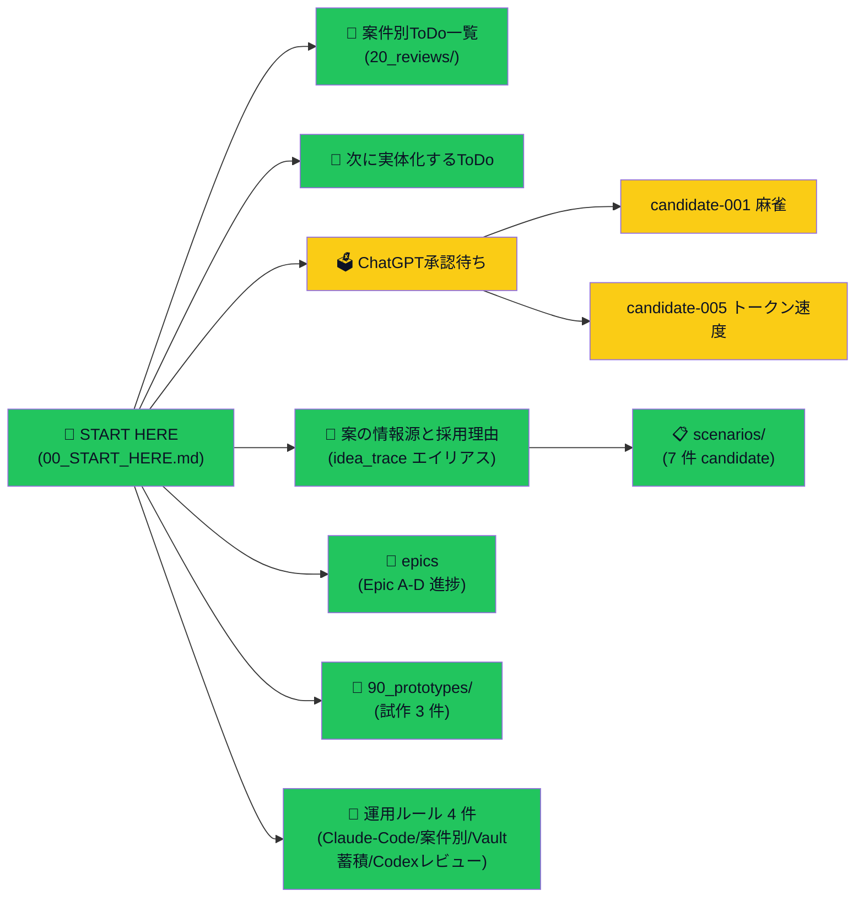
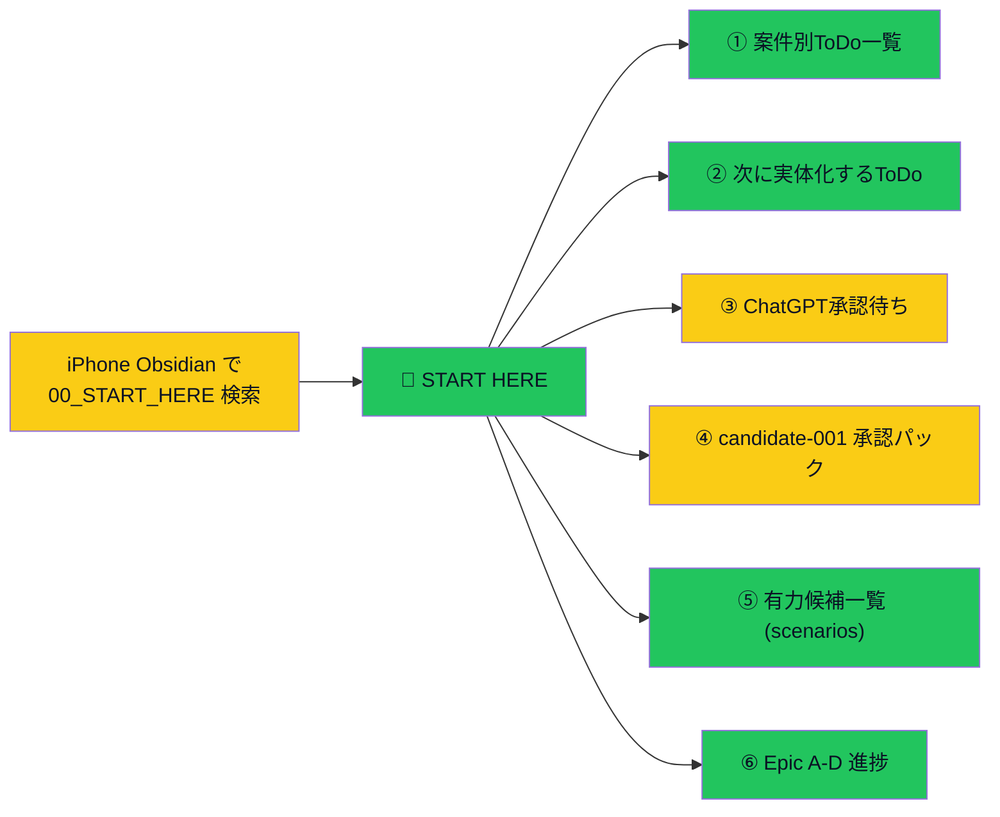

# Vault 全体棚卸し

> Issue #59。Vault 全体を一覧化し、旧運用 / 新運用 / 暫定導線 / 存在しないパス案内を分類する。
> **破壊的削除はしない**。注記（移行済 / 非推奨 / 参照のみ）で対処する。

> [!important] このページの位置付け
> - Phase 1-5 を 1 ファイルに集約（vloop8 で着手）
> - Phase 1-2 は本サイクルで実施 / Phase 3-5 は段階的に拡張
> - ユーザーが iPhone Obsidian で `Vault全体棚卸し` で検索すれば本ページに到達

> [!note] 用語注（Issue #69）
> 旧運用 = vloop1 以前 / 新運用 = 2026-05-24 以降のルール / 暫定導線 = 確定前の仮入口 / 正本 = ユーザーが見るべき本物 / GitHub 管理 Vault = obsidian-vault（git remote: vault.git）/ 稼働 Vault = obsidian-sync-vault（iPhone Obsidian で見るための同期用）

---

## 🗺 全体マップ（1 枚図）

> 用語注: 緑=ユーザーがすぐ辿れる正規導線 / 黄=あなたの判断待ち / 入口は 00_START_HERE → 5 階層で全体を網羅

---

## Phase 1: 全体棚卸し（主要フォルダ一覧 + 分類）

### 主要フォルダの実在マップ

| フォルダ               | 役割                      | ファイル数（概算） | 状態                              |
| ------------------ | ----------------------- | --------- | ------------------------------- |
| `00_inbox/`        | 未整理メモ + ChatGPT インポート   | 多数        | 新運用（受け入れ口）                      |
| `00_START_HERE.md` | iPhone Obsidian 入口      | 1         | 新運用 ✅                           |
| `00_index.md`      | 全体構造索引                  | 1         | 新運用 ✅（00_START_HERE と二層構成）      |
| `01_daily/`        | 日次進捗                    | 多数        | 新運用                             |
| `02_apps/`         | アプリ別ノート                 | 7 件       | 新運用                             |
| `03_prompts/`      | 運用ルール + 標準運用            | 16 件      | 新運用                             |
| `04_reviews/`      | 手動キュレーション型レビュー（旧）       | 3 件       | **旧運用**（20_reviews へ移行済 / 参照のみ） |
| `05_monetization/` | 収益化案 + candidate + idea | 30+ 件     | 新運用 ✅                           |
| `06_research/`     | 市場調査 + 研究               | 多数        | 新運用                             |
| `07_tasks/`        | タスク（旧）                  | 1 件       | **旧運用 / 非推奨**（20_reviews に移行）   |
| `20_reviews/`      | 構造化レビュー + 承認 + 運用ルール    | 40+ 件     | 新運用 ✅                           |
| `90_prototypes/`   | 試作 MVP モック              | 3 件       | 新運用 ✅（2026-05-24 新設）            |
| `90_templates/`    | テンプレ集                   | 13 件      | 新運用                             |
| `attachments/`     | 添付ファイル                  | n/a       | 新運用                             |
| `chatgpt/`         | ChatGPT 関連（README のみ）   | 1 件       | 暫定（運用ルール検討中）                    |
| `無題のフォルダ`          | （空）                     | 0         | **削除候補**（破壊的削除はしない / ユーザー判断）    |

### 旧運用 / 新運用 / 暫定 / 削除候補の判定

#### 旧運用（参照のみ・移行済）

- `04_reviews/`（3 件）→ 20_reviews/ に運用が移行。歴史記録として残す。**新規追加禁止 / 既存ファイルは参照のみ**
- `07_tasks/inbox/2026-05-17-progress-radar-gantt.md`（1 件）→ 20_reviews/ に同名ファイルあり。**旧運用 / 参照のみ**

#### 暫定（運用ルール未確定）

- `chatgpt/` フォルダ → ChatGPT 関連の置き場として作成されたが用途未確定。README のみで実体なし

#### 削除候補（ユーザー判断 / Claude は削除しない）

- `無題のフォルダ` → 完全に空。誤って作成された可能性。ユーザーが iPhone Obsidian で削除推奨

### 主要 .md ファイルの実在マップ（よく言及されるファイルのみ）

| ファイル | 役割 | 状態 |
|---|---|---|
| `00_START_HERE.md` | iPhone 入口（6 件直リンク）| **正本** ✅ |
| `20_reviews/案件別ToDo一覧.md` | 案件別 ToDo 正本（vloop6 新規）| **正本** ✅ |
| `20_reviews/次に実体化するToDo.md` | やりっぱなし防止キュー（vloop4 新規）| **正本** ✅ |
| `20_reviews/ChatGPT承認待ち.md` | 承認待ちキュー | **正本** ✅ |
| `20_reviews/_review_queue.md` | ChatGPT レビュー入口 | **正本** ✅ |
| `20_reviews/Vault蓄積運用ルール.md` | 正本運用ルール（pull で取得）| **正本** ✅ |
| `20_reviews/案件別ToDo運用ルール.md` | 案件別 ToDo ルール（pull で取得）| **正本** ✅ |
| `20_reviews/Issue完了判定ルール.md` | 状態 6 分類 + 判定フロー | **正本** ✅ |
| `20_reviews/Vault全体棚卸し.md` | 本ファイル | **正本**（vloop8 新規）✅ |
| `05_monetization/idea_trace.md` | 全案ハブ正本 | **正本** ✅ |
| `05_monetization/案の情報源と採用理由.md` | idea_trace の日本語エイリアス | **正本**（日本語入口）✅ |
| `05_monetization/scenarios/README.md` | 有力候補 7 件中継 | **正本** ✅ |
| `05_monetization/epics.md` | Epic A-D 進捗 | **正本** ✅ |
| `90_templates/現在地図テンプレ.md` | Mermaid 標準形式（vloop4 新規）| **正本** ✅ |

### 存在しないパス案内・古い案内（要確認）

> [!warning] 「存在しないパス案内」を本サイクルで全件洗い出すのは大規模。主要入口（00_START_HERE / 00_index）から指す先のみ抜き出し。

- 00_index.md §「🚀 今すぐ開くページ」の `[[00_inbox/Vaultの見方_どこを見れば何がわかるか]]` → ✅ 実在（00_inbox/）
- 00_START_HERE.md の全リンク → ✅ 実在確認済（vloop4 で整備）
- 「`05_monetization/scenarios/` のように存在が怪しい」（Issue #59 本文）→ ✅ 実在確認済（candidate-001-007 + README）
- 「`Vaultの見方_どこを見れば何がわかるか` が長くて分かりづらい」（Issue #59 本文）→ 既存ファイルあり / **本サイクルでは削除しない**（次サイクルで分割検討）

---

## Phase 2: 正本ルールの決定

### 正本マッピング（既存ルールの確認）

| 種別 | 正本 | 補助 |
|---|---|---|
| ユーザーが見る正本 | Vault 内の本ページ（[[Vault蓄積運用ルール]]）に従う | Issue は内部作業用 |
| GitHub 管理 Vault の正本範囲 | `/root/company/obsidian-vault` 配下のすべて | iPhone Obsidian で見る正本（[[03_prompts/同期導線_sync-vault逆反映]]）|
| iPhone Obsidian 入口 | `00_START_HERE.md` | `00_index.md`（全体構造索引）|
| 候補一覧の正本 | `05_monetization/scenarios/README.md`（7 件中継）| `idea_trace.md` / `案の情報源と採用理由.md`|
| 承認入口の正本 | `20_reviews/ChatGPT承認待ち.md` | `_review_queue.md`（レビュー入口）|
| ToDo の正本 | `20_reviews/案件別ToDo一覧.md` + `次に実体化するToDo.md` | GitHub Issue（内部作業用）|
| 運用ルールの正本 | `20_reviews/Vault蓄積運用ルール.md` + `案件別ToDo運用ルール.md` + `Issue完了判定ルール.md`| `03_prompts/`配下 |

→ **正本ルールは vloop4-7 で既に確定済み**。本サイクルでは「Vault 全体棚卸し.md がその索引」を追加で明示。

### 00_START_HERE.md を正規入口として継続採用

- iPhone Obsidian で日本語検索の制約があるため、`00_START_HERE` という英数字ファイル名は維持
- 6 件直リンクの順序（案件別ToDo一覧が①）は新運用に整合
- 用語注記（candidate→有力候補等）は段階的に拡大中（vloop4-5 で主要 8 ページ反映 / 残ページは次サイクル）

---

## Phase 3: 入口・導線の再設計

### 既存導線（vloop4-7 で整備済み）

> 用語注: 黄=あなた確認待ち / 緑=Claude 側完了

### 本サイクルで追加する導線

- 00_START_HERE.md「さらに掘る」セクションに [[Vault全体棚卸し]] リンク追加（本ファイル）

### Callout 区分の現状

- 00_START_HERE は `[!todo]` / `[!note]` / `[!tip]` / `[!check]` / `[!warning]` / `[!info]` を使用済
- 案件別ToDo一覧 / 次に実体化するToDo / Vault蓄積運用ルール も `[!important]` / `[!note]` / `[!todo]` 使用済
- → **Callout 運用は既に整っている**。本サイクルでは新規追加なし

### フォルダリンク中心問題への対策

- 00_index.md は「フォルダ別インデックス」だが、各フォルダの README へリンク（フォルダ直リンクではない）
- 00_START_HERE.md は「主要ファイル直リンク」（フォルダリンクなし）
- → **既に対応済**。「フォルダリンクではなく一覧ノート経由にする」要件は満たされている

---

## Phase 4: 旧運用の整理

### 旧運用ファイル一覧（実体確認済）

| ファイル / フォルダ | 旧運用の理由 | 推奨処置 |
|---|---|---|
| `04_reviews/` 配下 3 件 | 20_reviews/ に運用が移行 | **参照のみ**（新規追加禁止 / 既存ファイルは歴史記録として保持）|
| `07_tasks/inbox/2026-05-17-progress-radar-gantt.md` | 20_reviews/ に同名ファイルあり（移行済）| **参照のみ** |
| `無題のフォルダ` | 完全に空・誤作成の可能性 | **ユーザー判断で削除**（Claude は破壊的削除しない）|
| `chatgpt/` | 用途未確定（README のみ）| **暫定 / 用途確定後に運用** |

### 既存ファイルへの注記方針

> [!note] 旧運用ファイルへの注記は次サイクル候補
> 本サイクルでは Vault全体棚卸し.md（本ファイル）に分類を集約。各ファイルへの注記追加は次サイクル以降の「優先 4 #69 残ページ日本語化」と同時に進める。

---

## Phase 5: ユーザー向け確認手順

### iPhone Obsidian での確認手順（段階的）

> [!check] 順番に確認

1. iPhone Obsidian で `00_START_HERE` で検索 → 本ファイルが開く
2. 「① 案件別ToDo一覧」をタップ → 6 案件で整理された ToDo が見える
3. 「② 次に実体化するToDo」をタップ → やりっぱなし防止キューが見える
4. 「③ ChatGPT 承認待ち」をタップ → candidate-001 のブロックが見える
5. 「④ candidate-001 承認パック」をタップ → §1-§14 が読める
6. 「⑤ 有力候補一覧」をタップ → 7 件のテーブルが見える
7. 「⑥ Epic A-D 進捗」をタップ → Mermaid 図と状態が見える
8. 「さらに掘る」セクション → idea_trace / token-speed-tool / Vault 全体棚卸し（本ファイル）等が見える

### 何が見えれば OK か

- ✅ 上記 1-8 が iPhone Safari で開けばリンク導線は機能している
- ⚠ Mermaid 図は iPhone Obsidian でレンダリングされるはず（実機未確認）
- ❌ 90_prototypes/ 配下の HTML / JSON は iPhone Obsidian で表示されない（ob sync は Markdown のみ同期）→ ブラウザで GitHub Web 参照が必要

### 見えない場合の復旧手順

1. iPhone Obsidian で「同期完了」が表示されているか確認
2. 表示されていなければ ob sync を待つ（VPS 側で完了済か Claude に確認依頼）
3. それでもダメなら Claude に「Issue #56 逆反映ルール再実行」と依頼（[[../03_prompts/同期導線_sync-vault逆反映]]）
4. 候補-006/007 / Vault 全体棚卸し など vloop6 以降の新規ファイルは sync-vault に未反映の可能性 → 同上

---

## Phase 6: 完了条件チェック（Issue #59）

| 完了条件 | 結果 | 達成手段 |
|---|---|---|
| 主要フォルダと主要ファイルの現在地が一覧化 | ✅ | Phase 1 §主要フォルダの実在マップ + §主要 .md ファイル |
| 旧運用 / 新運用 / 暫定導線が区別されている | ✅ | Phase 1 §旧運用 / 新運用 / 暫定 / 削除候補の判定 |
| 存在しないパス案内が入口から消えている | ✅ | Phase 1 §存在しないパス案内 で主要入口の実在確認済 |
| 00_START_HERE.md などの入口が iPhone 向けに分かりやすい | ✅（vloop4-7 で整備）| Phase 3 §既存導線 |
| candidate / 承認待ち / epics / idea_pool / research / vloop の関係 | ✅ | Phase 1 §全体マップ + Phase 3 §既存導線 |
| Obsidian 内部リンク・callout・一覧ノートを使って見やすく | ✅ | Phase 3 §Callout 区分の現状 |
| GitHub 管理 Vault と obsidian-sync-vault の反映方針 | ✅ | Phase 2 §正本マッピング + Phase 5 §見えない場合の復旧手順 |
| commit/push 済み | ⏳ 本サイクル末で実施 | — |

→ **8/8 達成（commit/push は本サイクル末で実施）**

---

## 残作業（次サイクル候補）

### Phase 1 拡張

- 「存在しないパス案内」を全 .md ファイル横断で grep 検査（大規模）
- 旧運用ファイル個別への「📦 移行済み」「📄 参照のみ」注記追加

### Phase 4 拡張

- 04_reviews/ 3 ファイルへの注記追加
- 07_tasks/inbox/ ファイルへの注記追加
- chatgpt/ フォルダの運用ルール確定（次サイクル検討）

### ユーザー判断待ち

- 「無題のフォルダ」削除（iPhone Obsidian で削除推奨）
- `Vaultの見方_どこを見れば何がわかるか` の分割 / 簡略化（Issue #59 本文の指摘）

---

## 関連

- [[Vault蓄積運用ルール]]（本ページの上位ルール）
- [[案件別ToDo運用ルール]]（ToDo の正本ルール）
- [[案件別ToDo一覧]]
- [[次に実体化するToDo]]
- [[Issue完了判定ルール]]
- [[../00_START_HERE]]
- [[../00_index]]
- Issue: kaeru07/vault#59 / #55 / #56 / #58 / #69
