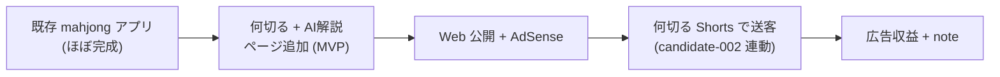

# candidate-001 ChatGPT 承認パック

> Issue #22。**このファイル単体で ChatGPT が方向性承認を判断できる**よう、判断材料を集約。
> [[../05_monetization/ChatGPT承認ゲート標準]] に従い **approved 化・progress 投入はしない**（Claude は材料集約まで）。
> 関連の一次ソース: [[2026-05-19_承認候補選定]] / [[../05_monetization/scenarios/candidate-001_公開ブロッカー]] / [[../05_monetization/scenarios/candidate-001_7日実行プラン]]

## 1. 対象（1行）
既存ほぼ完成の麻雀「何切る」アプリ（apps/mahjong）の公開ブロッカーを解消しストア公開→広告（AdMob/AdSense）で収益化。

## 2. 推奨理由（なぜ candidate-001 を最初に進めるか）
- **収益化インパクト high は3候補で唯一**（002/004 は medium、003 は low）
- 既存資産流用が最大（実装済み＋vercel.json あり）＝公開までの距離が最短
- 最初の1作業が「build 検証」と1分解明確・完了条件が検証可能
- 調査根拠が公式ストア一次（弱くない／spec scoreTotal 28/40 で1位）

## 3. 比較候補との差分

| 候補 | impact | score | candidate-001 との差 |
|---|---|---|---|
| **candidate-001** 麻雀何切るアプリ公開 | **high** | 28 | 基準（最速・唯一の high） |
| candidate-002 麻雀何切るShorts | medium | 27 | 収益化の壁高（90日1000万再生）。001への送客が主価値 |
| candidate-004 麻雀問題系3アプリ統合 | medium | 25 | 統合方針未確定が前提。001の後 |
| candidate-003 Obsidianテンプレ | low | 24 | 調査根拠2・要再調査。優先度外 |

## 4. メリット / デメリット
- **メリット**: 新規開発不要／何切る市場は専業アプリ複数で成立（市場あり）／動画化容易で candidate-002 と相乗／公開ブロッカー解消のみで収益導線に到達
- **デメリット/リスク**: 実 DL・収益は**ストア非公開＝推測**（人間が一次確認すべき）／build 成否・本番デプロイ状態は**未確認**（B1/B2）／競合はレッドオーシャン寄り（差別化軸は要設計）

## 5. 想定収益（推測・確定値ではない）
- モデル: 表示広告（AdMob/AdSense）＋ candidate-002 Shorts からの送客
- 規模: **未確認**。同カテゴリに専業アプリが複数継続＝市場成立は確認できるが、具体金額は非公開のため本パックでは**推測扱い**。承認後 B1/B2 を経て実数値で再評価する前提
- 数値を「確認済み」とは書かない（CLAUDE.local.md 機密/未確認ガード準拠）

## 5-補強. 市場根拠（2026-05-22 追加 / Issue #49 Epic B 追加調査）

iTunes Search JP（無料 API・一次データ）で **「何切る」直接検索**を実施した結果（[[../06_research/2026-05-22_上位5案追加調査]] §3-1）:

- 何切る専業アプリ **10 件以上存在**（ウザク式 354 reviews / 一択 227 / 牌効率 176 ほか）= 市場成立を実データで再確認
- レビュー数は最大 354 で **ニッチ市場・激戦区ではない**（雀魂 807969 のような巨人不在）
- AI 系は「麻雀何切るAI」1 件のみ（14 reviews）= **AI 解説の差別化軸はまだ空いている**
- Education カテゴリにも「みんなの何切る」存在 → 学習用途の需要あり

→ candidate-001 の差別化軸として **「Web 版 + AI 解説」** を追加（[[../05_monetization/scenarios/candidate-001]] §差別化軸の補強）。これにより chatgpt 承認時の判断材料が単純な「公開して広告」から「ニッチ × AI 解説差別化 × Web 版」へ強化される。

## 6. ブロッカー（[[../05_monetization/scenarios/candidate-001_公開ブロッカー]] 要約）
| # | 種別 | 内容 | 優先度 | 状態 |
|---|---|---|---|---|
| B1 | 技術 | `npm run build` 成否未検証 | 高 | 未確認 |
| B2 | 技術 | 本番 Vercel デプロイ状態未確認（vercel.json はあり） | 高 | 未確認 |
| B3 | ストア公開 | README が create-next-app 既定（ASO 文面なし） | 中 | 要整備 |
| B4 | 素材 | public/ デフォルト・アイコン/OGP/スクショ未整備 | 中 | 要整備 |
| B5 | 動画 | 紹介/何切る動画なし（candidate-002 連動） | 低 | 未着手 |

## 7. 最初の30日プラン（[[../05_monetization/scenarios/candidate-001_7日実行プラン]] を月次へ拡張）

| 期間 | フォーカス | 主要 ToDo | 完了条件 |
|---|---|---|---|
| Day1-2 | 公開可否確定 | B1 build検証 → B2 デプロイ状態確認 | build 成否＋本番URL有無が確定 |
| Day3-5 | 公開準備 | B3 ストア/紹介文ドラフト・B4 素材要件整理 | 文面ドラフト＋素材要件 |
| Day6-7 | 公開判断材料 | スクショ取得・公開Go/No-Go レビュー（判断は人間） | Go/No-Go 材料1枚 |
| Day8-14 | 公開実行（人間承認下） | ストア/Web 公開作業・広告枠設置（設定は人間） | 公開済 or 残ブロッカー明確化 |
| Day15-21 | 送客 | candidate-002 Shorts 構成3本→投稿運用（投稿は人間判断） | Shorts ストック＋導線 |
| Day22-30 | 計測・改善 | DL/広告収益の計測開始（[[../05_monetization/収益結果ダッシュボード設計]]）→ 月次レビュー | 実数値が月次収益レビューに記録 |

> Day8 以降の公開・広告設定・投稿は**人間判断/操作**（外部公開・課金・広告は AI 停止条件）。AI は Day1-7 の準備と各 Day のドラフトまで。

---

# Epic C 仕上げ（Issue #53）— 承認判断できる状態への増補

> Issue #53。candidate-001 を ChatGPT が「本当に着手すべきか」判断できる状態まで、市場・実装現実性・収益導線・着手可否を整理する。

## 9. 市場確認の深掘り（#53 Phase 1）

| 観点 | 評価 | 根拠 |
|---|---|---|
| 既存麻雀アプリとの差別化 | ◎ | 何切る専業 10 件以上だが AI 解説を冠するのは 1 件のみ（[[../06_research/2026-05-22_上位5案追加調査]] §3-1）。「Web 版 + AI 解説」が空き軸 |
| Shorts 相性 | ◎ | 何切る問題は 1 問 = 1 Shorts に変換しやすい（問題提示 → 思考時間 → AI 解説）。nanikiru-shorts 基盤が既存 |
| YouTube / TikTok 向き | ○ | 教育系・クイズ系は両プラットフォームで成立。日本麻雀のため日本市場中心 |
| 継続投稿しやすさ | ◎ | 何切る問題は無限に生成可能（牌姿パターン）。ネタ切れリスクが低い |
| AI 生成しやすさ | ○ | 問題文・解説テキストは LLM 生成可。牌姿画像は既存 mahjong アプリの描画資産を流用 |

> 市場確認の結論: 差別化軸（AI 解説）・Shorts 相性・継続性のいずれも良好。candidate-001 は「ニッチだが空き軸があり、動画化と継続投稿に強い」。

## 10. 実装現実性（#53 Phase 2）

| 観点 | 評価 | 内容 |
|---|---|---|
| MVP 最小構成 | ○ | 既存 mahjong（Next.js 16 / React 19）に「何切る問題 + AI 解説」ページを 1 つ追加。新規アプリ不要 |
| VPS / Vercel 相性 | ○ | vercel.json あり = Vercel デプロイ前提。VPS は不要（静的 + API Route で完結可） |
| iPhone 運用相性 | ○ | Web アプリのため iOS Safari で動作。ネイティブアプリ申請は任意（Web 先行が速い） |
| 既存麻雀資産流用 | ◎ | mahjong アプリの牌描画・UI を流用。何切る問題データは新規だが LLM 生成可 |
| Shorts 自動生成連携 | ○ | nanikiru-shorts（Remotion 基盤）と「問題 → Shorts」の連携が設計可能（candidate-002 と統合運用） |
| 更新コスト | ○ | 問題追加は LLM 生成 + 人間レビューで低コスト。AI 解説はモデル API コストが発生（要見積もり） |

> 実装現実性の結論: 新規開発は最小（既存 mahjong への 1 ページ追加 + 何切る問題データ）。AI 解説の API コストのみ承認後に見積もりが必要。MVP は Web 先行が最速。

## 11. 収益導線の整理（#53 Phase 3）

| 導線 | 適性 | 備考 |
|---|---|---|
| 表示広告（AdMob/AdSense） | ◎ 主軸 | Web 版に AdSense。学習系は広告許容度が比較的高い |
| Shorts 導線 | ◎ | 何切る Shorts → Web アプリ送客（candidate-002 と相互補完） |
| note | ○ | 何切る解説まとめ・牌効率講座を note 有料記事化 |
| サブスク | △ | AI 解説の無制限利用を月額化する余地。ただし MVP では時期尚早 |
| アフィリエイト | △ | 麻雀本・麻雀アプリのアフィリエイト。収益規模は小さい |
| 課金要素 | △ | 問題パック課金。MVP 後の検討事項 |

> 収益導線の結論: MVP は「表示広告 + Shorts 送客」の 2 主軸。note は早期に追加可能。サブスク/課金は MVP 検証後。

## 12. 着手する理由 / 着手しない理由（#53 Phase 4）

### 着手する理由
- 収益化スコア 24/30 で全候補中突出（[[../06_research/2026-05-22_上位5案追加調査]] §9）
- 既存 mahjong 資産流用で MVP までの距離が最短
- 差別化軸（AI 解説）が市場に空いている
- Shorts 相性・継続投稿性が高く、candidate-002 と相互補完

### 着手しない（hold/reject すべき）理由
- build 成否・本番デプロイ状態が未確認（B1/B2）— 公開可否が技術的に未確定
- AI 解説の API コストが未見積もり — 収益がコストを上回るか不明
- 実 DL・収益は推測のみ — 市場成立は確認できるが規模は不明
- 麻雀以外への横展開が効きにくい（日本麻雀ニッチに閉じる）

## 13. 1 枚図サマリー（#53 Phase 4）

> 用語注: candidate = 承認前の有力候補 / MVP = 最小機能の試作 / Shorts = 短尺動画 / AdSense = Web 表示広告
> できるようになったこと: candidate-001 の市場・実装・収益を 3 観点で整理 → 現在地: ChatGPT 承認判断の材料が完備 → 次の一手: ChatGPT が approve/hold/reject → ゴール: approved なら progress 投入 → MVP 実装

## 14. 並列確認（#53）

- **他 candidate との重複**: candidate-002（何切る Shorts）は送客元で**補完関係**（競合しない）。candidate-004（麻雀問題系統合）は別軸（統合方針が前提）。candidate-003（Obsidian テンプレ）は無関係。重複なし
- **今の運用で継続できるか**: 何切る問題は LLM で無限生成可・Shorts は nanikiru-shorts 基盤あり → 継続可能性は高い
- **自動案工場との循環**: 案工場（Epic A/B）の idea_pool でも「何切る」関連案（#20260521-039）が上位に来た = 自動収集でも candidate-001 方向が再浮上する循環。案工場と candidate-001 は方向性が一致

## ChatGPT 承認判断用まとめ（#53 完了条件）

ChatGPT は §1〜§14 を読めば candidate-001 を承認判断できる:
- **市場**: ニッチだが AI 解説の空き軸あり（§9）
- **実装**: 既存 mahjong 流用で MVP 最小・Web 先行が最速（§10）
- **収益**: 広告 + Shorts 送客が主軸、note 早期追加可（§11）
- **判断軸**: 着手するなら build 検証（B1）が最初の 1 作業 / hold するなら API コスト見積もり待ち（§12）
- **リスク**: build/デプロイ未確認・AI API コスト未見積もり（§12）

## 8. 人間判断欄（ChatGPT 方向性 → 人間が確定）
- 承認コマンド（[[../05_monetization/ChatGPT承認コマンド標準]]）:
  `candidate-001 approve` / `candidate-001 hold: <理由>` / `candidate-001 reject: <理由>`
- ChatGPT 方向性: （未記入）approve / reject / hold（理由: ____）
- 人間 status 確定: （未記入）approved / rejected / hold → [[../05_monetization/decision-log]] に1行＋[[../90_templates/承認判断テンプレート]]
- 確定日 / 判断者: （未記入）

## 承認後の最初の一手（承認されたら）
- B1 `npm run build` 検証を [[../05_monetization/progress追加ToDo案]] ToDo#1 として progress 投入（人間が投入・AI は送らない）

## 関連
- [[../05_monetization/scenarios/candidate-001]] / [[2026-05-19_承認候補選定]] / [[ChatGPT承認待ち]] / [[../05_monetization/ChatGPT承認ゲート標準]] / [[../05_monetization/decision-log]]
- [[../06_research/2026-05-22_上位5案追加調査]]（市場検証 + 収益化スコアリング）
- Issue: kaeru07/vault#22（関連 #14 / #15 / #16 / #18 / #19 / #49 / #52 / #53）
