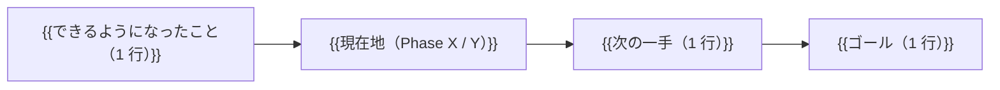

# {{date}} {{task}}

> 1 作業 = 1 ファイル の自動生成レビュー。`20_reviews/YYYY-MM-DD_<task-slug>.md` へコピーして使う。
> 詳細ルールは `/root/company/CLAUDE.local.md` § 作業レビューファイル自動生成ルール。
> **本ファイルを保存したら、必ず同時に [[../20_reviews/_review_queue]] の「未レビュー」へ 1 件追加すること**（追加形式は queue ファイル末尾を参照）。
> 追加時は `createdAt: YYYY-MM-DD HH:mm`（JST、本ファイル生成時刻）を必ず含める。`reviewedAt` は導入しない（`[x]` をレビュー済み判定の正本とする）。

---

## 1. 作業目的

- なぜこの作業をするのか:
- 背景:
- 期待効果:

---

## 2. 実施内容

- 主な変更（箇条書きで具体的に）:
  - 
  - 
- 関連調査・判断:
  - 

---

## 3. 変更ファイル

| ファイル | 変更内容 |
|---|---|
|  |  |

---

## 4. 検証結果

- typecheck: OK / NG / n/a
- build: OK / NG / n/a
- lint: OK / NG / n/a
- 手動確認: 
- 機密パターン事前チェック: OK（ルール例示のみ）/ NG
- ob sync: Fully synced / n/a
- git push: <commit hash> / n/a

---

## 5. 未対応

- スキップした項目:
- 環境制約で実行できなかったこと:
- ユーザー判断待ち:

---

## 6. 危険ポイント

- 既存機能への影響リスク:
- DB / 認証 / 本番 / 機密に触れたか:
- ロールバック手段:
- 観察すべき項目:

---

## 7. 次にやるべきこと

- フォローアップ作業:
- ユーザー判断待ち事項:
- 観察項目（数日〜数週間）:
- 関連 ToDo の追加候補:

---

## 8. ChatGPT レビュー依頼文

そのままコピペで ChatGPT に流せる形:

````text
以下は Claude Code / Codex の作業報告です。レビューしてください。

対象アプリ: {{targetApp}}
作業: {{task}}
runId: {{runId}}
日付: {{date}}
GitHub commit: {{commitHashes}}

## 作業目的
- 

## 実施内容
- 

## 変更ファイル
- 

## 検証結果
- typecheck / build / lint: 
- 手動確認: 
- 機密スキャン: 

## 未対応
- 

## 危険ポイント
- 

## 次にやるべきこと
- 

## 確認したい観点
- 抜け漏れがないか
- 危険な変更が混ざっていないか
- 既存機能を壊していないか
- 設計判断は妥当か
- 次にやるべき作業の優先順位は妥当か
- 収益化インパクトの評価は妥当か（{{monetizationImpact}}）
````

---

## 8.5. 1 枚図サマリー（必須・Issue #43）

レビュー受け手が**できるようになったこと / 現在地 / 次の一手**を 1 枚で把握できるよう、Mermaid 図を 1 つ置く:



> Mermaid が描画できない環境向けに、図の下に**テキスト 1 行サマリー**も併記すると親切。
> 例: `現在地: Phase A 設計完了 → 次: ChatGPT 承認 → ゴール: Phase 1 実取得 1 回成功`

---

## 9. 成果物紹介（必須・Issue #21）

| 項目 | 記入 |
|---|---|
| 何ができたか | {{何ができたか}} |
| どこで見れるか | {{ファイルパス}} |
| 何に使うか | {{用途}} |
| どう使うか | {{使い方}} |
| 次に見るファイル | {{次に見るファイル}} |
| 次にやること | {{次にやること}} |
| 注意点 | {{注意点・未確認/承認待ち等}} |

> 「未確認」を「確認済み」と書かない。詳細運用: [[../04_reviews/Claude作業レビュー運用]] §成果物紹介

---

## 関連

- progress runId: {{runId}}（正本）
- 関連 run: {{relatedRunIds}}
- 関連アプリ: [[../02_apps/{{targetApp}}]]
- 関連プロンプト: [[../03_prompts/Claude-Code標準運用]]
- レビュー運用: [[../04_reviews/Claude作業レビュー運用]]
- フォルダ運用: [[../20_reviews/README]]
