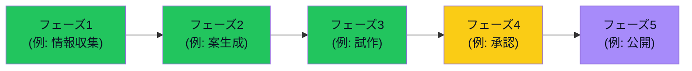
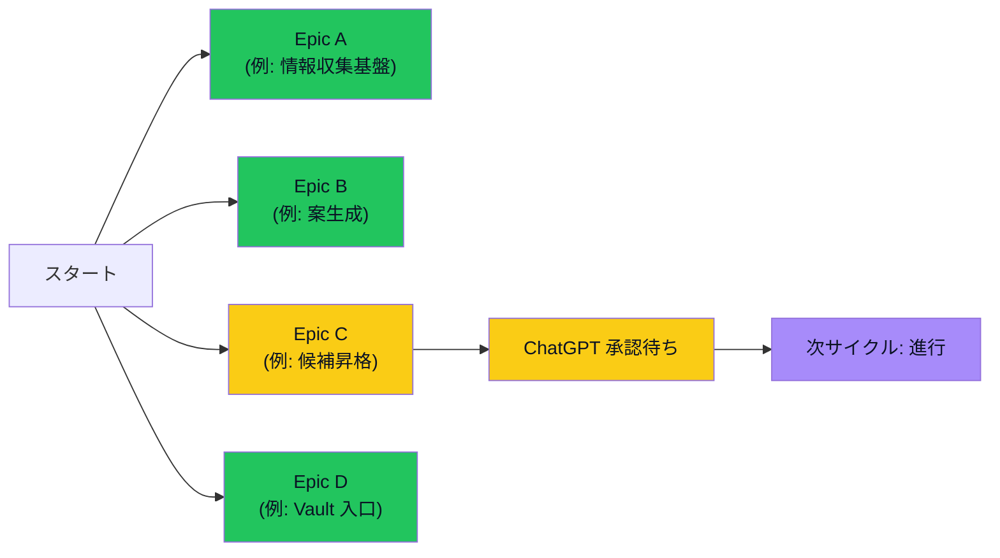
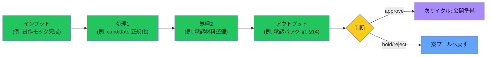

# 現在地図テンプレ

> Issue #68 に基づく Mermaid flowchart の標準テンプレ。
> Epic 進捗 / レビュー結果 / vloop サマリー / Issue完了判定 / START_HERE などで一貫して使う。

> [!important] このテンプレを使う理由
> 文章だけだと「done / あなたの確認待ち / 未対応 / 統合済み / 停止中 / 次サイクル」の状態が混在しやすい。
> 図にすると 1 目で分かる + 状態の色 / ラベルが統一できる。

---

## 標準色 / 状態ラベル

| 状態 | ラベル例 | Mermaid スタイル（クラス）| 意味 |
|---|---|---|---|
| done（完了） | `✅ done` | `classDef done fill:#22c55e,color:#0b1224` | Claude / ユーザー両方の作業完了 |
| あなたの確認待ち（user_check）| `🧑 あなた確認` | `classDef user fill:#facc15,color:#0b1224` | Claude 作業完了・ユーザー操作待ち |
| 未対応（open）| `🟠 未対応` | `classDef open fill:#fb923c,color:#0b1224` | まだ着手していない |
| 統合済み（merged）| `🔵 統合済` | `classDef merged fill:#60a5fa,color:#0b1224` | 別案に吸収された |
| 停止中（blocked）| `⛔ 停止` | `classDef blocked fill:#ef4444,color:#fff` | 障害・規約等で進めない |
| 次サイクル | `⏭ 次サイクル` | `classDef next fill:#a78bfa,color:#0b1224` | 次の vloop で着手予定 |
| Claude 作業中 | `🤖 作業中` | `classDef working fill:#38bdf8,color:#0b1224` | 今 vloop で進行中 |

---

## 基本テンプレ（フェーズ進行型）

> 用語注: フェーズ = 一連の作業の段階 / 凡例 = 緑=完了 / 黄=あなた確認待ち / 橙=未対応 / 青=統合 / 赤=停止 / 紫=次サイクル / 水=作業中

---

## 応用テンプレ（分岐型・Epic ステータス用）

> 用語注: Epic = 大きな作業テーマ / ChatGPT 承認待ち = ChatGPT が方向性 OK/NG/保留 を判断する待ち状態 / 次サイクル = 次の vloop 実行で進める予定

---

## 1 枚図サマリー用テンプレ（vloop レビュー / 作業レビュー）

> 用語注: 1 枚図サマリー = 作業結果を 1 図で見せる形式（Issue #43）

---

## 使い方（書き手向け）

1. **コピペで使う**: 上記 3 テンプレのいずれかを丸ごとコピーして、ノード名と classDef を書き換える
2. **状態ラベルは統一する**: ✅ / 🧑 / 🟠 / 🔵 / ⛔ / ⏭ / 🤖 から選ぶ
3. **classDef は必ず添える**: 色がないと状態が伝わらない
4. **用語注を必ず添える**: Mermaid 図の直下に「> 用語注:」で読み手向け補足
5. **状態を勝手に決めつけない**: done と user_check / open を混同しない（Issue #66 ルール）

---

## 使い方（読み手向け）

- **緑（✅）= 完了** = Claude / ユーザー両方の作業が終わっている
- **黄（🧑）= あなた確認待ち** = ユーザー（あなた）が iPhone / ブラウザで確認すれば前進する
- **橙（🟠）= 未対応** = まだ着手していない
- **青（🔵）= 統合済** = 別の案に吸収されたため独立した進捗は不要
- **赤（⛔）= 停止** = 障害 / 規約で進めない
- **紫（⏭）= 次サイクル** = 次の vloop（Claude のまとめ作業）で着手予定
- **水（🤖）= 作業中** = 今 vloop で進行中

---

## 反映先（Issue #68 Phase 2）

| ページ | 反映状況 |
|---|---|
| `00_START_HERE.md` | ⏳ 次サイクル候補（本サイクルでは「次に実体化するToDo」入口を優先） |
| `05_monetization/epics.md` | ⏳ 次サイクル候補 |
| `20_reviews/Issue完了判定ルール.md` | ⏳ 次サイクル候補 |
| `05_monetization/idea_trace.md` | ✅ 既に Mermaid 図あり（本テンプレ形式に揃える次サイクル候補） |
| `05_monetization/案の情報源と採用理由.md` | ✅ 本サイクルで Mermaid 図入り |
| `20_reviews/次に実体化するToDo.md` | ⏳ 次サイクル候補（状態分類は表形式で十分なため図は任意） |
| vloop サマリー（各サイクル）| ✅ 既に Mermaid 図あり（本テンプレ色分けは次サイクル以降） |

> [!note] 本サイクルでは**テンプレ作成 + 1 ページ反映**まで。残りの反映は次サイクル以降（やりっぱなしを避けるため、本テンプレを `次に実体化するToDo.md` に登録する）

---

## 関連

- [[../05_monetization/idea_trace]]（既存 Mermaid 図あり）
- [[../05_monetization/案の情報源と採用理由]]（本サイクルで Mermaid 図入り）
- [[../05_monetization/epics]]（Epic ステータス・次サイクルで本テンプレ反映予定）
- [[../20_reviews/次に実体化するToDo]]（本テンプレを反映待ちで登録）
- [[../00_START_HERE]]（iPhone 入口）
- [[../20_reviews/Issue完了判定ルール]]
- Issue: kaeru07/vault#68 / #70 / #69
